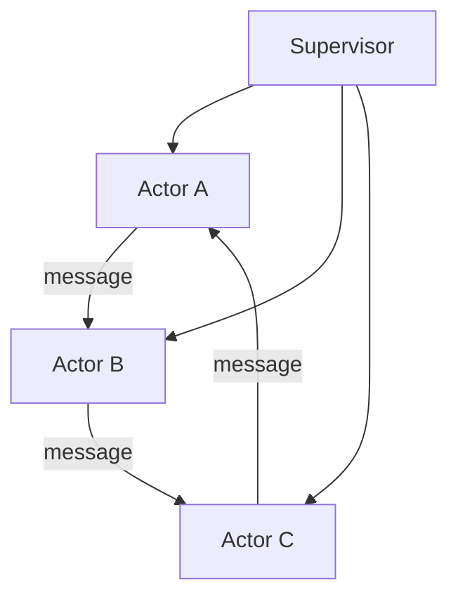
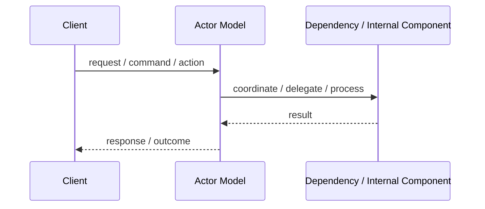
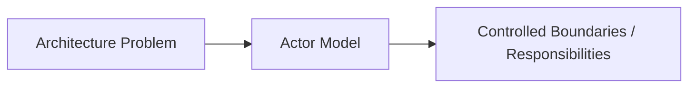

# Actor Model

## Core Idea

The Actor Model structures a system as independent actors that communicate by sending messages.

---

## Problem It Solves

A highly concurrent system needs isolated state, message-driven communication, and fault containment.

---

## Common Examples

- Chat systems
- IoT device coordination
- Game entities
- Telecom systems

---

## Architect Questions

- What entities should become actors?
- What state does each actor own?
- What messages can each actor receive?
- How will actors be supervised after failure?
- How will message ordering and backpressure be handled?
- Does the system need high concurrency?

---

## Main Diagram



---

## Runtime / Responsibility Flow



---

## Implementation Shape

```txt
1. Identify the main architectural problem.
2. Identify the primary responsibilities.
3. Define boundaries and contracts.
4. Decide communication style.
5. Decide ownership of state and data.
6. Add operational rules: testing, deployment, monitoring, failure handling.
7. Keep the pattern honest; do not use the name without enforcing the rules.
```

---

## When to Use

- Many independent entities process messages concurrently.
- State isolation is important.
- Failure supervision matters.
- Asynchronous message passing fits the domain.

---

## When Not to Use

- The workflow is simple and synchronous.
- Shared transactions across many actors are required.
- The team cannot handle actor lifecycle and messaging complexity.

---

## Common Smell That Suggests This Pattern

```txt
The current design is forcing one part of the system to know too much,
coordinate too much,
or change too often because boundaries are unclear.
```

---

## Common Mistakes

```txt
Using the pattern name without enforcing its boundaries.

Adding complexity before the problem is real.

Letting shared code, shared databases, or hidden dependencies break the architecture.

Confusing folder structure with actual architecture.

Ignoring operational concerns such as deployment, monitoring, scaling, and failure behavior.
```

---

## Best Visual Summary



## Final Meaning

Actor Model is useful when it directly solves the stated problem. If the problem is not real yet, the pattern may only add complexity.
