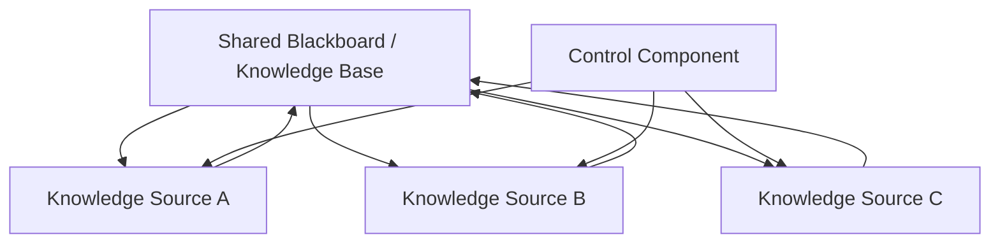
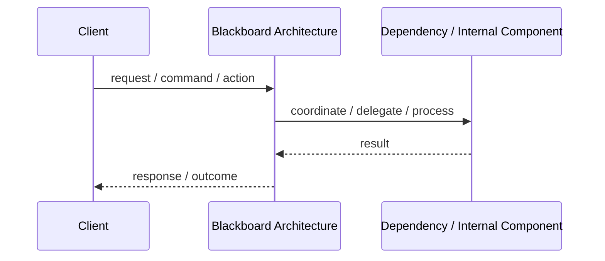
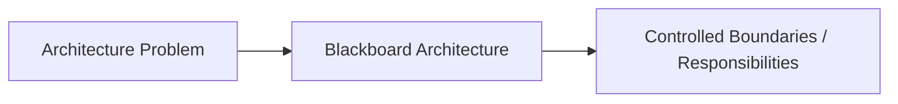

# Blackboard Architecture

## Core Idea

Blackboard Architecture uses a shared knowledge base where independent components contribute partial solutions until a final solution emerges.

---

## Problem It Solves

A complex problem cannot be solved by one deterministic algorithm and requires multiple specialized knowledge sources to collaborate.

---

## Common Examples

- Speech recognition
- AI reasoning systems
- Complex diagnostics
- Pattern recognition

---

## Architect Questions

- What shared knowledge representation is needed?
- What specialized knowledge sources contribute?
- Who controls which component runs next?
- How is progress measured?
- How are conflicts resolved?
- Is the problem exploratory or heuristic?

---

## Main Diagram



---

## Runtime / Responsibility Flow



---

## Implementation Shape

```txt
1. Identify the main architectural problem.
2. Identify the primary responsibilities.
3. Define boundaries and contracts.
4. Decide communication style.
5. Decide ownership of state and data.
6. Add operational rules: testing, deployment, monitoring, failure handling.
7. Keep the pattern honest; do not use the name without enforcing the rules.
```

---

## When to Use

- Multiple specialized solvers contribute partial answers.
- The solution emerges iteratively.
- The problem is complex, uncertain, or heuristic.
- A shared knowledge base is useful.

---

## When Not to Use

- A simple deterministic pipeline works.
- The workflow is linear and predictable.
- Shared state coordination would create unnecessary complexity.

---

## Common Smell That Suggests This Pattern

```txt
The current design is forcing one part of the system to know too much,
coordinate too much,
or change too often because boundaries are unclear.
```

---

## Common Mistakes

```txt
Using the pattern name without enforcing its boundaries.

Adding complexity before the problem is real.

Letting shared code, shared databases, or hidden dependencies break the architecture.

Confusing folder structure with actual architecture.

Ignoring operational concerns such as deployment, monitoring, scaling, and failure behavior.
```

---

## Best Visual Summary



## Final Meaning

Blackboard Architecture is useful when it directly solves the stated problem. If the problem is not real yet, the pattern may only add complexity.
