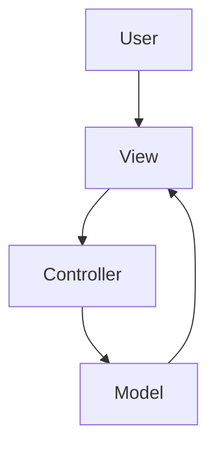
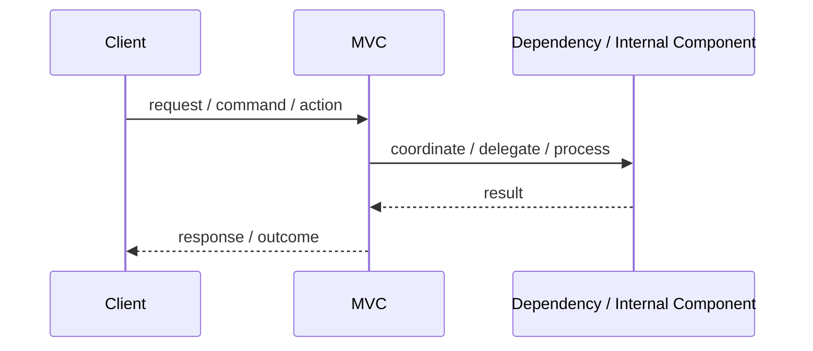
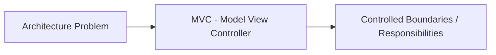

# MVC - Model View Controller

## Core Idea

MVC separates an application into Model, View, and Controller responsibilities.

---

## Problem It Solves

UI rendering, input handling, and business/data logic are mixed together.

---

## Common Examples

- Server-rendered web app
- Desktop GUI app
- Admin dashboard

---

## Architect Questions

- What is the model?
- What does the view render?
- What input does the controller handle?
- Should business logic live in the model or service layer?
- How does the view get updated?
- Are controllers becoming too large?

---

## Main Diagram



---

## Runtime / Responsibility Flow



---

## Implementation Shape

```txt
1. Identify the main architectural problem.
2. Identify the primary responsibilities.
3. Define boundaries and contracts.
4. Decide communication style.
5. Decide ownership of state and data.
6. Add operational rules: testing, deployment, monitoring, failure handling.
7. Keep the pattern honest; do not use the name without enforcing the rules.
```

---

## When to Use

- You need to separate UI, input, and model logic.
- The framework naturally supports MVC.
- The app has multiple views over shared data.
- You want better testability and UI organization.

---

## When Not to Use

- The app is a simple script or very small UI.
- Controllers become god objects.
- The model becomes anemic and all logic moves into controllers.

---

## Common Smell That Suggests This Pattern

```txt
The current design is forcing one part of the system to know too much,
coordinate too much,
or change too often because boundaries are unclear.
```

---

## Common Mistakes

```txt
Using the pattern name without enforcing its boundaries.

Adding complexity before the problem is real.

Letting shared code, shared databases, or hidden dependencies break the architecture.

Confusing folder structure with actual architecture.

Ignoring operational concerns such as deployment, monitoring, scaling, and failure behavior.
```

---

## Best Visual Summary



## Final Meaning

MVC - Model View Controller is useful when it directly solves the stated problem. If the problem is not real yet, the pattern may only add complexity.
