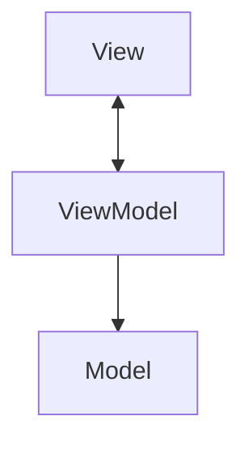
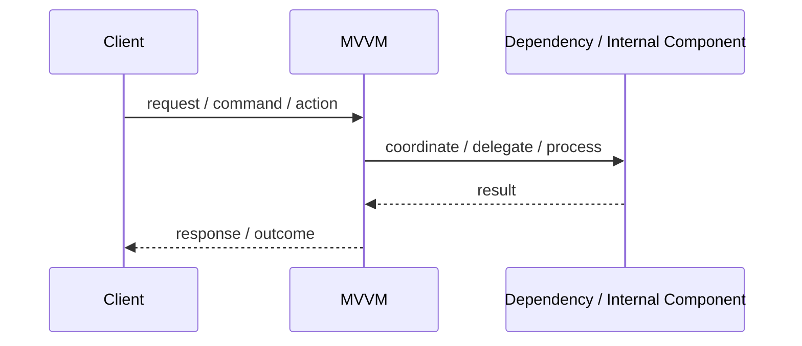
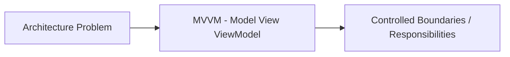

# MVVM - Model View ViewModel

## Core Idea

MVVM separates UI from presentation state and behavior using a ViewModel that the View binds to.

---

## Problem It Solves

UI code becomes tightly coupled to state management, formatting, commands, and domain objects.

---

## Common Examples

- WPF app
- SwiftUI-style state binding
- Frontend forms with view models

---

## Architect Questions

- What state should the ViewModel expose?
- What commands should the ViewModel handle?
- Can the View bind without manual DOM/UI manipulation?
- How much formatting belongs in the ViewModel?
- Can the ViewModel be tested without UI?
- Does the ViewModel hide domain complexity from the View?

---

## Main Diagram



---

## Runtime / Responsibility Flow



---

## Implementation Shape

```txt
1. Identify the main architectural problem.
2. Identify the primary responsibilities.
3. Define boundaries and contracts.
4. Decide communication style.
5. Decide ownership of state and data.
6. Add operational rules: testing, deployment, monitoring, failure handling.
7. Keep the pattern honest; do not use the name without enforcing the rules.
```

---

## When to Use

- The UI supports data binding.
- Presentation state is complex.
- You want testable UI behavior without rendering real views.
- Views should stay declarative and thin.

---

## When Not to Use

- The UI is very simple.
- The framework does not support binding well.
- ViewModels become giant duplicated models.

---

## Common Smell That Suggests This Pattern

```txt
The current design is forcing one part of the system to know too much,
coordinate too much,
or change too often because boundaries are unclear.
```

---

## Common Mistakes

```txt
Using the pattern name without enforcing its boundaries.

Adding complexity before the problem is real.

Letting shared code, shared databases, or hidden dependencies break the architecture.

Confusing folder structure with actual architecture.

Ignoring operational concerns such as deployment, monitoring, scaling, and failure behavior.
```

---

## Best Visual Summary



## Final Meaning

MVVM - Model View ViewModel is useful when it directly solves the stated problem. If the problem is not real yet, the pattern may only add complexity.
