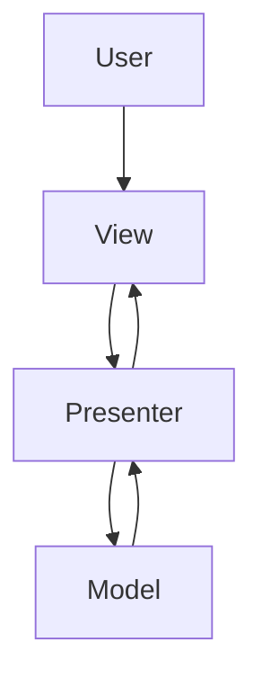
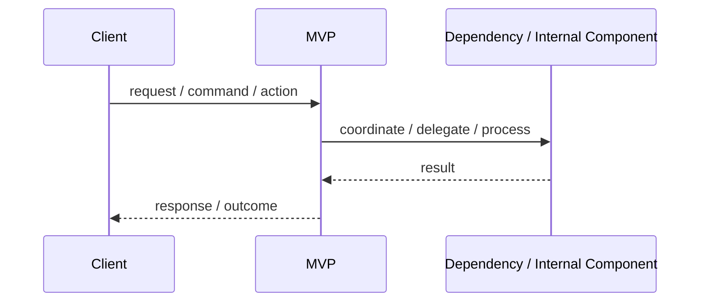
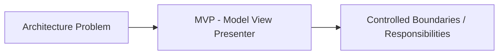

# MVP - Model View Presenter

## Core Idea

MVP separates presentation logic into a Presenter that updates a passive View and coordinates with the Model.

---

## Problem It Solves

UI logic is hard to test because it is embedded directly in the View.

---

## Common Examples

- Desktop apps
- Legacy web UI
- Mobile screens with testable presenters

---

## Architect Questions

- Can the View be passive?
- What user actions does the Presenter handle?
- What model data does the Presenter load?
- How does the Presenter update the View?
- Can the Presenter be tested with a mock View?
- Is MVP simpler than MVVM for this UI framework?

---

## Main Diagram



---

## Runtime / Responsibility Flow



---

## Implementation Shape

```txt
1. Identify the main architectural problem.
2. Identify the primary responsibilities.
3. Define boundaries and contracts.
4. Decide communication style.
5. Decide ownership of state and data.
6. Add operational rules: testing, deployment, monitoring, failure handling.
7. Keep the pattern honest; do not use the name without enforcing the rules.
```

---

## When to Use

- You want testable presentation logic.
- The view should be passive and dumb.
- The UI framework does not support strong binding.
- Presenters can coordinate screen behavior clearly.

---

## When Not to Use

- The framework already favors MVVM or declarative state.
- Presenter and View become tightly coupled anyway.
- The screen is too simple to justify the pattern.

---

## Common Smell That Suggests This Pattern

```txt
The current design is forcing one part of the system to know too much,
coordinate too much,
or change too often because boundaries are unclear.
```

---

## Common Mistakes

```txt
Using the pattern name without enforcing its boundaries.

Adding complexity before the problem is real.

Letting shared code, shared databases, or hidden dependencies break the architecture.

Confusing folder structure with actual architecture.

Ignoring operational concerns such as deployment, monitoring, scaling, and failure behavior.
```

---

## Best Visual Summary



## Final Meaning

MVP - Model View Presenter is useful when it directly solves the stated problem. If the problem is not real yet, the pattern may only add complexity.
