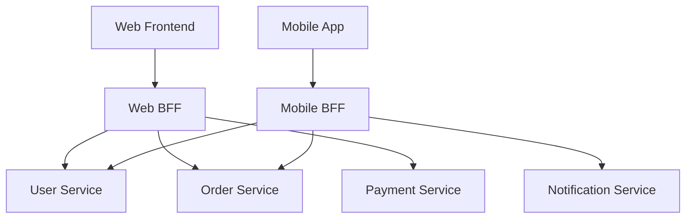
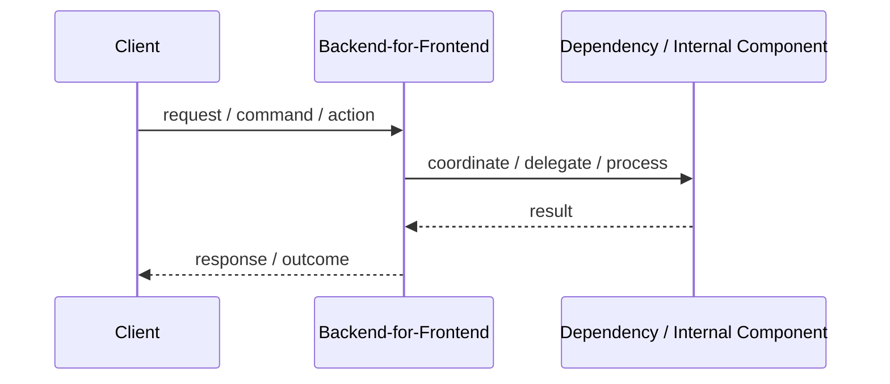

# Backend-for-Frontend - BFF

## Core Idea

BFF creates a backend tailored to the needs of a specific frontend or client experience.

---

## Problem It Solves

Different clients need different API shapes, but a shared backend API either over-fetches, under-fetches, or leaks internal service complexity.

---

## Common Examples

- Mobile BFF
- Web dashboard BFF
- Partner portal BFF

---

## Architect Questions

- Do different frontends need different data shapes?
- Is the frontend calling too many backend services?
- Can the BFF aggregate and tailor responses?
- Who owns the BFF: frontend team or backend team?
- How will authentication and caching work?
- Are we duplicating business logic in BFFs?

---

## Main Diagram



---

## Runtime / Responsibility Flow



---

## Implementation Shape

```txt
1. Identify the main architectural problem.
2. Identify the primary responsibilities.
3. Define boundaries and contracts.
4. Decide communication style.
5. Decide ownership of state and data.
6. Add operational rules: testing, deployment, monitoring, failure handling.
7. Keep the pattern honest; do not use the name without enforcing the rules.
```

---

## When to Use

- Different clients have different API needs.
- The frontend needs aggregation from multiple services.
- You want to reduce frontend complexity.
- Client-specific performance optimization matters.

---

## When Not to Use

- All clients need the same API shape.
- The BFF would duplicate core business logic.
- There are too many BFFs with no ownership discipline.

---

## Common Smell That Suggests This Pattern

```txt
The current design is forcing one part of the system to know too much,
coordinate too much,
or change too often because boundaries are unclear.
```

---

## Common Mistakes

```txt
Using the pattern name without enforcing its boundaries.

Adding complexity before the problem is real.

Letting shared code, shared databases, or hidden dependencies break the architecture.

Confusing folder structure with actual architecture.

Ignoring operational concerns such as deployment, monitoring, scaling, and failure behavior.
```

---

## Best Visual Summary


## Final Meaning

Backend-for-Frontend - BFF is useful when it directly solves the stated problem. If the problem is not real yet, the pattern may only add complexity.
