# Layered Architecture Using Diagrams

## Core Idea

**Layered Architecture** organizes software into separate layers, where each layer has a clear responsibility.

In simple words:

```txt
User requests come in from the top.

Data access happens near the bottom.

Business logic lives in the middle.

Each layer should only depend on the layer below it.
```

A common structure is:

```txt
Presentation Layer
Application / Service Layer
Domain / Business Layer
Data Access Layer
Database
```

The main goal is separation of concerns.

---

# 1. Layered Architecture: General Structure

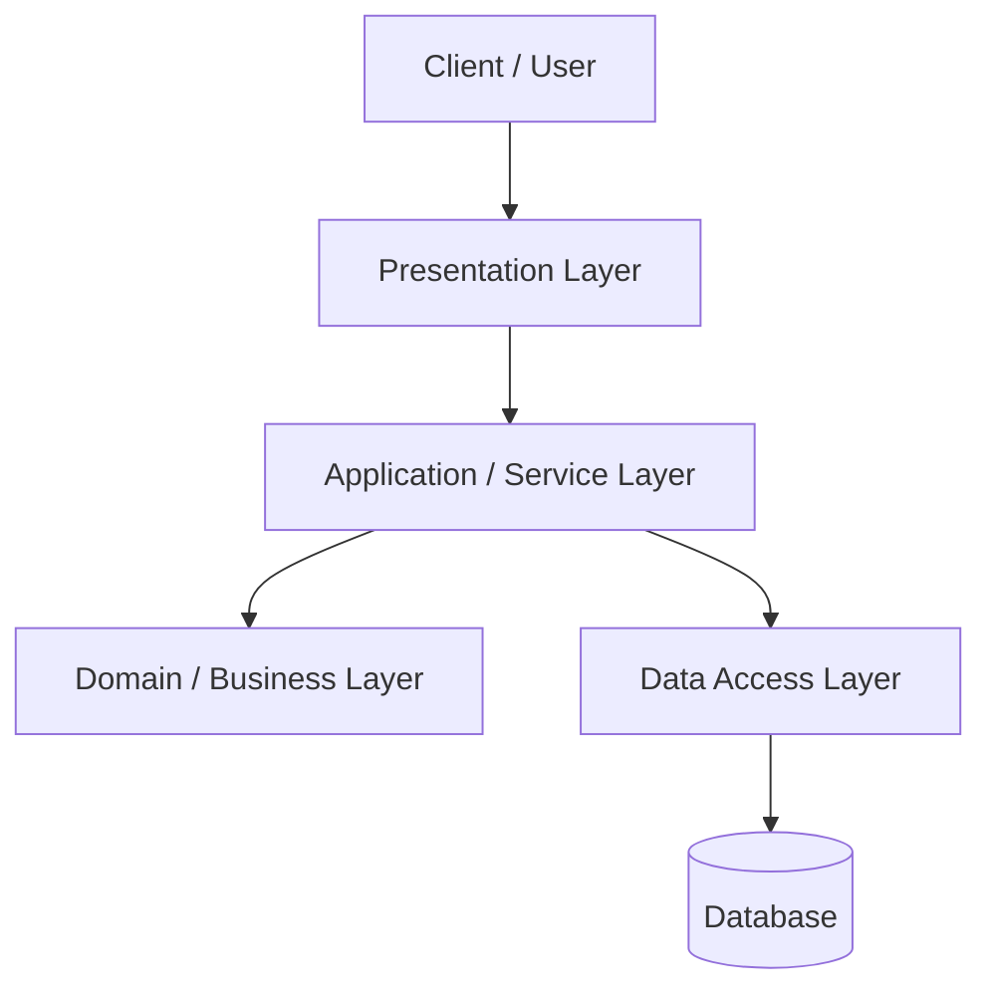

## What This Means

Each layer has a job.

```txt
Presentation Layer:
Handles user input and output.

Application Layer:
Coordinates use cases.

Domain Layer:
Contains business rules.

Data Access Layer:
Reads and writes data.

Database:
Stores persistent data.
```

The client should not talk directly to the database.

The controller should not contain heavy business rules.

The repository should not decide business policy.

---

# 2. Simple Mental Model

Think of layered architecture like a restaurant.

```txt
Customer:
Places an order.

Waiter:
Receives the order and communicates with the kitchen.

Kitchen:
Prepares the food using recipes and rules.

Storage:
Provides ingredients.
```

The customer does not walk into the storage room.

The waiter does not cook the food.

The storage room does not decide what meal should be prepared.

Each part has a responsibility.

---

# 3. The Problem Layered Architecture Solves

Without layers, everything mixes together.

Bad design:

```txt
Controller:
- validates request
- applies business rules
- calculates prices
- builds SQL queries
- sends emails
- formats response
```

That becomes hard to test, hard to change, and easy to break.

Layered Architecture separates responsibilities so each part can change with less damage.

---

# 4. Bad Structure: Everything Mixed Together

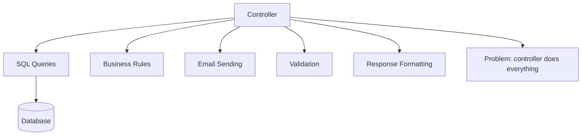

## Why This Is Bad

```txt
Business logic is hard to reuse.

Testing requires too much setup.

Database details leak into UI code.

Controllers become huge.

Changes in storage can affect request handling.

Changes in business rules can affect response formatting.

The system has no clear dependency direction.
```

This is how simple apps become painful.

---

# 5. Good Structure: Responsibilities Separated

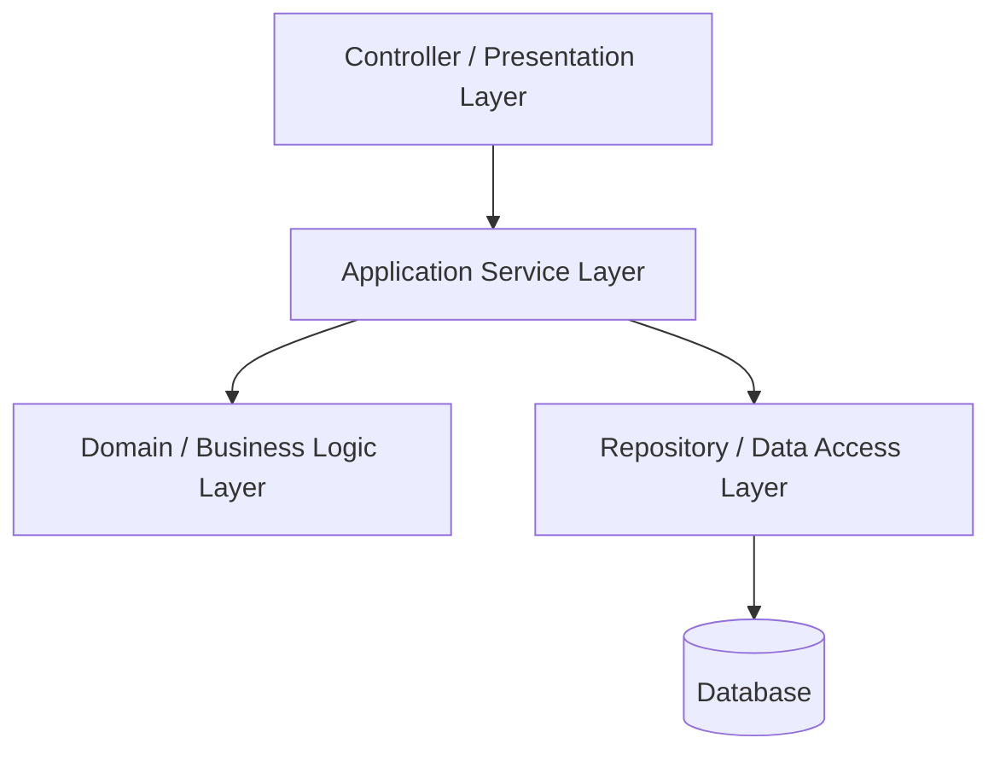

## Improvement

```txt
Controller handles HTTP/UI concerns.

Service coordinates the use case.

Domain contains business rules.

Repository handles persistence.

Database stores data.
```

Now each layer has a reason to exist.

---

# 6. Example 1: Online Course Platform

## Problem

A learning platform lets students enroll in courses.

The enrollment workflow may include:

```txt
Validate student account
Check course availability
Check prerequisites
Create enrollment record
Charge payment if required
Send confirmation
Return enrollment result
```

Without layers, the controller may do everything.

That is bad design.

---

## Architect Questions

An architect would ask:

```txt
Which logic belongs to the UI/controller?

Which logic belongs to the use case?

Which rules are core business rules?

Which code should handle database access?

Can the enrollment rules be tested without HTTP?

Can the database be changed without rewriting controllers?

Are we separating orchestration from business decisions?

Are dependencies flowing in a clean direction?
```

---

## Layered Architecture Diagram

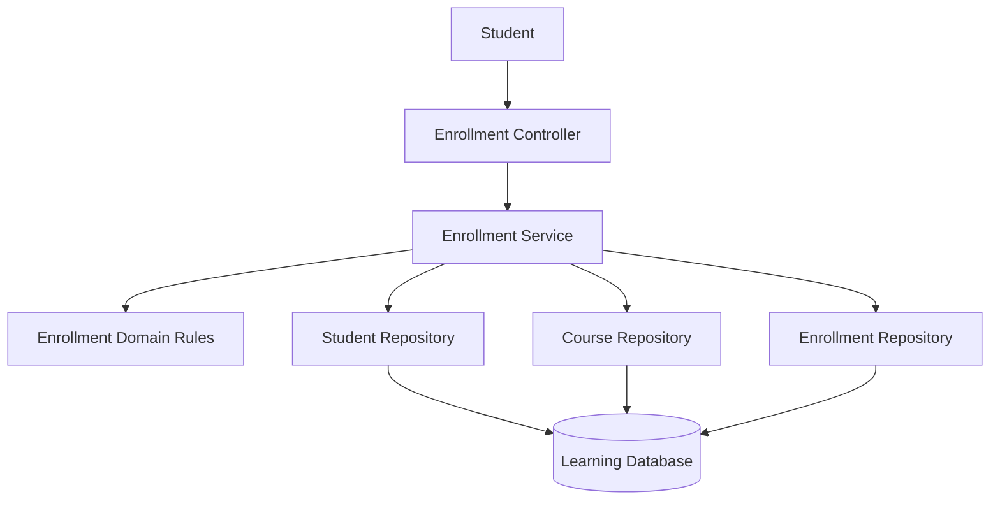

---

## Runtime Flow: Enroll in Course

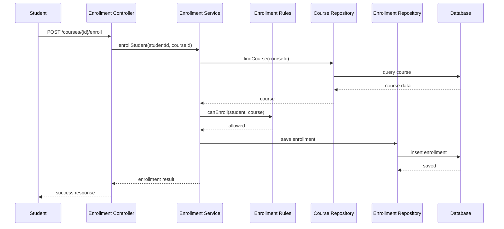

---

## Architectural Meaning

The controller does not decide whether the student can enroll.

The domain rules decide that.

The repository does not know enrollment policy.

It only saves and retrieves data.

The service coordinates the workflow.

---

# 7. Example 2: Banking Transfer System

## Problem

A banking app allows customers to transfer money.

A transfer has rules:

```txt
Source account must exist.
Destination account must exist.
Source account must have enough balance.
Account must not be frozen.
Transfer amount must be within limits.
Transaction must be recorded.
Notification may be sent.
```

Putting all of that into a controller is reckless.

---

## Architect Questions

An architect would ask:

```txt
Where should transfer rules live?

Can transfer rules be tested without the database?

Should account persistence be separated from business decisions?

Should the controller know balance logic?

Where should transaction orchestration happen?

Should notification be part of the core transaction or a side effect?

How do we prevent database code from containing business policy?
```

---

## Layered Architecture Diagram

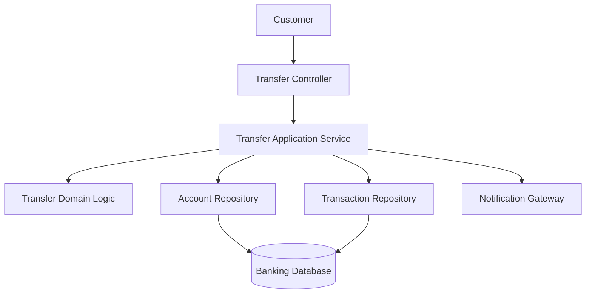

---

## Runtime Flow: Transfer Money

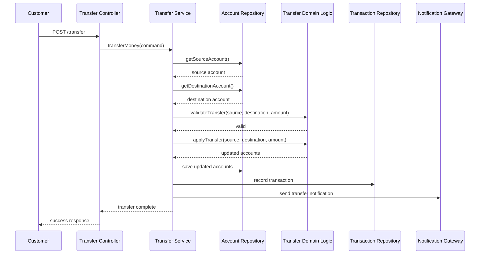

---

## Architectural Meaning

The controller handles the request.

The service coordinates the transfer.

The domain layer enforces transfer rules.

The repositories handle storage.

The notification gateway handles an external side effect.

This separation matters because banking rules should not be buried inside controllers or SQL code.

---

# 8. Example 3: Hotel Reservation System

## Problem

A hotel system allows guests to reserve rooms.

Reservation logic may include:

```txt
Check room availability.
Apply seasonal pricing.
Validate guest information.
Apply loyalty discount.
Create reservation.
Take deposit.
Send confirmation.
```

Without layers, this becomes messy fast.

---

## Architect Questions

An architect would ask:

```txt
Which layer checks room availability?

Where does pricing logic live?

Should payment processing be isolated behind a gateway?

Can reservation rules be tested without the web layer?

Can database queries change without changing pricing rules?

Does the service coordinate too much business policy?

Are external systems hidden behind interfaces?
```

---

## Layered Architecture Diagram

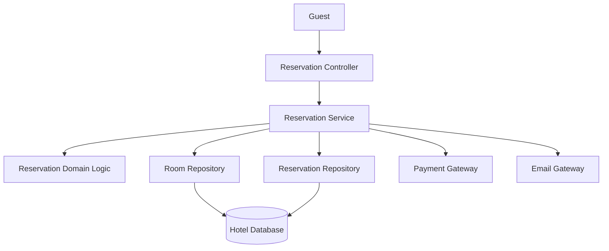

---

## Runtime Flow: Reserve Room

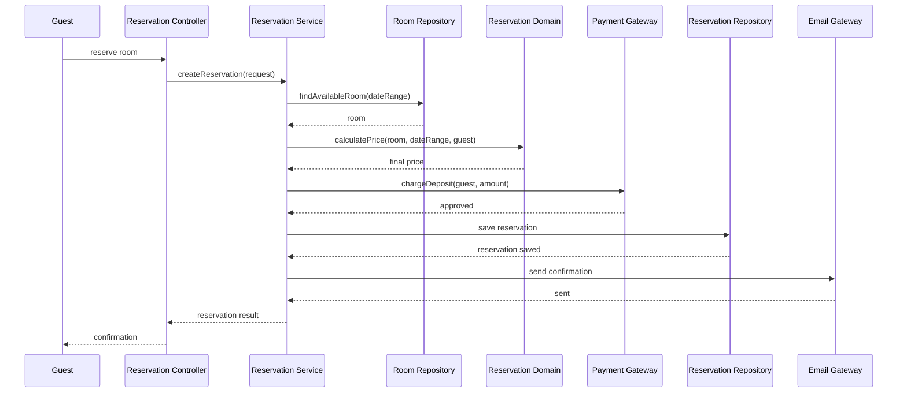

---

## Architectural Meaning

Pricing rules are not in the controller.

Payment API details are not in the domain.

Database queries are not mixed with reservation policy.

Each layer has a clean job.

---

# 9. Common Layers Explained

## Presentation Layer

```txt
Purpose:
Handle user interaction.

Examples:
Controllers
Views
API endpoints
UI handlers
Request/response mapping
```

Should do:

```txt
Parse input.
Validate request shape.
Call application service.
Format output.
```

Should not do:

```txt
Contain business rules.
Build SQL queries.
Call many repositories directly.
Coordinate complex workflows.
```

---

## Application / Service Layer

```txt
Purpose:
Coordinate use cases.
```

Examples:

```txt
EnrollmentService
TransferService
ReservationService
CheckoutService
```

Should do:

```txt
Start and coordinate workflows.
Call domain logic.
Call repositories.
Call gateways.
Manage transactions.
Return use-case result.
```

Should not do:

```txt
Contain every low-level business rule.
Become a god service.
Know HTTP-specific details.
Build SQL queries manually.
```

---

## Domain / Business Layer

```txt
Purpose:
Represent core business rules.
```

Examples:

```txt
Transfer rules
Pricing rules
Enrollment eligibility
Reservation policy
Discount rules
Account balance rules
```

Should do:

```txt
Enforce business invariants.
Make business decisions.
Represent domain concepts.
Stay independent from frameworks when possible.
```

Should not do:

```txt
Know about HTTP.
Know about database queries.
Know about UI.
Know about vendor SDKs.
```

---

## Data Access Layer

```txt
Purpose:
Persist and retrieve data.
```

Examples:

```txt
Repositories
DAOs
ORM models
Query services
Database mappers
```

Should do:

```txt
Read data.
Write data.
Map database records to objects.
Hide storage details from higher layers.
```

Should not do:

```txt
Decide business policy.
Handle request formatting.
Send emails.
Coordinate use cases.
```

---

## Infrastructure Layer

```txt
Purpose:
Connect to external technical systems.
```

Examples:

```txt
Payment provider client
Email gateway
File storage client
Message queue client
External API client
```

Should do:

```txt
Handle external communication.
Translate vendor responses.
Hide SDK details.
```

Should not do:

```txt
Own business decisions.
Leak vendor-specific details into domain logic.
```

---

# 10. Strict Layering vs Relaxed Layering

## Strict Layering

Each layer only talks to the layer directly below it.

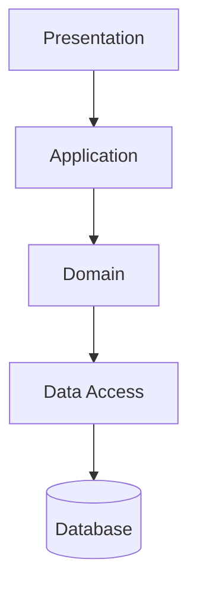

### Benefit

```txt
Very clear dependency flow.
Easy to understand.
```

### Problem

```txt
Can create unnecessary pass-through methods.
May become rigid.
```

---

## Relaxed Layering

A layer can skip a layer when appropriate.

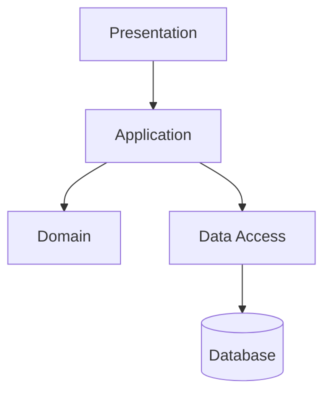

### Benefit

```txt
More practical.
Less boilerplate.
```

### Problem

```txt
Can become messy if every layer talks to everything.
```

## Architectural Judgment

Use relaxed layering carefully.

The application layer often needs to call both domain logic and repositories.

But controllers should still not directly talk to database repositories for complex business operations.

---

# 11. Layered Architecture vs Modular Monolith

These two are often confused.

## Layered Architecture

Organizes by technical responsibility.

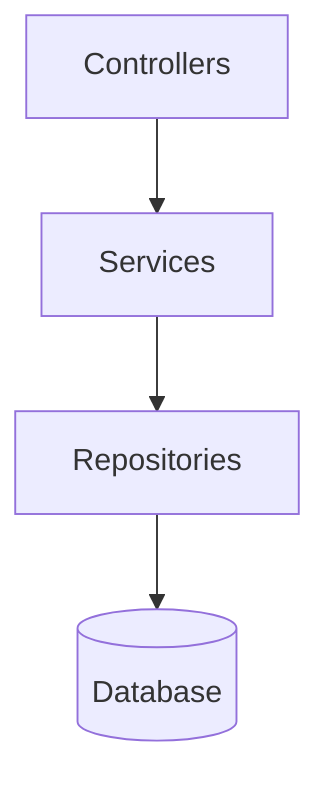

## Modular Monolith

Organizes by business capability.


## Best Practical Combination

Use modules first, then layers inside each module.

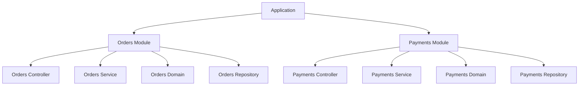

Bad structure:

```txt
/controllers
/services
/repositories
/models
```

Better structure:

```txt
/modules/orders/controller
/modules/orders/service
/modules/orders/domain
/modules/orders/repository

/modules/payments/controller
/modules/payments/service
/modules/payments/domain
/modules/payments/repository
```

The first structure hides business boundaries.

The second structure makes business ownership obvious.

---

# 12. Layered Architecture vs Clean Architecture

## Layered Architecture

Usually points dependencies downward.

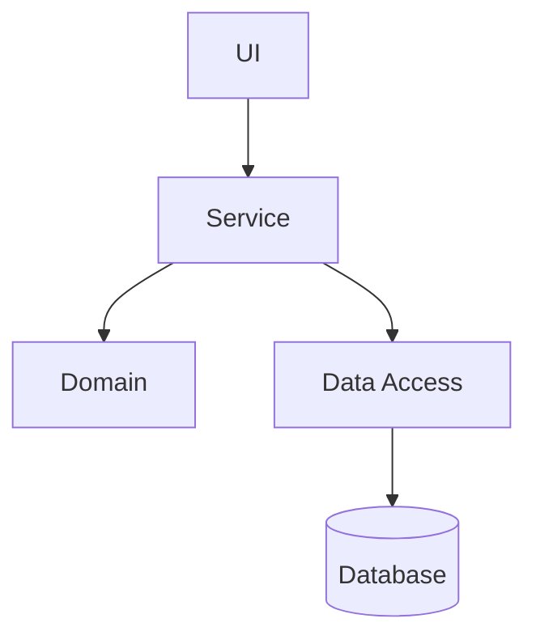

## Clean Architecture

Puts domain at the center and makes dependencies point inward.

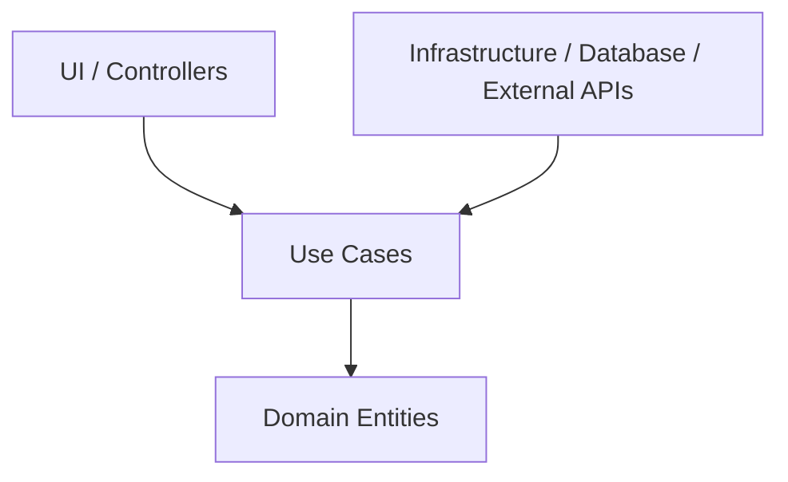

## Main Difference

| Architecture        | Dependency Direction           |
| ------------------- | ------------------------------ |
| Traditional Layered | Often downward toward database |
| Clean Architecture  | Inward toward domain/use cases |

Layered Architecture is simpler.

Clean Architecture gives stronger protection to business rules.

---

# 13. Layered Architecture vs Hexagonal Architecture

## Layered Architecture

```txt
Main idea:
Separate technical layers.
```

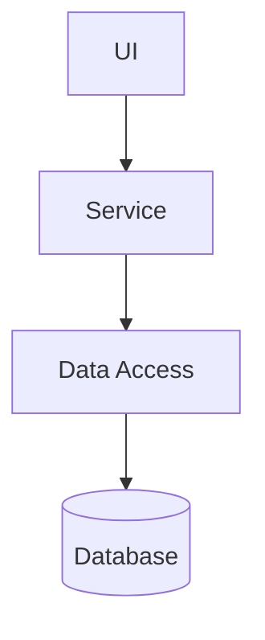

## Hexagonal Architecture

```txt
Main idea:
Business core talks through ports.
External systems connect through adapters.
```

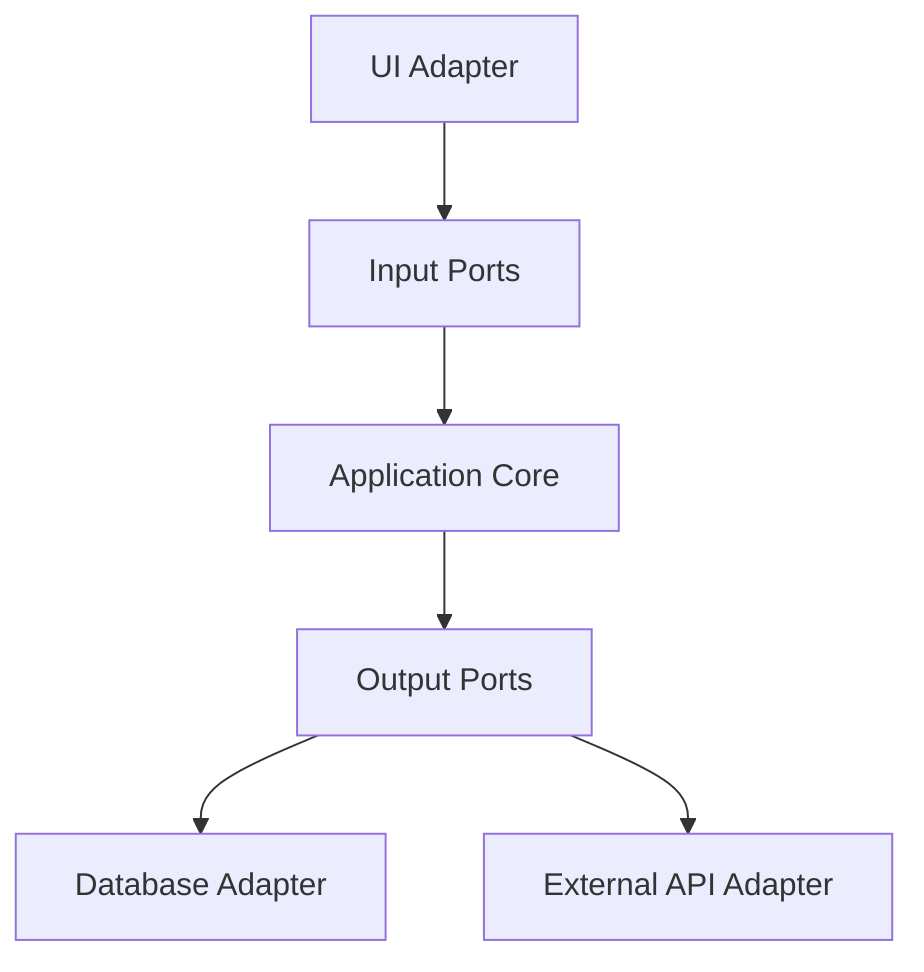

## Main Difference

| Architecture           | Focus                              |
| ---------------------- | ---------------------------------- |
| Layered Architecture   | Separate system into layers        |
| Hexagonal Architecture | Isolate core from external systems |

Layered Architecture is easier to start.

Hexagonal Architecture is better when you need strong testability and replaceable infrastructure.

---

# 14. Common Smell That Suggests Layered Architecture

Layered Architecture is useful when you see this:

```txt
Controllers are doing too much.
```

Or:

```txt
Business rules, database logic, and UI logic are mixed together.
```

Examples:

```txt
Controller calculates discounts and writes SQL.

Repository sends emails.

Database model validates user permissions.

UI component calls five backend repositories directly.

Payment SDK code appears inside business rules.
```

Those are layering problems.

---

# 15. Common Mistakes

## Mistake 1: Fat Controllers

Bad:

```txt
Controller validates request,
calculates price,
updates database,
sends email,
formats response.
```

Better:

```txt
Controller maps request.
Controller calls service.
Service coordinates workflow.
Domain applies business rules.
Repository saves data.
```

---

## Mistake 2: Fat Services

Bad:

```txt
Service contains every business rule,
every validation,
every calculation,
every integration call,
and every database operation.
```

That is just moving the mess from controller to service.

Better:

```txt
Service coordinates.
Domain decides.
Repository persists.
Gateway integrates.
```

---

## Mistake 3: Repositories With Business Rules

Bad:

```txt
Repository decides whether a user is allowed to transfer money.
```

Better:

```txt
Repository loads account data.
Domain/service decides whether transfer is allowed.
```

---

## Mistake 4: Anemic Domain by Accident

Bad:

```txt
Domain objects are only data bags.
All rules live in giant services.
```

Sometimes simple CRUD apps are fine with this.

But for complex business systems, the domain should contain real behavior and rules.

---

## Mistake 5: Layering Only by Folder Names

Folders do not create architecture.

Bad:

```txt
/controllers
/services
/repositories
```

But services still call controllers, repositories call services, and everything imports everything.

Architecture is dependency control, not just folder structure.

---

# 16. When to Use Layered Architecture

Use Layered Architecture when:

```txt
You want a simple, understandable structure.

The system has UI/API, business logic, and data access.

The team needs clear responsibility separation.

The application is mostly CRUD or workflow-based.

You want controllers to stay thin.

You want data access isolated.

You want easier testing by layer.

You do not need the full complexity of Clean or Hexagonal Architecture.
```

---

# 17. When Not to Use Layered Architecture

Do not use simple Layered Architecture when:

```txt
The domain is complex and needs stronger protection from infrastructure.

External systems change frequently and must be easily replaceable.

You need strict dependency inversion.

You need high testability of business rules without framework/database dependencies.

The system has many independent business capabilities and layering hides module ownership.

The layer structure causes too many pass-through methods.
```

In those cases, consider Modular Monolith with Clean or Hexagonal ideas inside modules.

---

# 18. Layered Architecture Strengths

```txt
Easy to understand.

Easy for teams to learn.

Clear separation of responsibilities.

Good for CRUD applications.

Good starting architecture.

Works well with many web frameworks.

Makes controllers thinner.

Keeps database code out of UI code.
```

---

# 19. Layered Architecture Weaknesses

```txt
Can become too database-driven.

Can hide business module boundaries.

Can create fat service layers.

Can cause pass-through boilerplate.

Can make domain logic weak if everything goes into services.

Can become rigid if strict layering is overused.

Does not automatically enforce good boundaries.
```

Layered Architecture is useful, but it is not enough by itself for large systems.

---

# 20. Implementation Shape Without Code

## Step 1: Identify Entry Points

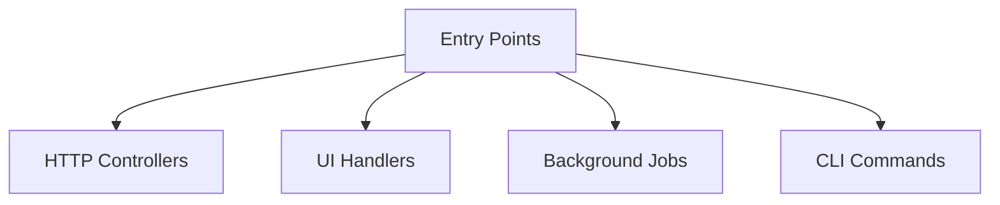

These belong near the presentation layer.

---

## Step 2: Define Use Cases

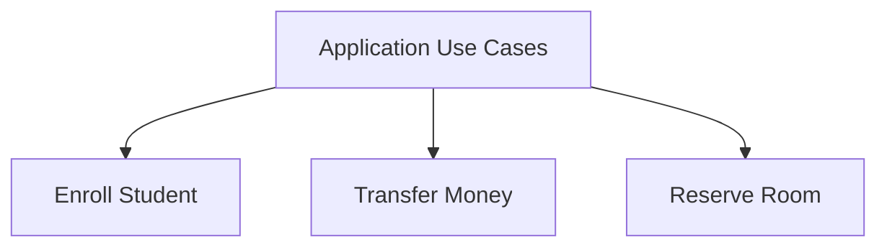

Use cases belong in the application/service layer.

---

## Step 3: Move Business Rules Into Domain

```mermaid
flowchart TD
    DOMAIN[Domain Layer]

    DOMAIN --> RULE1[Eligibility Rules]
    DOMAIN --> RULE2[Pricing Rules]
    DOMAIN --> RULE3[Transfer Rules]
    DOMAIN --> RULE4[Policy Rules]
```

Rules should not be scattered across controllers and repositories.

---

## Step 4: Isolate Data Access

```mermaid
flowchart TD
    SERVICE[Application Service]

    REPO[Repository]

    DB[(Database)]

    SERVICE --> REPO
    REPO --> DB
```

Data access should be behind repositories, query services, or similar persistence abstractions.

---

## Step 5: Isolate External Systems

```mermaid
flowchart TD
    SERVICE[Application Service]

    GATEWAY[External Gateway]

    EXTERNAL[External System]

    SERVICE --> GATEWAY
    GATEWAY --> EXTERNAL
```

Payment providers, email services, storage providers, and external APIs should not leak everywhere.

---

# 21. Best Visual Summary

```mermaid
flowchart TD
    CLIENT[Client]

    PRESENTATION[Presentation Layer]

    APPLICATION[Application / Use Case Layer]

    DOMAIN[Domain / Business Rules Layer]

    DATA[Data Access / Infrastructure Layer]

    DB[(Database / External Systems)]

    CLIENT --> PRESENTATION
    PRESENTATION --> APPLICATION
    APPLICATION --> DOMAIN
    APPLICATION --> DATA
    DATA --> DB
```

## Final Meaning

Layered Architecture is not mainly about folders.

It is about controlling responsibilities and dependencies.

Use it to keep UI logic, use-case orchestration, business rules, and data access from turning into one tangled mess.
