# Modular Monolith Architecture Using Diagrams

## Core Idea

A **Modular Monolith** is an architectural style where the system is deployed as **one application**, but the code is organized into **clear, independent modules**.

In simple words:

```txt
One deployable application.

Multiple internal modules.

Each module has clear ownership.

Modules communicate through defined interfaces.

Modules do not freely reach into each other’s internals.
```

A modular monolith gives you some benefits of microservices without immediately paying the full cost of distributed systems.

---

# 1. Modular Monolith: General Structure

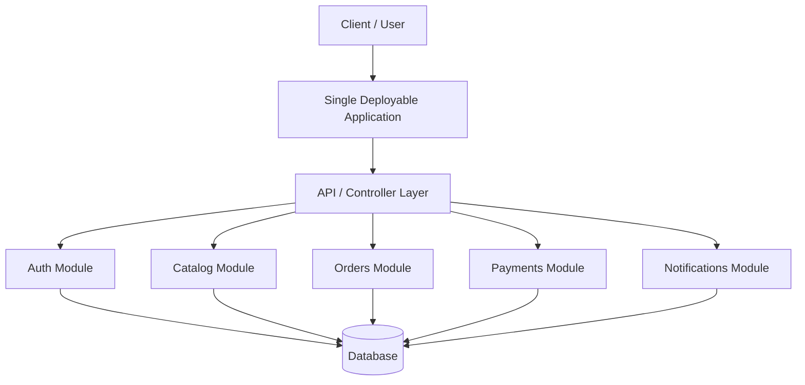

## What This Means

The system is still one application.

But internally, the application is split into business modules.

Each module should have:

```txt
Its own use cases
Its own business rules
Its own internal services
Its own data access logic
Its own public interface
```

The goal is not just folders.

The goal is **controlled coupling**.

---

# 2. Simple Mental Model

Think of a modular monolith like one company building with separate departments.

```txt
One building.

Inside:
- Sales
- Finance
- Support
- Engineering
- HR
```

Each department has its own responsibilities.

Good version:

```txt
Departments communicate through clear processes.
```

Bad version:

```txt
Everyone walks into everyone else's office and changes their documents.
```

That is the difference between a modular monolith and a messy monolith.

---

# 3. Problem Modular Monolith Solves

A normal monolith often starts simple.

Then over time:

```txt
Controllers become huge.
Business rules spread everywhere.
Modules directly query each other's tables.
Shared utilities become dumping grounds.
Tests become slow.
Changes in one area break another area.
```

The system becomes a **big ball of mud**.

A modular monolith solves this by enforcing internal boundaries before the system becomes too tangled.

---

# 4. Bad Monolith vs Modular Monolith

## Bad Monolith

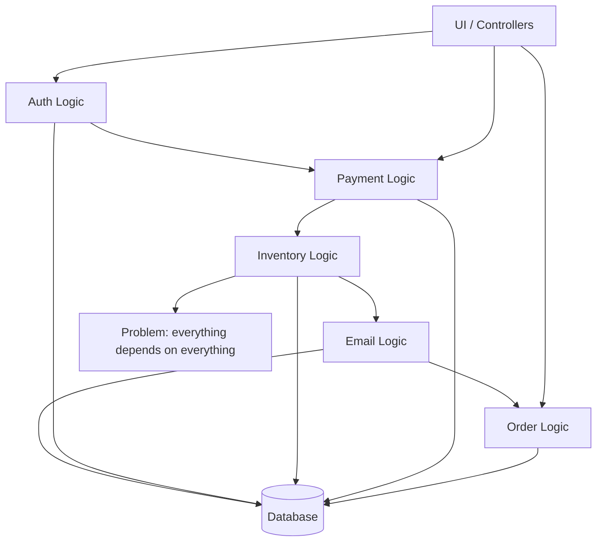

## Problem

```txt
No clear ownership.

No clear dependency direction.

No stable module APIs.

No table ownership.

Business rules are duplicated.

Any change can break unrelated features.
```

---

## Modular Monolith

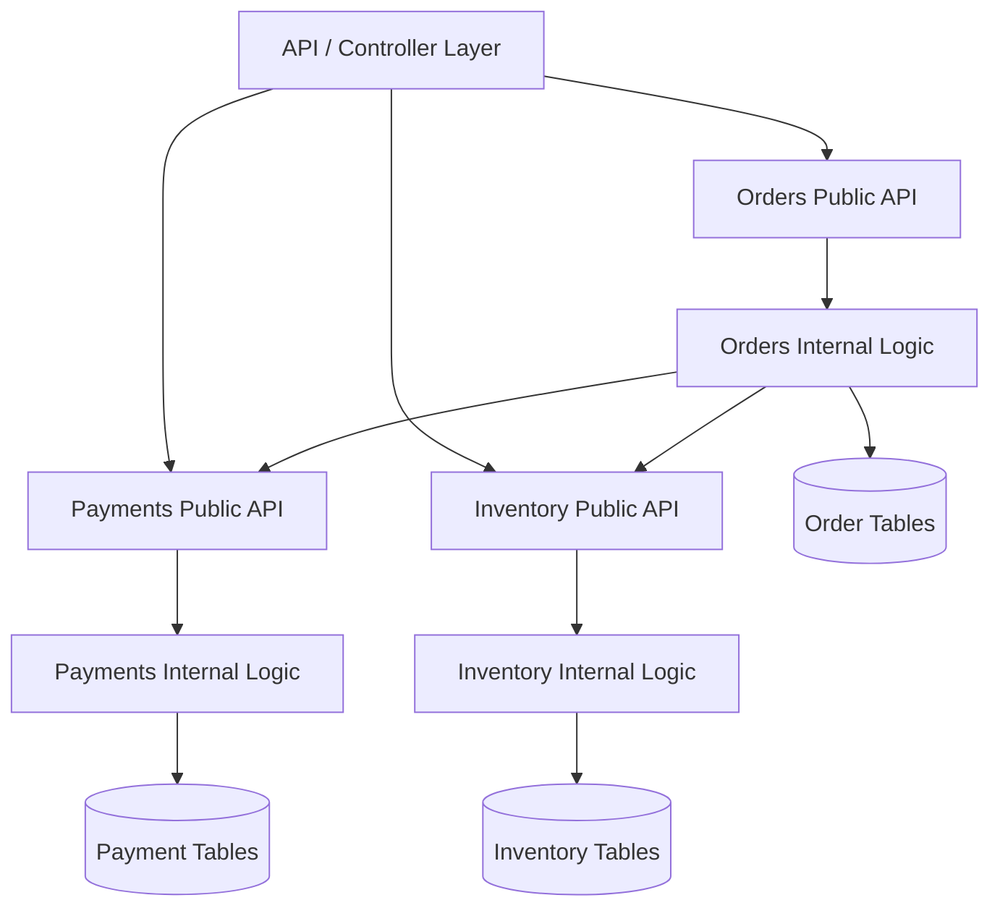

## Improvement

```txt
Each module owns its internal logic.

Other modules call public APIs.

Modules do not directly modify each other's tables.

The application is still deployed as one unit.
```

---

# 5. Example 1: E-Commerce Modular Monolith

## Problem

An e-commerce platform has several business capabilities:

```txt
Account management
Product catalog
Cart
Orders
Payments
Inventory
Shipping
Notifications
Admin dashboard
```

A messy monolith would let every feature call every other feature directly.

A modular monolith separates each business capability into a module.

---

## Architect Questions

An architect would ask:

```txt
What are the main business capabilities?

Which module owns which data?

Which module owns which business rules?

What public operations should each module expose?

Which internals must be hidden?

Can this remain one deployable app for now?

Which modules might later become services?

Are we preventing direct cross-module database access?

Are module boundaries based on business meaning or technical layers only?
```

---

## Modular Monolith Diagram

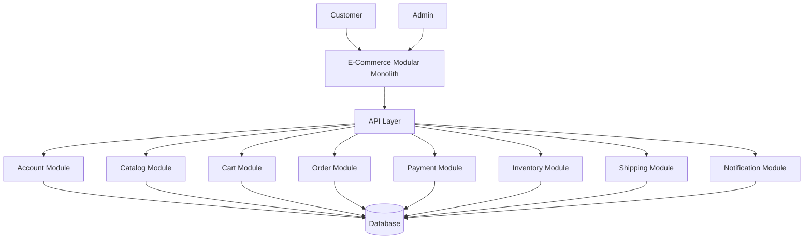

---

## Runtime Flow: Place Order

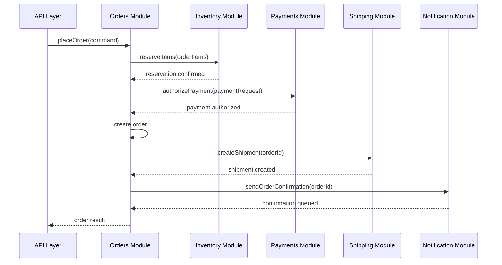

---

## Architectural Meaning

The API layer does not manually coordinate every subsystem.

The Orders module owns the order use case.

The Orders module can call public APIs from Inventory, Payments, Shipping, and Notifications.

But it should not directly modify their internal data.

Bad:

```txt
Orders module updates payment tables directly.
```

Better:

```txt
Orders module calls Payments.authorizePayment().
```

---

# 6. Example 2: Hospital Management Modular Monolith

## Problem

A hospital system has many connected capabilities:

```txt
Patient records
Appointments
Doctors
Billing
Insurance claims
Prescriptions
Lab results
Notifications
```

These features are related, but they have different business rules.

A modular monolith can keep the system deployable as one app while still enforcing boundaries.

---

## Architect Questions

An architect would ask:

```txt
Which module owns patient identity?

Which module owns appointment scheduling?

Which module owns billing rules?

Can billing read appointment data through a public interface?

Can lab results be updated without affecting appointments?

Are there compliance boundaries around patient records?

Which module operations need audit logging?

Would microservices add value now, or just complexity?
```

---

## Modular Monolith Diagram

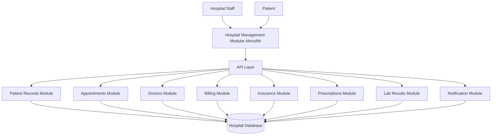

---

## Runtime Flow: Schedule Appointment

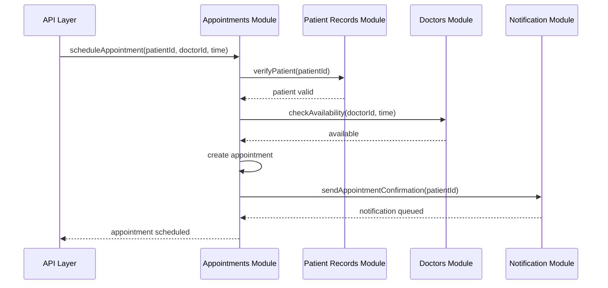

---

## Architectural Meaning

Appointments owns the scheduling workflow.

Patients owns patient data.

Doctors owns provider availability.

Notifications owns message delivery.

The modules cooperate through public operations, not by reaching into each other's internals.

---

# 7. Example 3: Banking Modular Monolith

## Problem

A banking application has capabilities like:

```txt
Customer profiles
Accounts
Transactions
Cards
Loans
Fraud checks
Statements
Notifications
```

A bank may eventually split some parts into services, but starting as a modular monolith may be safer if the team needs strong consistency and simple transactions.

---

## Architect Questions

An architect would ask:

```txt
Which module owns account balances?

Which module owns transaction rules?

Which operations must be strongly consistent?

Should fraud checks be synchronous or asynchronous?

Can notifications be event-driven inside the monolith?

Which modules are security-sensitive?

Which modules might later require independent scaling?

What database tables belong to each module?
```

---

## Modular Monolith Diagram

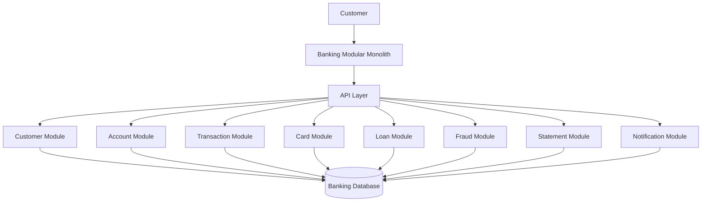

---

## Runtime Flow: Transfer Money

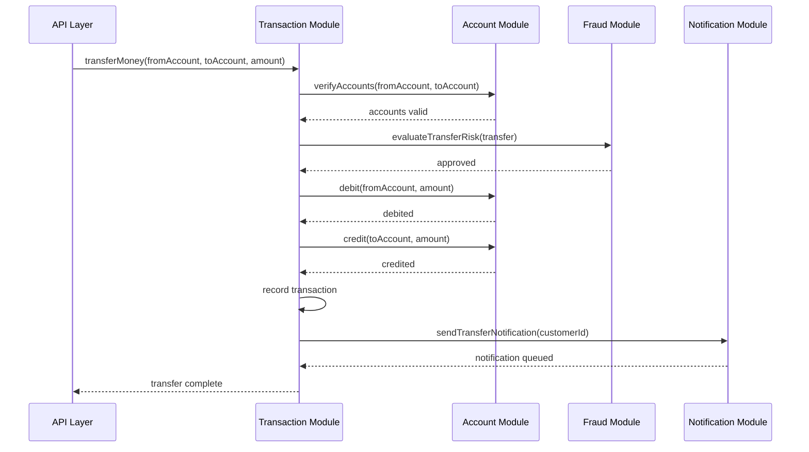

---

## Architectural Meaning

The Transaction module owns the transfer workflow.

The Account module owns account operations.

The Fraud module owns risk evaluation.

The Notification module owns messaging.

This keeps responsibilities separated even though the app is deployed as one unit.

---

# 8. Internal Module Structure

A module should not be just a random folder.

A strong module usually has internal layers.

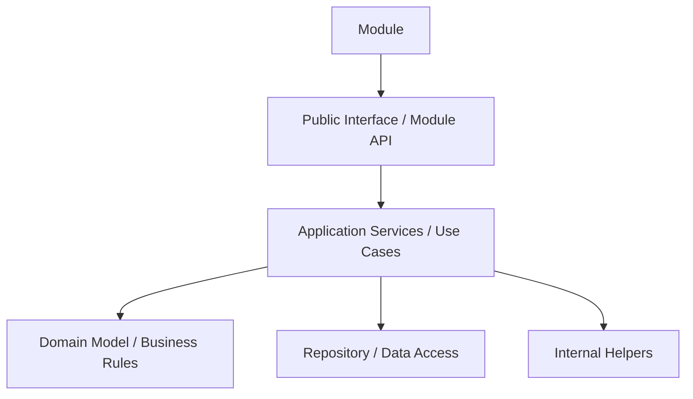

## Meaning

```txt
Public Interface:
What other modules are allowed to call.

Application Services:
Use cases and orchestration inside the module.

Domain:
Business rules, entities, value objects.

Repository:
Data access owned by this module.

Internal Helpers:
Private implementation details.
```

The important rule:

```txt
Other modules should call the public interface only.
```

---

# 9. Module Communication Rules

## Bad Communication

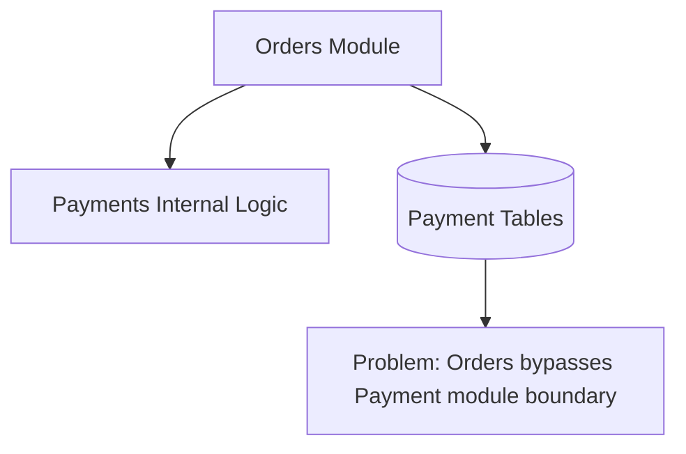

This creates tight coupling.

If Payments changes internally, Orders breaks.

---

## Good Communication

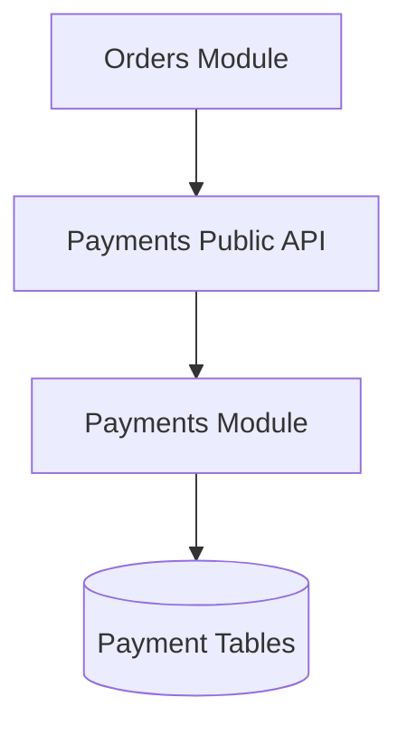

Orders asks Payments to do payment work.

Payments owns its own data and rules.

---

# 10. Shared Database in Modular Monolith

A modular monolith can use one physical database.

That is okay.

The issue is not one database.

The issue is no ownership.

## Better Database Ownership

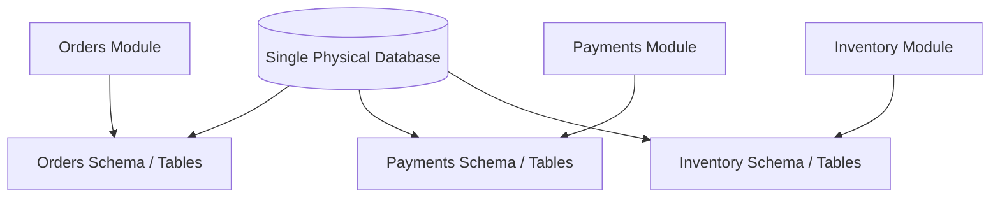

## Rule

```txt
One physical database is fine.

But each module should own its own tables or schema.

Other modules should not directly write those tables.
```

Bad:

```txt
Inventory directly updates order_status.
```

Better:

```txt
Inventory emits reservation result or calls Orders public API.
```

---

# 11. Synchronous vs Event-Based Communication

Inside a modular monolith, modules can communicate synchronously or through internal events.

## Synchronous Module Call

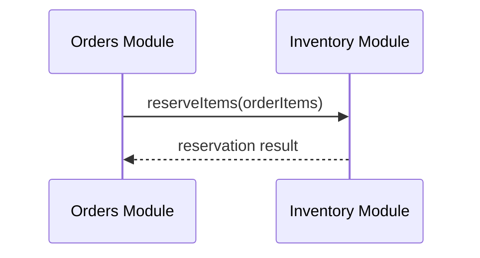

Good for:

```txt
Immediate decisions
Validation
Required workflow steps
Strong consistency
```

---

## Internal Event

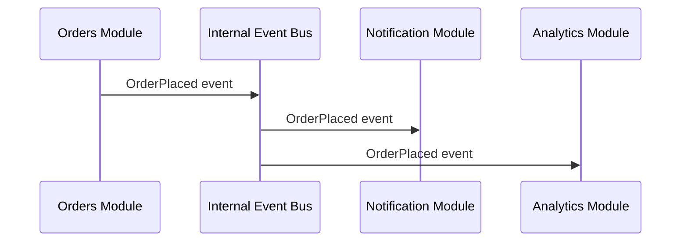

Good for:

```txt
Notifications
Analytics
Audit logs
Secondary workflows
Loose coupling
```

---

## Architect Judgment

Do not turn everything into events.

Use direct calls when the caller needs an immediate answer.

Use events when other modules need to react but the main workflow should not depend on them.

---

# 12. Modular Monolith vs Regular Monolith

## Regular Monolith

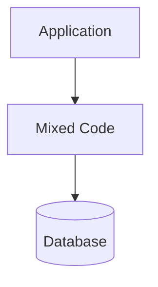

## Modular Monolith

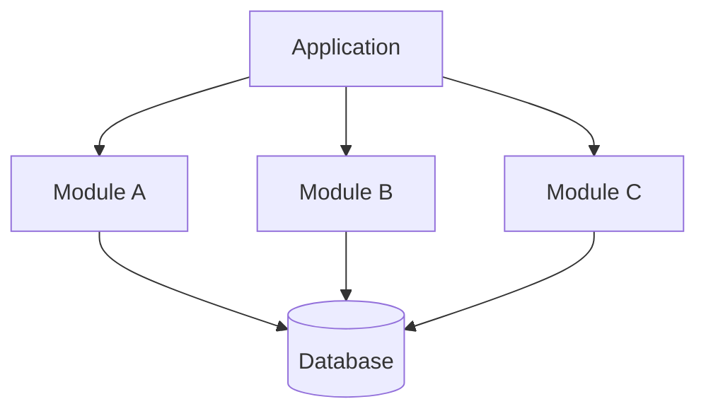

## Main Difference

| Architecture     | Meaning                                              |
| ---------------- | ---------------------------------------------------- |
| Regular Monolith | One deployable app, often with weak boundaries       |
| Modular Monolith | One deployable app with explicit internal boundaries |

A modular monolith is not just a monolith with folders.

It needs rules.

---

# 13. Modular Monolith vs Microservices

## Modular Monolith

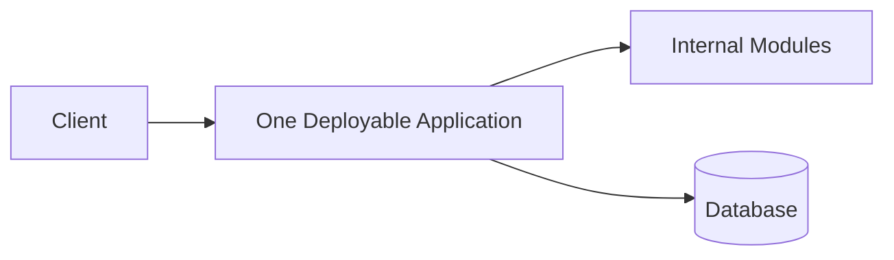

## Microservices

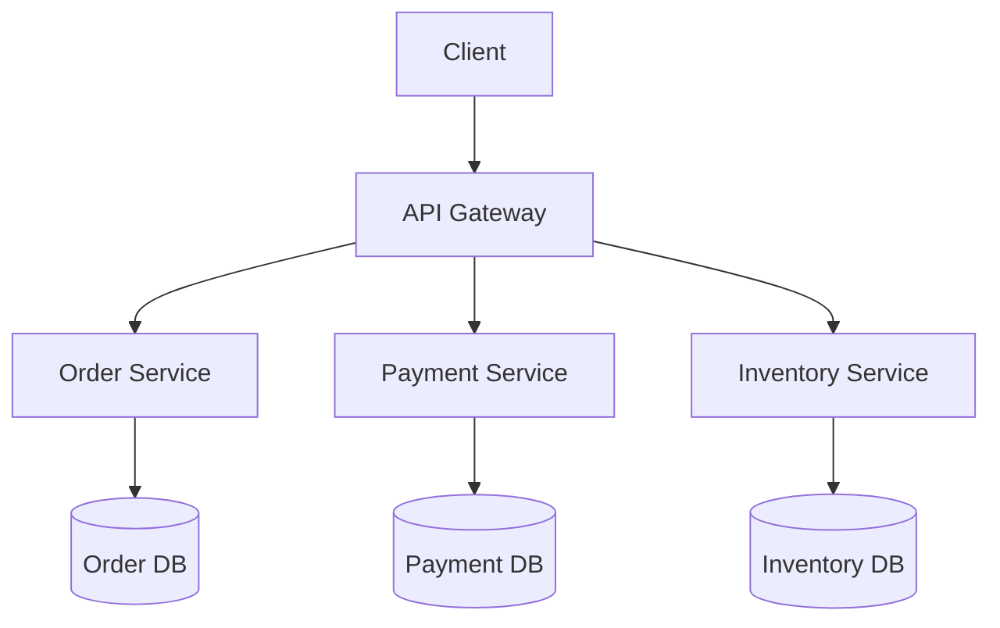

## Main Difference

| Topic             | Modular Monolith                           | Microservices                   |
| ----------------- | ------------------------------------------ | ------------------------------- |
| Deployment        | One deployable app                         | Many deployable services        |
| Communication     | In-process calls/events                    | Network calls/messages          |
| Database          | Often one physical DB with ownership rules | Usually separate DB per service |
| Operations        | Simpler                                    | More complex                    |
| Scaling           | Whole app scales together                  | Services can scale separately   |
| Failure isolation | Lower                                      | Higher if designed well         |
| Transactions      | Simpler                                    | Harder                          |
| Team autonomy     | Moderate                                   | Higher with mature teams        |

Blunt truth:

```txt
A modular monolith is often the right architecture before microservices.

Microservices without strong module boundaries become a distributed monolith.
```

---

# 14. Modular Monolith vs Layered Architecture

These are not the same thing.

## Layered Architecture

Organizes by technical responsibility:

```txt
Controller layer
Service layer
Repository layer
Database layer
```

Diagram:

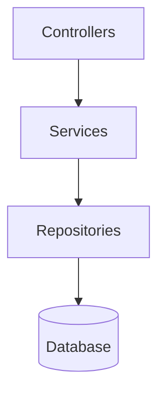

## Modular Monolith

Organizes by business capability:

```txt
Orders module
Payments module
Inventory module
Shipping module
```

Diagram:

```mermaid
flowchart TD
    ORDERS[Orders Module]

    PAYMENTS[Payments Module]

    INVENTORY[Inventory Module]

    SHIPPING[Shipping Module]
```

## Practical Combination

A good modular monolith often uses both:

```txt
Business modules first.
Layers inside each module.
```

Diagram:

```mermaid
flowchart TD
    APP[Application]

    ORDERS[Orders Module]
    PAYMENTS[Payments Module]

    ORDERS_API[Orders API]
    ORDERS_DOMAIN[Orders Domain]
    ORDERS_REPO[Orders Repository]

    PAYMENTS_API[Payments API]
    PAYMENTS_DOMAIN[Payments Domain]
    PAYMENTS_REPO[Payments Repository]

    APP --> ORDERS
    APP --> PAYMENTS

    ORDERS --> ORDERS_API
    ORDERS --> ORDERS_DOMAIN
    ORDERS --> ORDERS_REPO

    PAYMENTS --> PAYMENTS_API
    PAYMENTS --> PAYMENTS_DOMAIN
    PAYMENTS --> PAYMENTS_REPO
```

Bad design is organizing only by technical layer:

```txt
/controllers
/services
/repositories
/models
```

That often hides business boundaries.

Better:

```txt
/modules/orders
/modules/payments
/modules/inventory
```

---

# 15. Modular Monolith vs Distributed Monolith

A distributed monolith is when services are separated physically but still tightly coupled logically.

## Distributed Monolith

```mermaid
flowchart TD
    ORDER_SERVICE[Order Service]
    PAYMENT_SERVICE[Payment Service]
    INVENTORY_SERVICE[Inventory Service]

    SHARED_DB[(Shared Database)]

    ORDER_SERVICE --> PAYMENT_SERVICE
    PAYMENT_SERVICE --> INVENTORY_SERVICE
    INVENTORY_SERVICE --> ORDER_SERVICE

    ORDER_SERVICE --> SHARED_DB
    PAYMENT_SERVICE --> SHARED_DB
    INVENTORY_SERVICE --> SHARED_DB

    PROBLEM[Problem: distributed complexity without real independence]

    SHARED_DB --> PROBLEM
```

## Why It Is Bad

```txt
Multiple deployments.

Network failures.

Shared database coupling.

No real independence.

Hard debugging.

Harder transactions.

No clean ownership.
```

A clean modular monolith is usually better than fake microservices.

---

# 16. Implementation Shape Without Code

## Step 1: Identify Business Capabilities

```mermaid
flowchart TD
    SYSTEM[System]

    SYSTEM --> CAP1[Capability A]
    SYSTEM --> CAP2[Capability B]
    SYSTEM --> CAP3[Capability C]
```

Ask:

```txt
What does the business do?
```

Not:

```txt
What technical folders do we need?
```

Good module names:

```txt
Orders
Payments
Inventory
Shipping
Accounts
Billing
Scheduling
Claims
```

Bad module names:

```txt
Helpers
Managers
Utils
Common
Services
```

Those become junk drawers.

---

## Step 2: Define Module Ownership

```mermaid
flowchart TD
    MODULE[Module]

    RULES[Business Rules]
    DATA[Owned Data]
    USECASES[Use Cases]
    EVENTS[Events]

    MODULE --> RULES
    MODULE --> DATA
    MODULE --> USECASES
    MODULE --> EVENTS
```

Each module should own something real.

If a module owns nothing, it is probably not a module.

---

## Step 3: Define Public Interfaces

```mermaid
flowchart TD
    OTHER[Other Modules]

    PUBLIC[Module Public Interface]

    INTERNAL[Module Internals]

    OTHER --> PUBLIC
    PUBLIC --> INTERNAL

    OTHER -. should not access .-> INTERNAL
```

The public interface is the contract.

Everything else is private implementation.

---

## Step 4: Protect Data Access

```mermaid
flowchart TD
    MODULE_A[Module A]

    MODULE_B_API[Module B Public API]

    MODULE_B_DB[(Module B Tables)]

    MODULE_A --> MODULE_B_API
    MODULE_A -. should not write directly .-> MODULE_B_DB
```

This is one of the most important rules.

Modules should not freely write each other’s tables.

---

## Step 5: Add Internal Events for Side Effects

```mermaid
flowchart TD
    ORDER[Orders Module]

    EVENT[OrderPlaced Event]

    NOTIFY[Notification Module]
    ANALYTICS[Analytics Module]
    AUDIT[Audit Module]

    ORDER --> EVENT

    EVENT --> NOTIFY
    EVENT --> ANALYTICS
    EVENT --> AUDIT
```

Events are good for side effects that should not clutter the core use case.

---

# 17. Rules for a Healthy Modular Monolith

```txt
Modules are based on business capabilities.

Each module owns its business rules.

Each module owns its data access.

Modules communicate through public interfaces.

Internal implementation is hidden.

Cross-module database writes are forbidden.

Shared utilities are kept small.

Events are used for secondary reactions.

Controllers stay thin.

Use cases live inside modules.

Tests can target modules independently.
```

---

# 18. Common Mistakes

## Mistake 1: Calling Folders “Modules”

Bad:

```txt
/controllers
/services
/repositories
/models
```

That is layering, not modularity.

Better:

```txt
/modules/orders
/modules/payments
/modules/inventory
/modules/shipping
```

---

## Mistake 2: Shared Database With No Ownership

Bad:

```txt
Any module can read or write any table.
```

Better:

```txt
Each module owns its own tables.

Other modules request behavior through public interfaces.
```

---

## Mistake 3: Giant Shared Module

Bad:

```txt
SharedModule:
- validation
- email
- payment helpers
- date logic
- business rules
- constants
- DTOs
- random utilities
```

That becomes a landfill.

Shared code should be boring and generic.

Business logic should stay inside business modules.

---

## Mistake 4: Overusing Events

Bad:

```txt
Everything publishes events.
Everything reacts to everything.
No one knows the actual workflow.
```

Use events where decoupling is valuable.

Do not use events to hide a workflow that should be explicit.

---

## Mistake 5: Pretending It Is Microservices

A modular monolith is not microservices.

Do not add unnecessary network boundaries inside the same app.

The benefit is that modules are separated logically, not physically.

---

# 19. When to Use Modular Monolith

Use a modular monolith when:

```txt
You want simple deployment.

You want clean internal boundaries.

The team is small or medium.

The product is still evolving.

Business boundaries are emerging but not stable enough for services.

You want to avoid distributed system complexity.

You may extract services later.

You need strong consistency across workflows.

You want better maintainability than a messy monolith.
```

---

# 20. When Not to Use Modular Monolith

Do not use it when:

```txt
Independent deployment is already required.

Different modules need radically different scaling.

Teams need hard service ownership boundaries.

Security or regulatory needs require physical isolation.

One module must fail independently from the rest.

The app is already so large that one deployable unit is blocking delivery.

You have mature service infrastructure and clear domain boundaries.
```

Even then, extract carefully.

Microservices are not magic.

---

# 21. Common Smell That Suggests Modular Monolith

Modular Monolith is a good fit when you see this:

```txt
We want microservice-like boundaries,
but we do not want microservice-level operational complexity yet.
```

Other signs:

```txt
The team is tired of tangled monolith code.

The app is not large enough to justify microservices.

The domain has clear business areas.

The same deployment pipeline is still acceptable.

Most workflows are strongly connected.

You want future service extraction to be possible.
```

---

# 22. Common Smell That Suggests Extraction Later

A module may later become a service when:

```txt
It has a clear business boundary.

It owns its data.

It already communicates through public interfaces.

It needs independent scaling.

It needs independent deployment.

It has a dedicated team.

It has different reliability or security requirements.
```

Do not extract modules that are still tangled.

You will just move the mess across the network.

---

# 23. Migration Path: Messy Monolith to Modular Monolith

```mermaid
flowchart LR
    MESS[Messy Monolith]

    IDENTIFY[Identify Business Capabilities]

    GROUP[Group Code by Module]

    PUBLIC[Define Public Module APIs]

    DATA[Assign Data Ownership]

    RULES[Enforce Dependency Rules]

    EVENTS[Add Internal Events Where Useful]

    MODULAR[Modular Monolith]

    MESS --> IDENTIFY
    IDENTIFY --> GROUP
    GROUP --> PUBLIC
    PUBLIC --> DATA
    DATA --> RULES
    RULES --> EVENTS
    EVENTS --> MODULAR
```

## Practical Steps

```txt
1. Identify business capabilities.
2. Move related code into module folders.
3. Define public operations for each module.
4. Stop direct cross-module database writes.
5. Move business rules into owning modules.
6. Replace random shared utilities with clear module-owned logic.
7. Add tests around module boundaries.
8. Use internal events for secondary reactions.
9. Extract services later only when justified.
```

---

# 24. Best Visual Summary

```mermaid
flowchart LR
    CLIENT[Client]

    APP[One Deployable Application]

    MODULE_A[Module A]
    MODULE_B[Module B]
    MODULE_C[Module C]

    PUBLIC_API[Public Module Interfaces]

    CLIENT --> APP

    APP --> PUBLIC_API

    PUBLIC_API --> MODULE_A
    PUBLIC_API --> MODULE_B
    PUBLIC_API --> MODULE_C
```

## Final Meaning

A modular monolith is not “just a monolith.”

It is a monolith with discipline.

Use it when you want clean architecture, strong boundaries, simple deployment, and the option to extract services later without creating a distributed disaster.
