# Monolith Architecture Using Diagrams

## Core Idea

A **Monolith** is a software architecture where the application is built, packaged, and deployed as one unit.

In simple words:

```txt
One application.
One codebase or tightly connected codebase.
One deployable unit.
Many internal modules.
```

A monolith can still have clean internal architecture.

Bad monolith:

```txt
Everything calls everything.
No clear boundaries.
Business logic mixed with UI, database, and integrations.
```

Good monolith:

```txt
One deployable application.
Clear modules inside.
Strong boundaries.
Clean dependency direction.
```

The problem is not “monolith.”

The problem is usually an **unstructured monolith**.

---

# 1. Monolith: General Structure

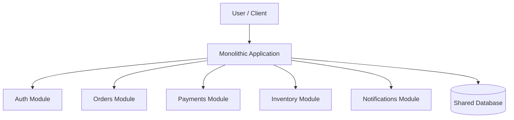

## What This Means

The system has many responsibilities, but they are deployed together.

The modules may be separate internally, but they live inside one application process or one deployable artifact.

---

# 2. Simple Mental Model

Think of a monolith like one large building.

```txt
One building.

Inside the building:
- accounting department
- sales department
- operations department
- support department
- engineering department
```

The departments can be organized well or badly.

A good monolith has hallways, doors, labels, and rules.

A bad monolith is one giant room where everyone shouts across the floor.

---

# 3. The Problem Monolith Solves

A monolith is often the simplest way to start because it avoids distributed system complexity.

With a monolith, you do not immediately need:

```txt
Service discovery
Distributed tracing
Network retries
Eventual consistency
Cross-service authentication
Multiple deployment pipelines
Distributed transactions
Complex observability
```

For many early systems, microservices are overkill.

A monolith lets the team build the product faster.

---

# 4. What a Bad Monolith Looks Like

## Big Ball of Mud

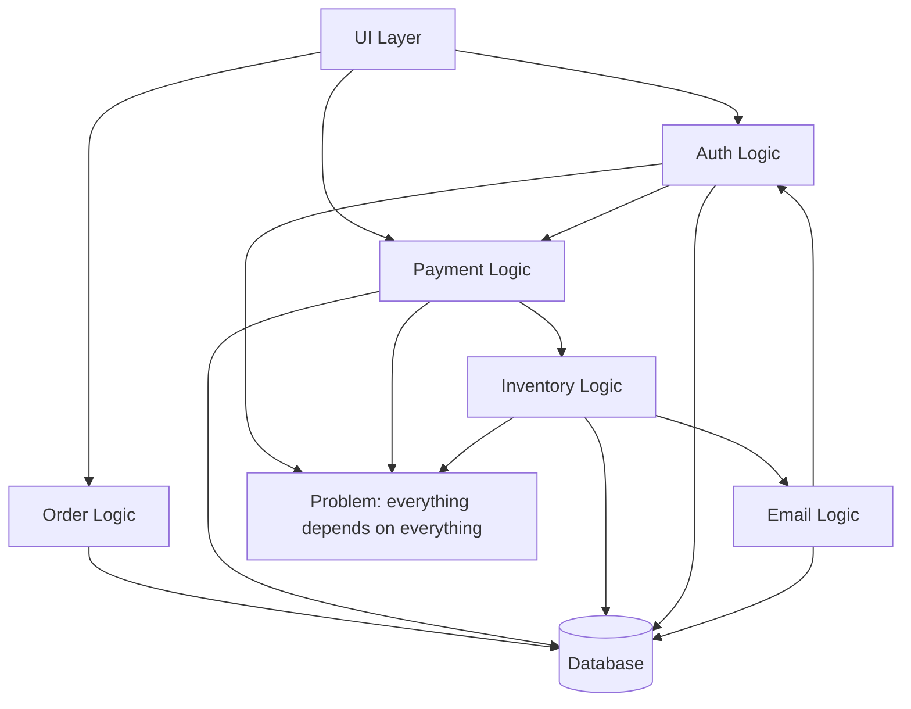

This is the version people complain about.

The problem is uncontrolled coupling.

---

## Why This Becomes Painful

```txt
Small changes break unrelated features.

Testing becomes slow and fragile.

Developers are afraid to touch old code.

Business rules are duplicated.

Database tables are shared with no ownership.

No module has a clear responsibility.

Deployments become risky.
```

That is not just “monolith pain.”

That is **bad modularity pain**.

---

# 5. What a Good Monolith Looks Like

## Modular Monolith

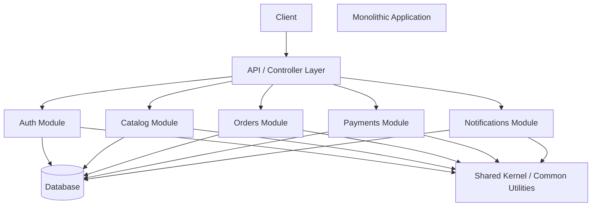

## What This Means

The application is still deployed as one unit.

But internally, it has clear module boundaries.

Each module owns its logic.

Ideally, each module also owns its data access rules.

---

# 6. Example 1: E-Commerce Monolith

## Problem

A startup is building an online store.

The system needs:

```txt
User accounts
Product catalog
Shopping cart
Checkout
Payments
Orders
Shipping
Email notifications
Admin dashboard
```

A team might be tempted to create microservices immediately.

But early on, the business is still changing fast.

Splitting everything into services too early can slow the team down.

---

## Architect Questions

An architect would ask:

```txt
Is the product still changing quickly?

Is the team small?

Do we really need independent service deployments?

Are module boundaries clear yet?

Can one database transaction simplify the workflow?

Would microservices add more operational complexity than value?

Can we design this as a modular monolith first?

Which modules may later become services?
```

---

## Monolith Diagram

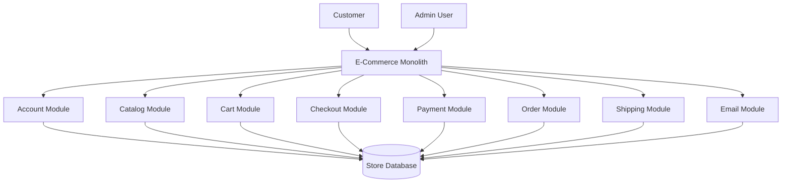

---

## Runtime Flow: Place Order

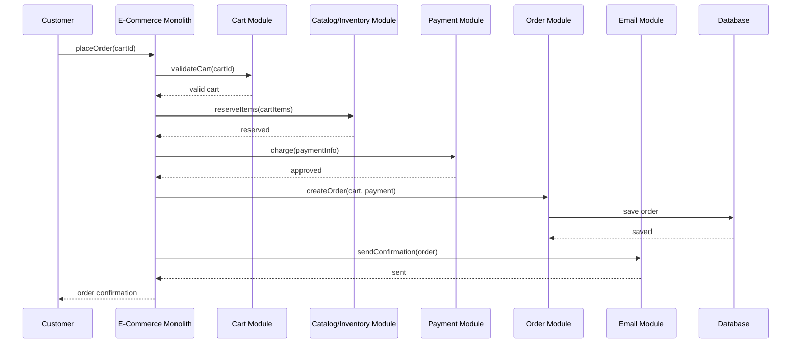

---

## Architectural Meaning

Everything is inside one deployable application.

The benefit is simplicity:

```txt
One deployment.
One database transaction if needed.
One place to debug.
Simpler local development.
No network calls between modules.
```

The risk is that the modules may become tangled if boundaries are not enforced.

---

# 7. Example 2: Internal HR Platform Monolith

## Problem

A company builds an internal HR platform.

Features include:

```txt
Employee profiles
Time-off requests
Payroll exports
Performance reviews
Document storage
Manager approvals
Notifications
```

The system is important, but it may not need massive scale.

A monolith may be the right choice.

---

## Architect Questions

An architect would ask:

```txt
How many users will use this system?

Does the system need independent scaling by feature?

Does each feature require separate deployment?

Is operational simplicity more valuable than service isolation?

Can the modules be separated cleanly inside one app?

Will the company have enough DevOps maturity for distributed services?

Are compliance and audit requirements easier in one deployable system?
```

---

## Monolith Diagram

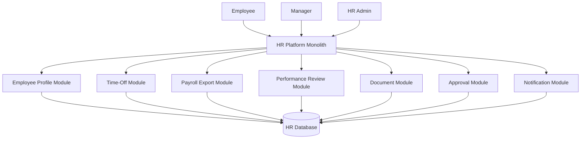

---

## Runtime Flow: Request Time Off

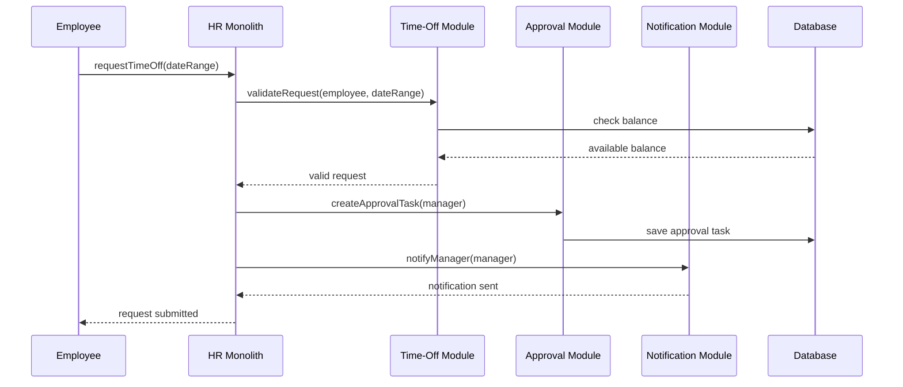

---

## Architectural Meaning

The HR platform may not need microservices.

A well-structured monolith is easier to build, deploy, audit, and maintain.

The key is module discipline.

---

# 8. Example 3: Learning Management System Monolith

## Problem

A school or training company builds a learning platform.

Features include:

```txt
Courses
Lessons
Students
Assignments
Quizzes
Grades
Certificates
Payments
Notifications
```

This system has many modules, but they are tightly related.

A modular monolith can be a strong fit.

---

## Architect Questions

An architect would ask:

```txt
Are the features tightly connected?

Do courses, quizzes, grades, and certificates share workflows?

Will independent deployment actually help?

Is the team large enough to manage many services?

Can a single database simplify reporting?

Do we expect extreme scaling differences between modules?

Can we keep modules separated internally?
```

---

## Monolith Diagram

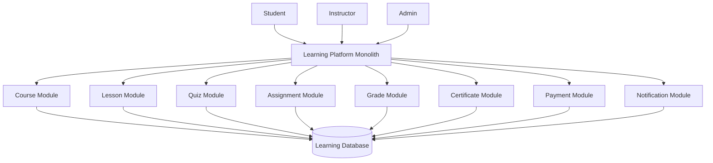

---

## Runtime Flow: Complete Course

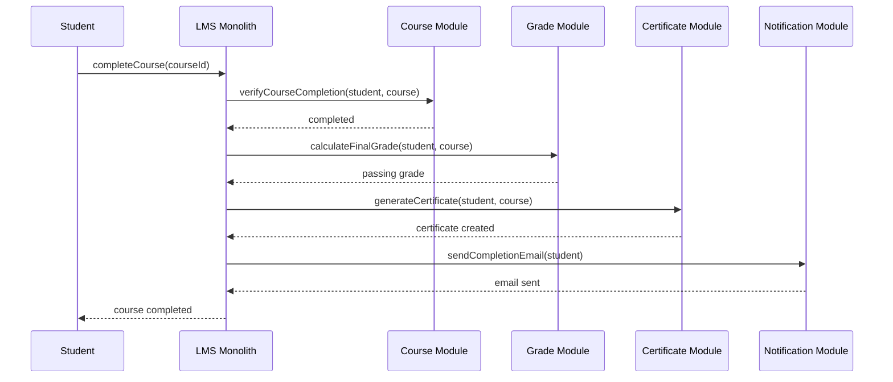

---

## Architectural Meaning

This is a good monolith candidate because the workflows are closely connected.

Splitting too early could create unnecessary distributed complexity.

---

# 9. Monolith vs Modular Monolith

## Traditional Unstructured Monolith

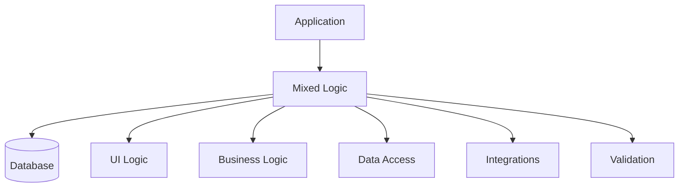

This is bad.

Everything is mixed.

---

## Modular Monolith

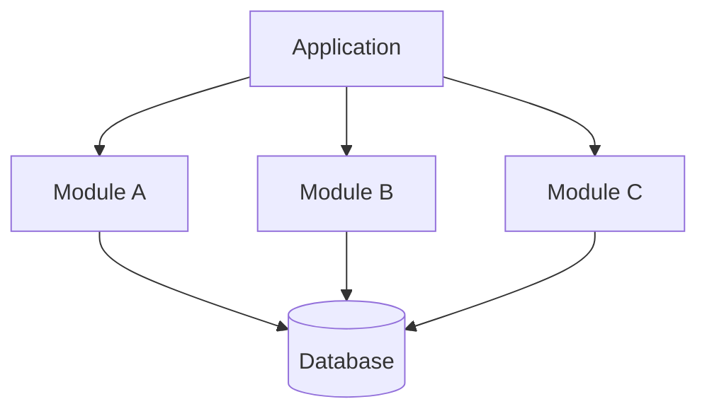

This is better.

The deployment is still one unit, but the internal boundaries are clear.

---

## Main Difference

| Type                  | Meaning                                                   |
| --------------------- | --------------------------------------------------------- |
| Unstructured Monolith | One deployable unit with tangled internal code            |
| Modular Monolith      | One deployable unit with clear internal module boundaries |

The second one is usually the smart starting point.

---

# 10. Monolith vs Microservices

## Monolith

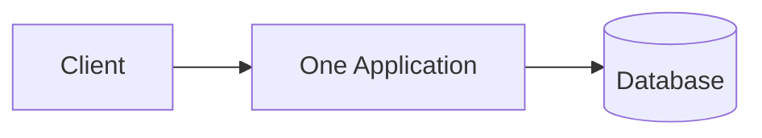

## Microservices

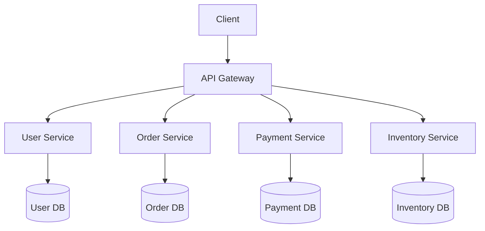

## Main Difference

| Architecture  | Main Idea                              |
| ------------- | -------------------------------------- |
| Monolith      | One deployable application             |
| Microservices | Many independently deployable services |

---

# 11. Tradeoff: Monolith vs Microservices

| Question               | Monolith                             | Microservices                                             |
| ---------------------- | ------------------------------------ | --------------------------------------------------------- |
| Deployment             | One deployment                       | Many deployments                                          |
| Local development      | Easier                               | Harder                                                    |
| Transactions           | Simpler                              | Harder                                                    |
| Debugging              | Easier at first                      | Harder without tooling                                    |
| Scaling                | Whole app scales together            | Services can scale independently                          |
| Team autonomy          | Lower                                | Higher if teams are mature                                |
| Operational complexity | Lower                                | Higher                                                    |
| Failure isolation      | Lower                                | Higher if designed well                                   |
| Network complexity     | Low                                  | High                                                      |
| Best for               | Early/simple/tightly coupled systems | Large systems with clear boundaries and mature operations |

Blunt truth:

```txt
Most teams should not start with microservices unless they have a real reason.
```

A modular monolith is often the better first architecture.

---

# 12. Monolith Strengths

```txt
Simple deployment.

Simple local development.

Easy debugging.

Easy transaction management.

No network latency between internal modules.

Lower infrastructure cost.

Lower DevOps burden.

Good for small teams.

Good for early-stage products.

Good when business rules are still changing.
```

---

# 13. Monolith Weaknesses

```txt
Can become tightly coupled.

Large codebase can slow development.

One deployment can affect the whole system.

One bug can take down the whole app.

Scaling is coarse-grained.

Build/test times can become long.

Poor boundaries make future extraction difficult.

Shared database can become a coupling trap.
```

The monolith does not automatically fail.

It fails when boundaries are ignored.

---

# 14. Clean Monolith Internal Design

A monolith should still have layers and modules.

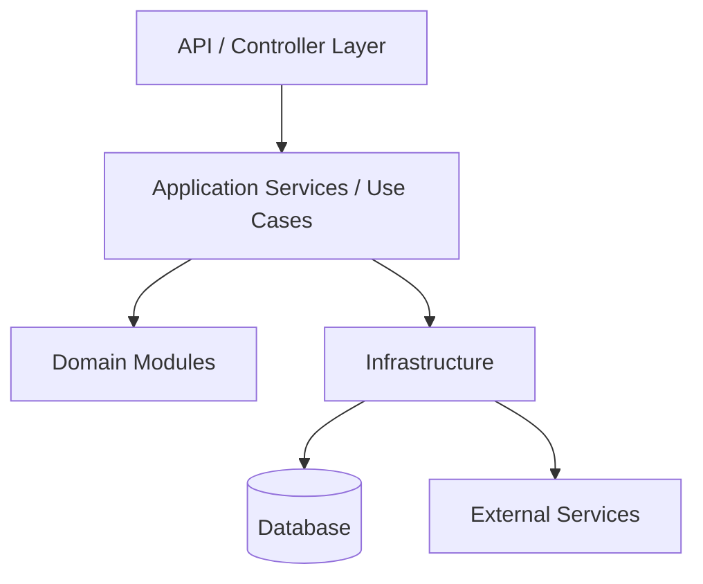

## Meaning

```txt
API layer handles requests.
Application layer coordinates use cases.
Domain modules contain business rules.
Infrastructure handles database and external systems.
```

Do not dump everything into controllers.

That is how monoliths rot.

---

# 15. Module Boundary Design

A good monolith should have explicit boundaries.

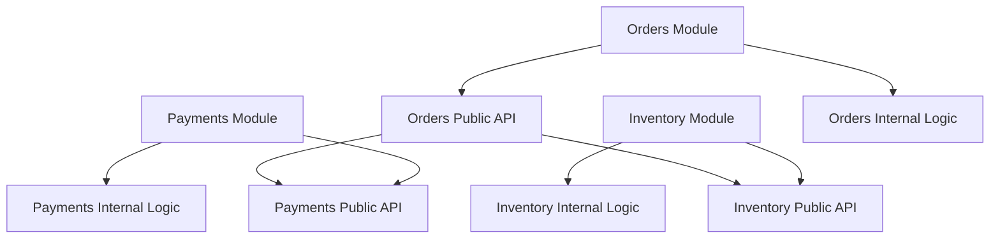

## Rule

Modules should not reach into each other’s internals.

They should communicate through public interfaces.

Bad:

```txt
Orders module directly modifies payment tables.
```

Better:

```txt
Orders module calls Payment module public operation.
```

---

# 16. Shared Database Risk

Many monoliths use one database.

That is normal.

But the risk is table ownership becoming unclear.

## Bad Shared Database

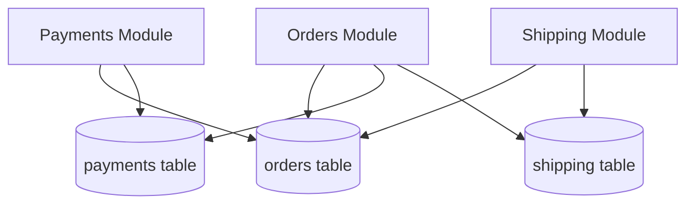

Problem:

```txt
Every module reads and writes every table.
No ownership.
Changes become dangerous.
```

---

## Better Shared Database Discipline

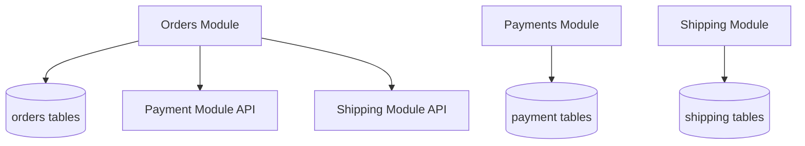

Each module owns its tables.

Other modules ask through module APIs or application services.

---

# 17. When to Use a Monolith

Use a monolith when:

```txt
The team is small.

The product is early.

Requirements are changing quickly.

You need fast development speed.

The system does not require independent scaling per feature.

The domain boundaries are not clear yet.

Operational simplicity matters.

The features are tightly connected.

You want simpler transactions and debugging.
```

---

# 18. When Not to Use a Monolith

Avoid a monolith when:

```txt
Different parts need very different scaling.

Different teams need independent deployment.

The system is already too large for one deployable unit.

Failures must be isolated by service boundary.

Regulatory or security boundaries require isolation.

Build and deployment times are blocking the organization.

Clear domain boundaries already exist and are stable.

You have mature DevOps, observability, and service ownership.
```

Do not jump to microservices just because the monolith is messy.

A messy monolith often becomes messy microservices.

Fix the boundaries first.

---

# 19. Common Smell That Suggests Monolith Is Still Fine

A monolith is probably fine when:

```txt
The app is mostly one business product.

The same team owns most features.

Most workflows touch many parts of the system.

The database transactions are important.

The traffic is not extreme.

The team does not yet have clear service boundaries.
```

In this case, a modular monolith is usually the best move.

---

# 20. Common Smell That Suggests Monolith Is Becoming a Problem

A monolith may be outgrowing itself when:

```txt
Every small change requires a full risky deployment.

Teams constantly block each other.

Build and test times are painful.

One module causes outages for unrelated modules.

Scaling one hot feature requires scaling the whole app.

Boundaries are clear, but deployment is still forced together.

The database is the main coupling point.
```

That is when service extraction may become reasonable.

---

# 21. Migration Path: Monolith to Services

Do not split randomly.

Split by stable business capability.

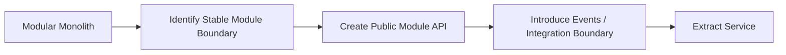

## Sensible Extraction Order

```txt
1. Clean internal module boundaries.
2. Stop cross-module database writes.
3. Define public module interfaces.
4. Add integration events where useful.
5. Extract one module only when there is a real reason.
6. Keep the rest monolithic until extraction is justified.
```

Bad migration:

```txt
Split database and services before understanding boundaries.
```

That just creates a distributed mess.

---

# 22. Monolith vs Distributed Monolith

## Distributed Monolith

A distributed monolith is the worst of both worlds.

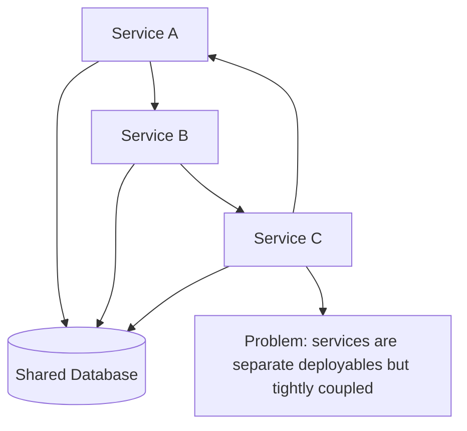

## Why It Is Bad

```txt
Many deployments.
Network calls.
Shared database coupling.
No real team independence.
No real failure isolation.
Harder debugging.
Harder transactions.
```

This is worse than a monolith.

A clean monolith is better than fake microservices.

---

# 23. Implementation Shape Without Code

## Step 1: Start With One Deployable App

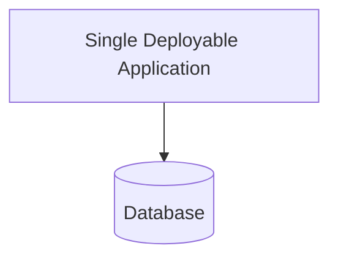

Keep deployment simple at first.

---

## Step 2: Split Internally by Module

```mermaid
flowchart TD
    APP[Application]

    M1[Module A]
    M2[Module B]
    M3[Module C]

    APP --> M1
    APP --> M2
    APP --> M3
```

Modules should map to business capabilities.

---

## Step 3: Define Dependency Rules

```mermaid
flowchart TD
    API[API Layer]

    USECASE[Application / Use Case Layer]

    DOMAIN[Domain Modules]

    INFRA[Infrastructure]

    API --> USECASE
    USECASE --> DOMAIN
    USECASE --> INFRA
```

Dependencies should not be random.

---

## Step 4: Protect Module Internals

```mermaid
flowchart TD
    MODULE[Module]

    PUBLIC[Public Interface]

    INTERNAL[Internal Implementation]

    MODULE --> PUBLIC
    MODULE --> INTERNAL

    OTHER[Other Module]

    OTHER --> PUBLIC
    OTHER -. should not access .-> INTERNAL
```

Other modules should not bypass the public interface.

---

## Step 5: Extract Later Only If Needed

```mermaid
flowchart TD
    MONOLITH[Modular Monolith]

    MODULE[Stable Module]

    REASON[Real Extraction Reason]

    SERVICE[Independent Service]

    MONOLITH --> MODULE
    MODULE --> REASON
    REASON --> SERVICE
```

Valid extraction reasons:

```txt
Independent scaling
Independent deployment
Security isolation
Team ownership
Performance isolation
Clear business boundary
```

---

# 24. Simple Architecture Summary

| Concept              | Meaning                                                     |
| -------------------- | ----------------------------------------------------------- |
| Monolith             | One deployable application                                  |
| Modular Monolith     | One deployable application with clear internal modules      |
| Big Ball of Mud      | Unstructured monolith with tangled dependencies             |
| Shared Database      | One database used by the app, risky if ownership is unclear |
| Module Boundary      | Rule that controls how modules interact                     |
| Service Extraction   | Moving a module into its own deployable service             |
| Distributed Monolith | Multiple services that are still tightly coupled            |

---

# 25. Best Visual Summary

```mermaid
flowchart LR
    CLIENT[Client]

    MONOLITH[One Deployable Application]

    MODULES[Clear Internal Modules]

    DATABASE[(Database)]

    CLIENT --> MONOLITH
    MONOLITH --> MODULES
    MONOLITH --> DATABASE
```

## Final Meaning

A monolith is not automatically bad.

A messy monolith is bad.

A modular monolith is often the best starting architecture because it gives you simple deployment while still preserving clean internal boundaries.

Use microservices later only when the business, team, scale, or operational needs justify the extra complexity.
