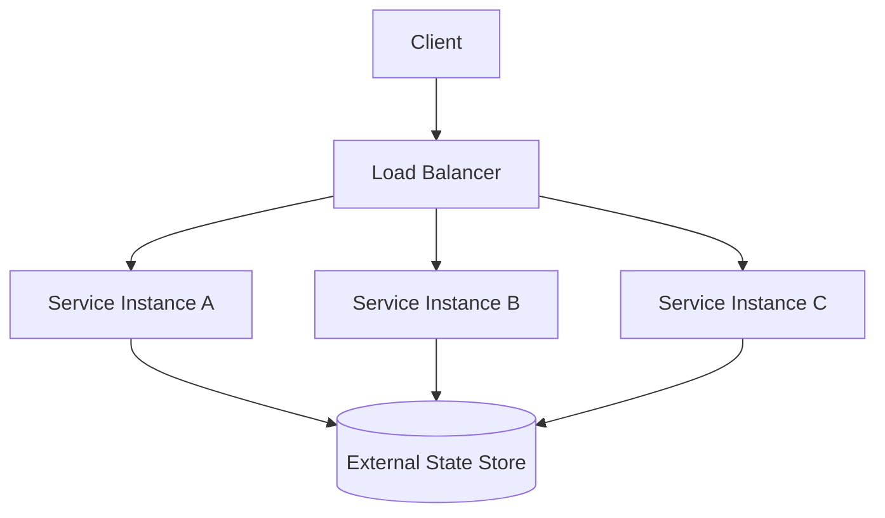
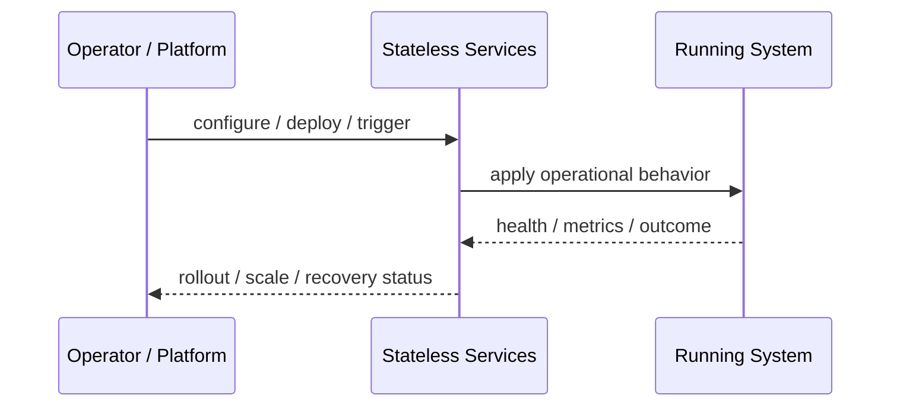
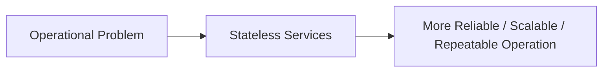

# Stateless Services

## Core Idea

Stateless Services do not store client/session-specific state inside the service instance between requests.

---

## Problem It Solves

Services that keep local session state are hard to scale, replace, restart, and load-balance.

---

## 3 Concrete Examples

### Example 1: Web API Replicas

Any API replica can handle any request because session data is stored in a shared store or token.

### Example 2: Containerized Backend

A crashed container can be replaced without losing user workflow state.

### Example 3: Serverless Function

Each invocation reads needed state from external storage instead of relying on local memory.

---

## Architect Questions

- What state currently lives inside the service instance?
- Where should session, cache, workflow, or user state live instead?
- Can any replica handle any request?
- What happens when an instance is killed mid-request?
- Is local cache safe to lose?
- How will authentication/session identity be restored per request?

---

## Main Diagram



---

## Runtime / Operational Flow



---

## Implementation Shape

```txt
1. Identify the operational pressure: scale, reliability, release risk, latency, cost, resilience, or repeatability.
2. Define the boundary where this pattern applies: service, deployment, region, cell, edge, infrastructure, or traffic layer.
3. Define automation rules and rollback rules.
4. Define state ownership and data migration implications.
5. Define health checks, metrics, logs, traces, and alerts.
6. Test failure behavior, rollout behavior, and recovery behavior.
7. Keep the pattern focused. Do not add cloud-native machinery without a real operational reason.
```

---

## When to Use

- You want easy horizontal scaling.
- Instances may restart or be replaced frequently.
- Any request should be routable to any replica.

---

## When Not to Use

- The service fundamentally owns local durable state.
- Externalizing state would make the system worse.
- Sticky sessions are unavoidable and accepted.

---

## Common Smell That Suggests This Pattern

```txt
The system is becoming hard to deploy, hard to scale, hard to recover,
too fragile under failure,
too slow for users,
or too dependent on manual operations.
```

---

## Common Mistakes

```txt
Using a cloud-native pattern without operational maturity.

Ignoring state and database migration problems.

Adding automation with no rollback.

Scaling the app while the database remains the bottleneck.

Treating deployment strategy as a substitute for testing.

Creating infrastructure that nobody can debug.
```

---

## Best Visual Summary



## Final Meaning

Stateless Services is useful when it solves a real operational pressure. If the system is small or the risk is not real yet, the pattern can add cost and complexity before it adds value.
