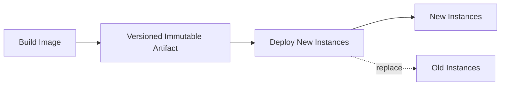
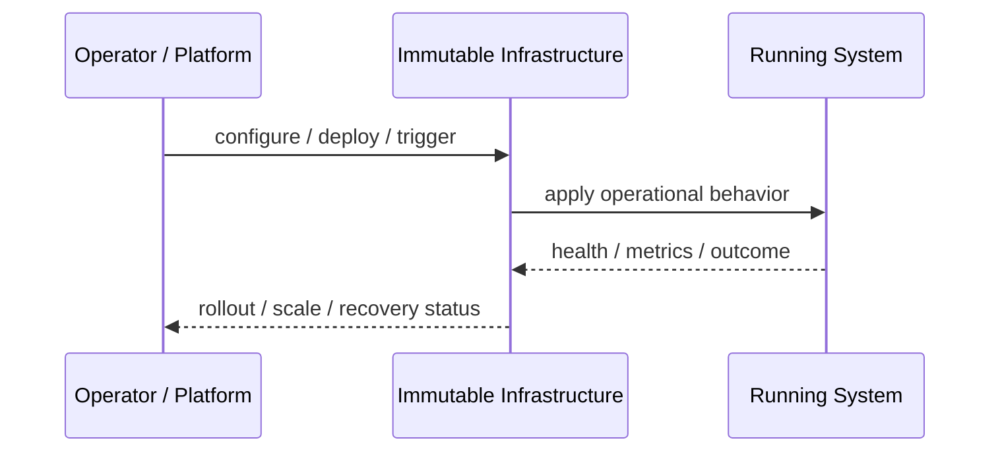
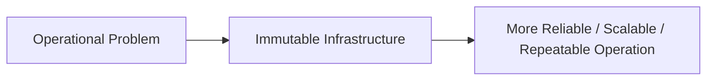

# Immutable Infrastructure

## Core Idea

Immutable Infrastructure replaces servers or containers instead of modifying them in place.

---

## Problem It Solves

Long-lived servers drift over time, making deployments, debugging, rollback, and reproducibility painful.

---

## 3 Concrete Examples

### Example 1: Golden VM Image

A new machine image is built for each release and old instances are replaced.

### Example 2: Container Deployment

A new container image is deployed instead of patching a running container.

### Example 3: Auto Scaling Group Refresh

Instances are terminated and recreated from a new launch template.

---

## Architect Questions

- Can infrastructure be rebuilt from source/configuration?
- Are servers being patched manually?
- How are images versioned?
- How is rollback performed?
- Where is persistent data stored?
- How do we prove production matches the declared artifact?

---

## Main Diagram



---

## Runtime / Operational Flow



---

## Implementation Shape

```txt
1. Identify the operational pressure: scale, reliability, release risk, latency, cost, resilience, or repeatability.
2. Define the boundary where this pattern applies: service, deployment, region, cell, edge, infrastructure, or traffic layer.
3. Define automation rules and rollback rules.
4. Define state ownership and data migration implications.
5. Define health checks, metrics, logs, traces, and alerts.
6. Test failure behavior, rollout behavior, and recovery behavior.
7. Keep the pattern focused. Do not add cloud-native machinery without a real operational reason.
```

---

## When to Use

- You need reproducible environments.
- Manual server drift is a problem.
- Rollback should replace artifacts, not patch machines.

---

## When Not to Use

- The environment cannot be rebuilt automatically.
- Persistent local mutation is required.
- Build/release automation is not ready.

---

## Common Smell That Suggests This Pattern

```txt
The system is becoming hard to deploy, hard to scale, hard to recover,
too fragile under failure,
too slow for users,
or too dependent on manual operations.
```

---

## Common Mistakes

```txt
Using a cloud-native pattern without operational maturity.

Ignoring state and database migration problems.

Adding automation with no rollback.

Scaling the app while the database remains the bottleneck.

Treating deployment strategy as a substitute for testing.

Creating infrastructure that nobody can debug.
```

---

## Best Visual Summary



## Final Meaning

Immutable Infrastructure is useful when it solves a real operational pressure. If the system is small or the risk is not real yet, the pattern can add cost and complexity before it adds value.
