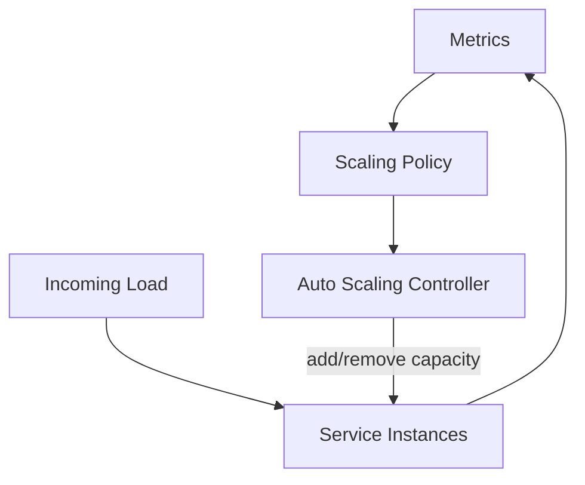
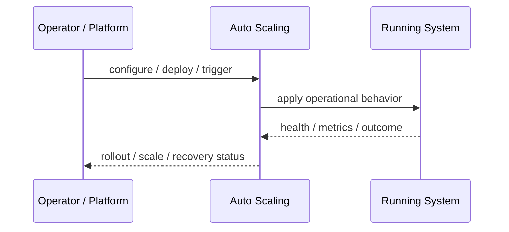
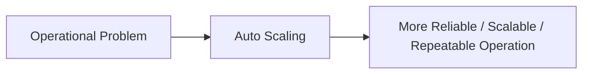

# Auto Scaling

## Core Idea

Auto Scaling automatically adjusts capacity based on demand, schedules, or metrics.

---

## Problem It Solves

Fixed capacity either wastes money during low demand or fails during high demand.

---

## 3 Concrete Examples

### Example 1: CPU-Based Scaling

Add more service replicas when CPU stays above 70%.

### Example 2: Queue-Based Scaling

Add workers when queue depth or message age grows.

### Example 3: Scheduled Scaling

Increase capacity before daily business-hour traffic starts.

---

## Architect Questions

- What metric best represents demand?
- What is the scale-out threshold?
- What is the scale-in threshold?
- How fast can new capacity become ready?
- What prevents flapping?
- Are downstream dependencies also scalable?

---

## Main Diagram



---

## Runtime / Operational Flow



---

## Implementation Shape

```txt
1. Identify the operational pressure: scale, reliability, release risk, latency, cost, resilience, or repeatability.
2. Define the boundary where this pattern applies: service, deployment, region, cell, edge, infrastructure, or traffic layer.
3. Define automation rules and rollback rules.
4. Define state ownership and data migration implications.
5. Define health checks, metrics, logs, traces, and alerts.
6. Test failure behavior, rollout behavior, and recovery behavior.
7. Keep the pattern focused. Do not add cloud-native machinery without a real operational reason.
```

---

## When to Use

- Load changes over time.
- Capacity should match demand.
- Metrics can reliably trigger scaling decisions.

---

## When Not to Use

- Metrics do not reflect demand.
- Startup time is too slow for traffic spikes.
- Downstream dependencies cannot scale too.

---

## Common Smell That Suggests This Pattern

```txt
The system is becoming hard to deploy, hard to scale, hard to recover,
too fragile under failure,
too slow for users,
or too dependent on manual operations.
```

---

## Common Mistakes

```txt
Using a cloud-native pattern without operational maturity.

Ignoring state and database migration problems.

Adding automation with no rollback.

Scaling the app while the database remains the bottleneck.

Treating deployment strategy as a substitute for testing.

Creating infrastructure that nobody can debug.
```

---

## Best Visual Summary



## Final Meaning

Auto Scaling is useful when it solves a real operational pressure. If the system is small or the risk is not real yet, the pattern can add cost and complexity before it adds value.
