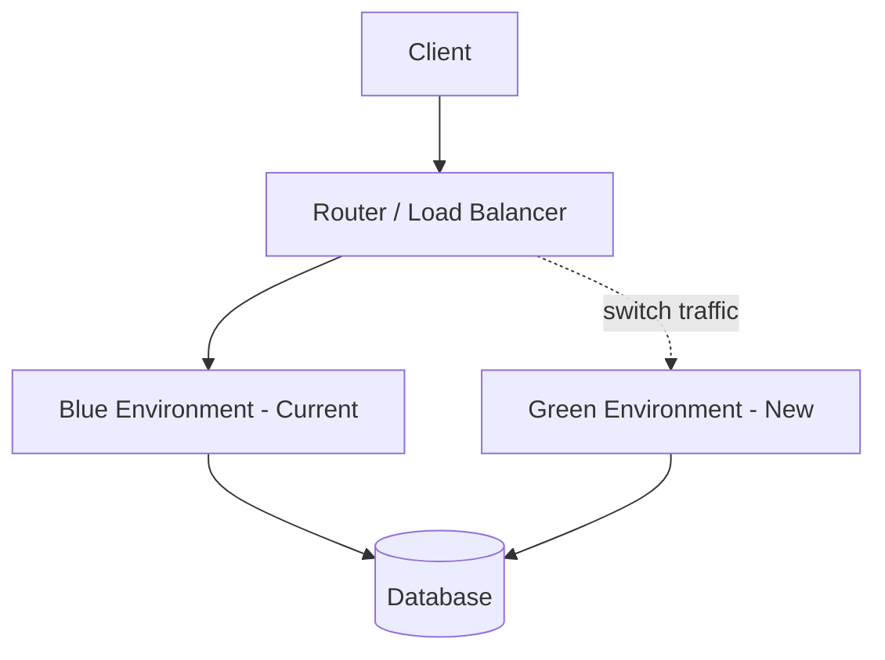
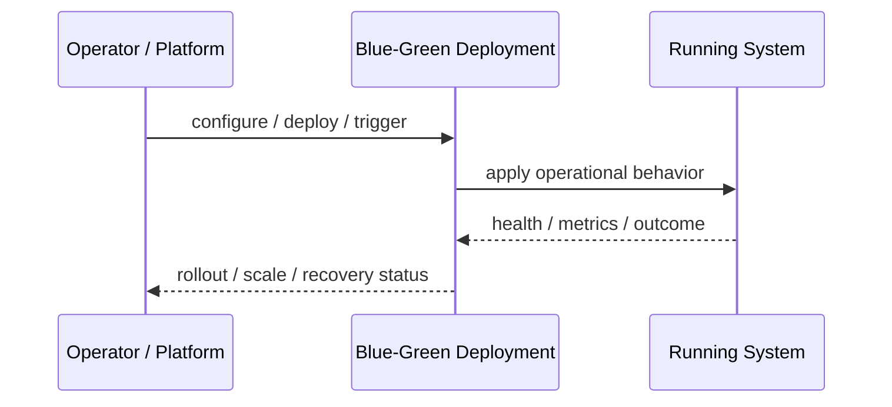
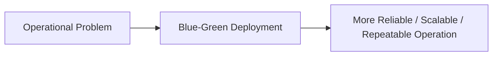

# Blue-Green Deployment

## Core Idea

Blue-Green Deployment keeps two production-like environments and switches traffic from the old version to the new version.

---

## Problem It Solves

Deployments need fast cutover and fast rollback with minimal downtime.

---

## 3 Concrete Examples

### Example 1: Web App Release

Blue runs current production while Green is deployed and tested before traffic switches.

### Example 2: API Upgrade

Traffic is moved from v1 environment to v2 environment after smoke tests.

### Example 3: Database-Compatible Release

A new app stack is prepared while the old one keeps serving traffic.

---

## Architect Questions

- Can we afford two production environments?
- How is traffic switched?
- How is rollback performed?
- Are database migrations backward compatible?
- How is Green validated before cutover?
- What happens to in-flight requests?

---

## Main Diagram



---

## Runtime / Operational Flow



---

## Implementation Shape

```txt
1. Identify the operational pressure: scale, reliability, release risk, latency, cost, resilience, or repeatability.
2. Define the boundary where this pattern applies: service, deployment, region, cell, edge, infrastructure, or traffic layer.
3. Define automation rules and rollback rules.
4. Define state ownership and data migration implications.
5. Define health checks, metrics, logs, traces, and alerts.
6. Test failure behavior, rollout behavior, and recovery behavior.
7. Keep the pattern focused. Do not add cloud-native machinery without a real operational reason.
```

---

## When to Use

- You need fast rollback.
- Two environments are affordable.
- Database changes are backward compatible.

---

## When Not to Use

- Two full environments are too expensive.
- Database migrations are not compatible.
- Traffic cutover cannot be controlled safely.

---

## Common Smell That Suggests This Pattern

```txt
The system is becoming hard to deploy, hard to scale, hard to recover,
too fragile under failure,
too slow for users,
or too dependent on manual operations.
```

---

## Common Mistakes

```txt
Using a cloud-native pattern without operational maturity.

Ignoring state and database migration problems.

Adding automation with no rollback.

Scaling the app while the database remains the bottleneck.

Treating deployment strategy as a substitute for testing.

Creating infrastructure that nobody can debug.
```

---

## Best Visual Summary



## Final Meaning

Blue-Green Deployment is useful when it solves a real operational pressure. If the system is small or the risk is not real yet, the pattern can add cost and complexity before it adds value.
