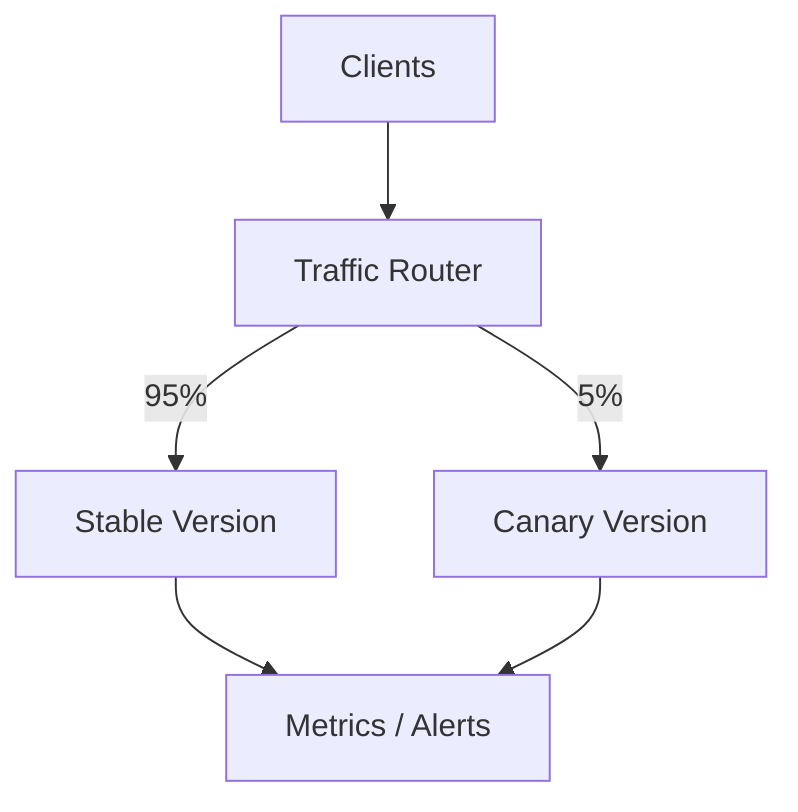
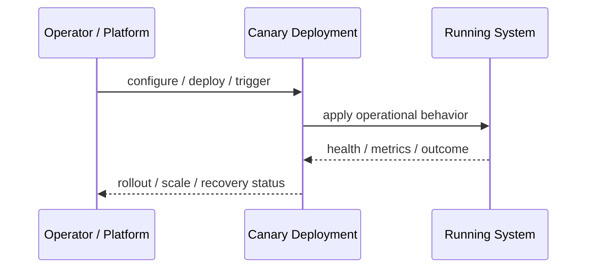
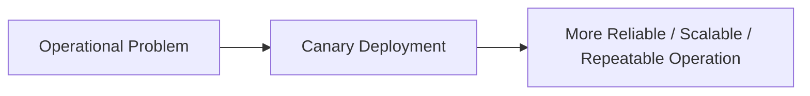

# Canary Deployment

## Core Idea

Canary Deployment releases a new version to a small percentage of traffic before gradually increasing exposure.

---

## Problem It Solves

A new release may contain bugs, and exposing it to all users at once is risky.

---

## 3 Concrete Examples

### Example 1: 5 Percent API Canary

Route 5% of traffic to v2 and monitor errors before increasing.

### Example 2: Tenant Canary

Enable the new backend for one internal tenant first.

### Example 3: Region Canary

Deploy to one low-risk region before global rollout.

---

## Architect Questions

- What traffic slice gets the canary?
- Which metrics decide promotion or rollback?
- How long should each stage run?
- Can users be consistently routed to the same version?
- Are database changes compatible with both versions?
- How is rollback automated?

---

## Main Diagram



---

## Runtime / Operational Flow



---

## Implementation Shape

```txt
1. Identify the operational pressure: scale, reliability, release risk, latency, cost, resilience, or repeatability.
2. Define the boundary where this pattern applies: service, deployment, region, cell, edge, infrastructure, or traffic layer.
3. Define automation rules and rollback rules.
4. Define state ownership and data migration implications.
5. Define health checks, metrics, logs, traces, and alerts.
6. Test failure behavior, rollout behavior, and recovery behavior.
7. Keep the pattern focused. Do not add cloud-native machinery without a real operational reason.
```

---

## When to Use

- You want to reduce release risk.
- Metrics can detect bad releases.
- Traffic can be split safely.

---

## When Not to Use

- You cannot split traffic reliably.
- You do not have fast metrics or rollback.
- A small traffic slice is not representative.

---

## Common Smell That Suggests This Pattern

```txt
The system is becoming hard to deploy, hard to scale, hard to recover,
too fragile under failure,
too slow for users,
or too dependent on manual operations.
```

---

## Common Mistakes

```txt
Using a cloud-native pattern without operational maturity.

Ignoring state and database migration problems.

Adding automation with no rollback.

Scaling the app while the database remains the bottleneck.

Treating deployment strategy as a substitute for testing.

Creating infrastructure that nobody can debug.
```

---

## Best Visual Summary



## Final Meaning

Canary Deployment is useful when it solves a real operational pressure. If the system is small or the risk is not real yet, the pattern can add cost and complexity before it adds value.
