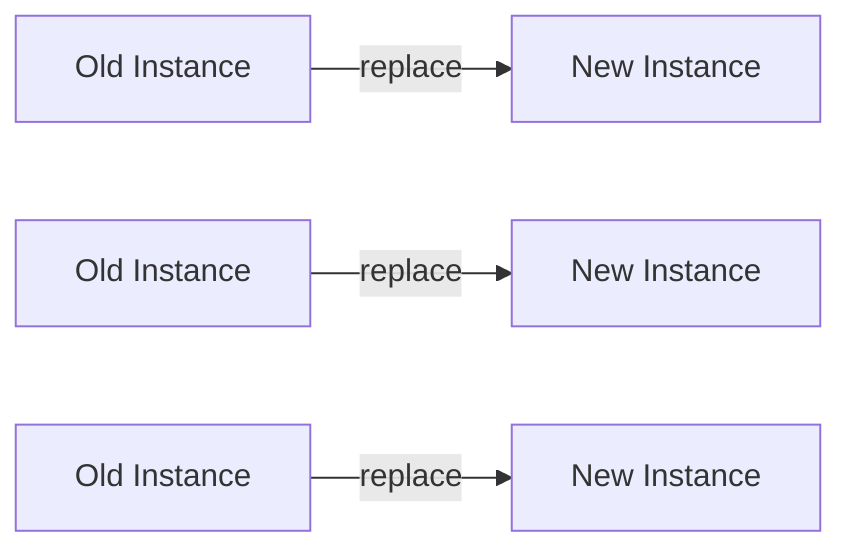
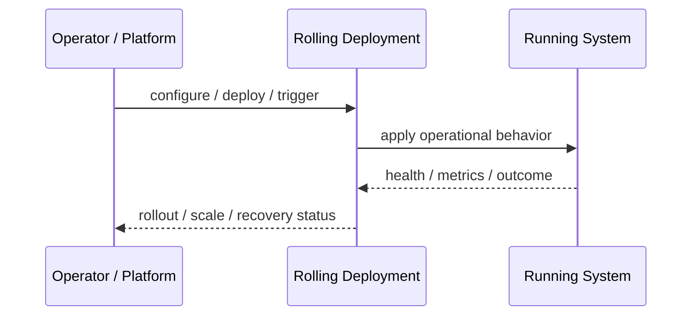
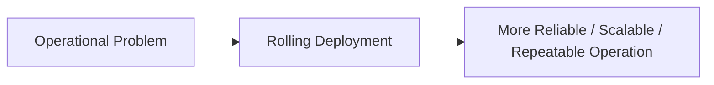

# Rolling Deployment

## Core Idea

Rolling Deployment replaces instances gradually while keeping the service available.

---

## Problem It Solves

A service needs updates without taking all instances offline at once.

---

## 3 Concrete Examples

### Example 1: Kubernetes Rolling Update

Pods are replaced one batch at a time.

### Example 2: VM Fleet Upgrade

A few instances are drained, updated, and returned before moving to the next batch.

### Example 3: API Patch Release

Load balancer removes old instances while new ones become healthy.

---

## Architect Questions

- How many instances can be unavailable during rollout?
- How many new instances can be added above normal capacity?
- Are old and new versions compatible?
- How are health checks defined?
- How is rollback triggered?
- Can in-flight traffic drain safely?

---

## Main Diagram



---

## Runtime / Operational Flow



---

## Implementation Shape

```txt
1. Identify the operational pressure: scale, reliability, release risk, latency, cost, resilience, or repeatability.
2. Define the boundary where this pattern applies: service, deployment, region, cell, edge, infrastructure, or traffic layer.
3. Define automation rules and rollback rules.
4. Define state ownership and data migration implications.
5. Define health checks, metrics, logs, traces, and alerts.
6. Test failure behavior, rollout behavior, and recovery behavior.
7. Keep the pattern focused. Do not add cloud-native machinery without a real operational reason.
```

---

## When to Use

- You need zero or low downtime updates.
- Old and new versions can coexist.
- Health checks can detect bad instances.

---

## When Not to Use

- Old and new versions are incompatible.
- Any mixed-version period is unsafe.
- Instances cannot drain gracefully.

---

## Common Smell That Suggests This Pattern

```txt
The system is becoming hard to deploy, hard to scale, hard to recover,
too fragile under failure,
too slow for users,
or too dependent on manual operations.
```

---

## Common Mistakes

```txt
Using a cloud-native pattern without operational maturity.

Ignoring state and database migration problems.

Adding automation with no rollback.

Scaling the app while the database remains the bottleneck.

Treating deployment strategy as a substitute for testing.

Creating infrastructure that nobody can debug.
```

---

## Best Visual Summary



## Final Meaning

Rolling Deployment is useful when it solves a real operational pressure. If the system is small or the risk is not real yet, the pattern can add cost and complexity before it adds value.
