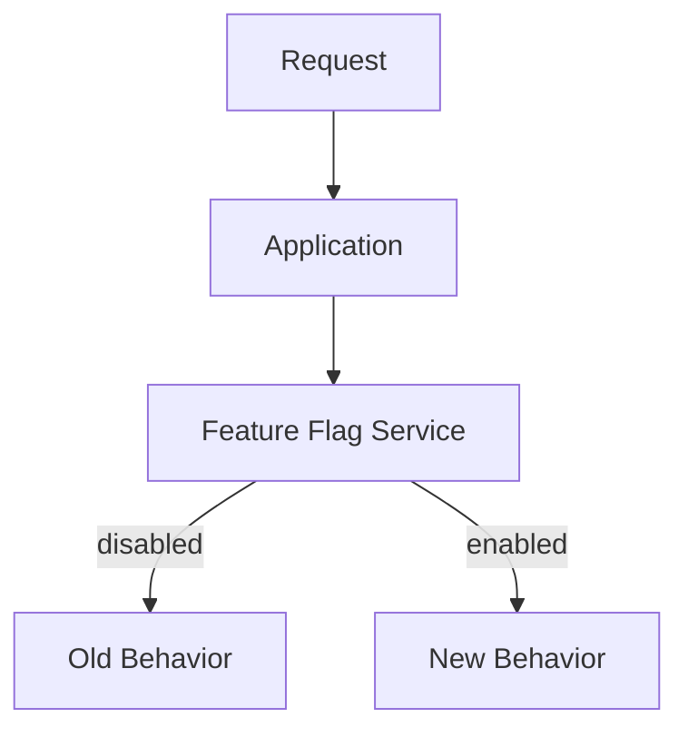
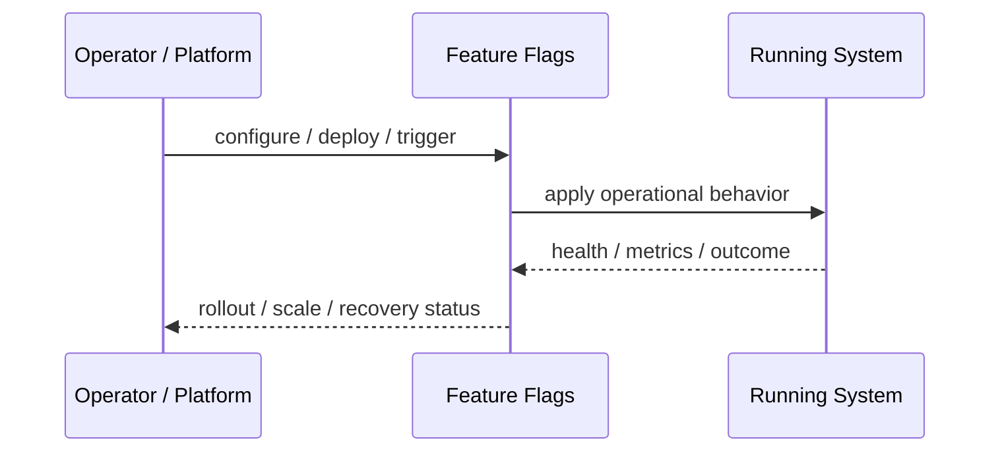
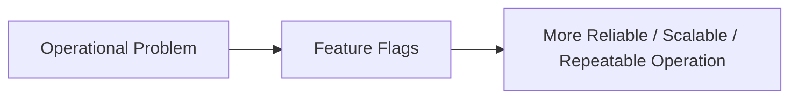

# Feature Flags

## Core Idea

Feature Flags separate deployment from release by controlling behavior with runtime configuration.

---

## Problem It Solves

Teams need to deploy code safely while enabling, disabling, or targeting features without redeploying.

---

## 3 Concrete Examples

### Example 1: Gradual Feature Rollout

A new checkout flow is enabled for 10% of users.

### Example 2: Kill Switch

A faulty recommendation feature is turned off immediately.

### Example 3: Tenant-Specific Feature

A beta feature is enabled only for selected customers.

---

## Architect Questions

- What behavior is controlled by the flag?
- Who can change the flag?
- Is the flag temporary or permanent?
- How is targeting defined?
- What is the safe default?
- How will stale flags be removed?

---

## Main Diagram



---

## Runtime / Operational Flow



---

## Implementation Shape

```txt
1. Identify the operational pressure: scale, reliability, release risk, latency, cost, resilience, or repeatability.
2. Define the boundary where this pattern applies: service, deployment, region, cell, edge, infrastructure, or traffic layer.
3. Define automation rules and rollback rules.
4. Define state ownership and data migration implications.
5. Define health checks, metrics, logs, traces, and alerts.
6. Test failure behavior, rollout behavior, and recovery behavior.
7. Keep the pattern focused. Do not add cloud-native machinery without a real operational reason.
```

---

## When to Use

- Deployment and release should be separated.
- Features need targeted rollout or quick rollback.
- Runtime control is valuable.

---

## When Not to Use

- Flags are never cleaned up.
- Flags control deep architectural differences permanently.
- Runtime config changes are unsafe or unaudited.

---

## Common Smell That Suggests This Pattern

```txt
The system is becoming hard to deploy, hard to scale, hard to recover,
too fragile under failure,
too slow for users,
or too dependent on manual operations.
```

---

## Common Mistakes

```txt
Using a cloud-native pattern without operational maturity.

Ignoring state and database migration problems.

Adding automation with no rollback.

Scaling the app while the database remains the bottleneck.

Treating deployment strategy as a substitute for testing.

Creating infrastructure that nobody can debug.
```

---

## Best Visual Summary



## Final Meaning

Feature Flags is useful when it solves a real operational pressure. If the system is small or the risk is not real yet, the pattern can add cost and complexity before it adds value.
