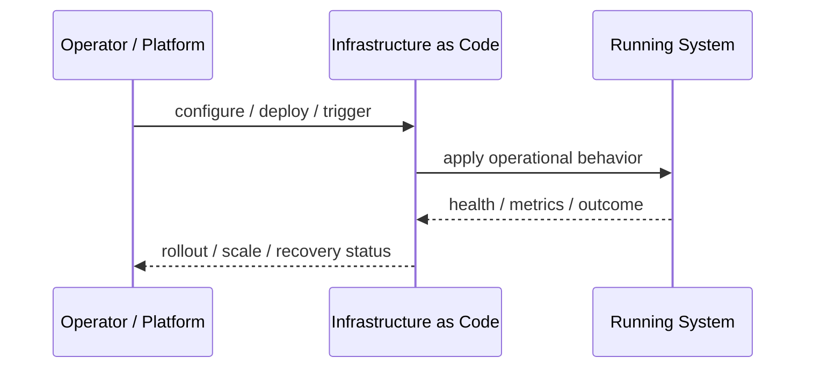
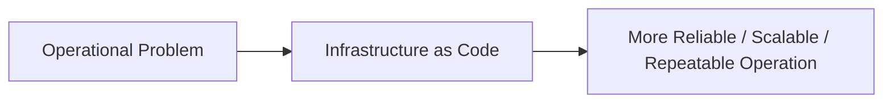

# Infrastructure as Code

## Core Idea

Infrastructure as Code defines infrastructure using versioned, reviewable, repeatable code.

---

## Problem It Solves

Manually configured infrastructure is hard to reproduce, audit, review, and recover.

---

## 3 Concrete Examples

### Example 1: Terraform Cloud Network

VPCs, subnets, load balancers, and databases are declared in Terraform.

### Example 2: Kubernetes Manifests

Deployments, services, and config are defined in YAML and versioned.

### Example 3: Policy-Controlled Environments

Dev, staging, and production are created from reusable IaC modules.

---

## Architect Questions

- What infrastructure should be declared as code?
- How are modules versioned?
- How are secrets handled?
- How are changes reviewed?
- How is drift detected?
- How are environments promoted?

---

## Main Diagram


---

## Runtime / Operational Flow



---

## Implementation Shape

```txt
1. Identify the operational pressure: scale, reliability, release risk, latency, cost, resilience, or repeatability.
2. Define the boundary where this pattern applies: service, deployment, region, cell, edge, infrastructure, or traffic layer.
3. Define automation rules and rollback rules.
4. Define state ownership and data migration implications.
5. Define health checks, metrics, logs, traces, and alerts.
6. Test failure behavior, rollout behavior, and recovery behavior.
7. Keep the pattern focused. Do not add cloud-native machinery without a real operational reason.
```

---

## When to Use

- Infrastructure must be reproducible and reviewable.
- Multiple environments need consistency.
- Manual changes are causing drift.

---

## When Not to Use

- The team will bypass code with manual console changes.
- Secrets and state are not managed properly.
- A tiny throwaway environment does not justify the overhead.

---

## Common Smell That Suggests This Pattern

```txt
The system is becoming hard to deploy, hard to scale, hard to recover,
too fragile under failure,
too slow for users,
or too dependent on manual operations.
```

---

## Common Mistakes

```txt
Using a cloud-native pattern without operational maturity.

Ignoring state and database migration problems.

Adding automation with no rollback.

Scaling the app while the database remains the bottleneck.

Treating deployment strategy as a substitute for testing.

Creating infrastructure that nobody can debug.
```

---

## Best Visual Summary



## Final Meaning

Infrastructure as Code is useful when it solves a real operational pressure. If the system is small or the risk is not real yet, the pattern can add cost and complexity before it adds value.
