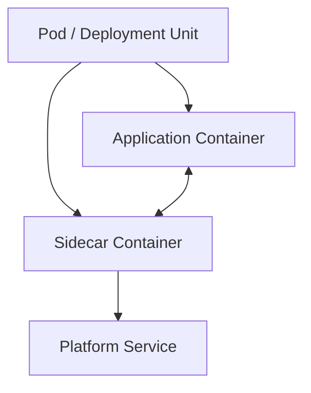
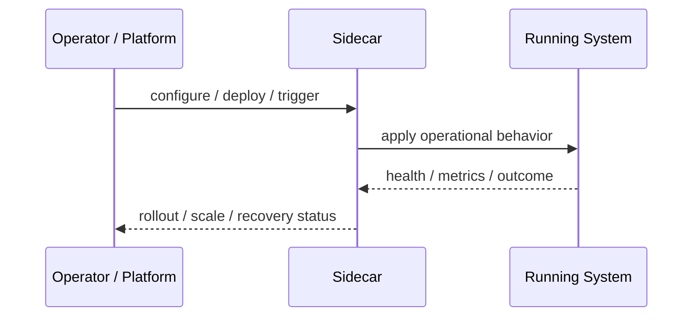
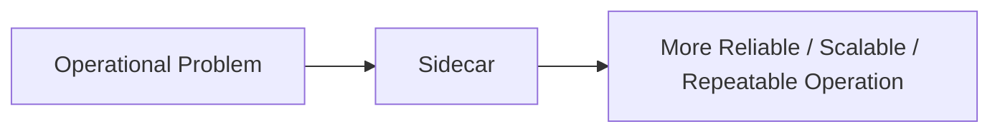

# Sidecar

## Core Idea

Sidecar runs a companion process/container next to the main application to provide auxiliary capabilities.

---

## Problem It Solves

Cross-cutting operational behavior should not be embedded inside every application service.

---

## 3 Concrete Examples

### Example 1: Log Forwarder Sidecar

A sidecar tails app logs and sends them to a logging platform.

### Example 2: Proxy Sidecar

A sidecar handles mTLS, retries, and telemetry for service calls.

### Example 3: Config Watcher

A sidecar watches configuration changes and updates local files.

---

## Architect Questions

- What operational concern should be externalized?
- How does the app communicate with the sidecar?
- What happens if the sidecar fails?
- Should every service use the same sidecar?
- Does the sidecar add latency?
- Who owns sidecar configuration?

---

## Main Diagram



---

## Runtime / Operational Flow



---

## Implementation Shape

```txt
1. Identify the operational pressure: scale, reliability, release risk, latency, cost, resilience, or repeatability.
2. Define the boundary where this pattern applies: service, deployment, region, cell, edge, infrastructure, or traffic layer.
3. Define automation rules and rollback rules.
4. Define state ownership and data migration implications.
5. Define health checks, metrics, logs, traces, and alerts.
6. Test failure behavior, rollout behavior, and recovery behavior.
7. Keep the pattern focused. Do not add cloud-native machinery without a real operational reason.
```

---

## When to Use

- Cross-cutting operational logic should sit next to the app.
- A companion process can handle logging, proxying, config, or security.
- You want consistency across services.

---

## When Not to Use

- A library or platform feature is simpler.
- The sidecar adds more failure points than value.
- Business logic starts moving into the sidecar.

---

## Common Smell That Suggests This Pattern

```txt
The system is becoming hard to deploy, hard to scale, hard to recover,
too fragile under failure,
too slow for users,
or too dependent on manual operations.
```

---

## Common Mistakes

```txt
Using a cloud-native pattern without operational maturity.

Ignoring state and database migration problems.

Adding automation with no rollback.

Scaling the app while the database remains the bottleneck.

Treating deployment strategy as a substitute for testing.

Creating infrastructure that nobody can debug.
```

---

## Best Visual Summary



## Final Meaning

Sidecar is useful when it solves a real operational pressure. If the system is small or the risk is not real yet, the pattern can add cost and complexity before it adds value.
