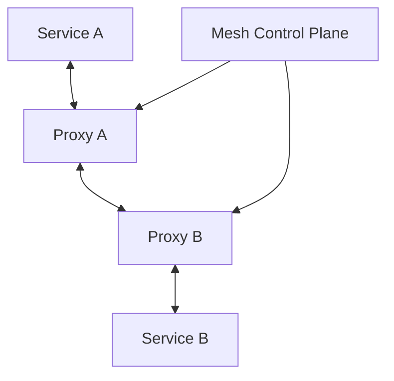
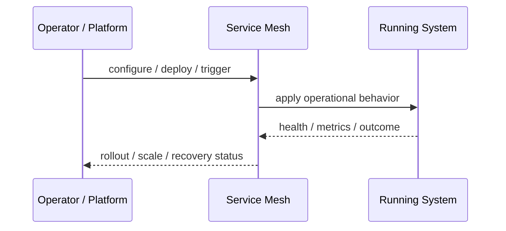
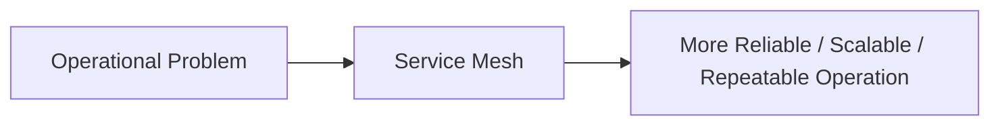

# Service Mesh

## Core Idea

Service Mesh provides infrastructure-level service-to-service traffic management, security, and observability.

---

## Problem It Solves

Microservices need consistent mTLS, retries, routing, metrics, and policy without duplicating code in every service.

---

## 3 Concrete Examples

### Example 1: mTLS Everywhere

All internal service calls are encrypted and authenticated by mesh proxies.

### Example 2: Canary Traffic Split

The mesh routes 10% of service traffic to a new version.

### Example 3: Unified Telemetry

Every service call emits standard latency, error, and trace data.

---

## Architect Questions

- Do we have enough services to justify a mesh?
- What traffic policies are needed?
- How will identity and certificates be managed?
- Will sidecars or ambient mode be used?
- Can the team operate the mesh?
- How will debugging work through proxies?

---

## Main Diagram



---

## Runtime / Operational Flow



---

## Implementation Shape

```txt
1. Identify the operational pressure: scale, reliability, release risk, latency, cost, resilience, or repeatability.
2. Define the boundary where this pattern applies: service, deployment, region, cell, edge, infrastructure, or traffic layer.
3. Define automation rules and rollback rules.
4. Define state ownership and data migration implications.
5. Define health checks, metrics, logs, traces, and alerts.
6. Test failure behavior, rollout behavior, and recovery behavior.
7. Keep the pattern focused. Do not add cloud-native machinery without a real operational reason.
```

---

## When to Use

- You have many services needing uniform mTLS, telemetry, and traffic policy.
- Platform teams can operate mesh infrastructure.
- Service-to-service behavior should be centrally managed.

---

## When Not to Use

- You only have a few services.
- The team cannot operate the mesh.
- A gateway or client library solves the real problem.

---

## Common Smell That Suggests This Pattern

```txt
The system is becoming hard to deploy, hard to scale, hard to recover,
too fragile under failure,
too slow for users,
or too dependent on manual operations.
```

---

## Common Mistakes

```txt
Using a cloud-native pattern without operational maturity.

Ignoring state and database migration problems.

Adding automation with no rollback.

Scaling the app while the database remains the bottleneck.

Treating deployment strategy as a substitute for testing.

Creating infrastructure that nobody can debug.
```

---

## Best Visual Summary



## Final Meaning

Service Mesh is useful when it solves a real operational pressure. If the system is small or the risk is not real yet, the pattern can add cost and complexity before it adds value.
