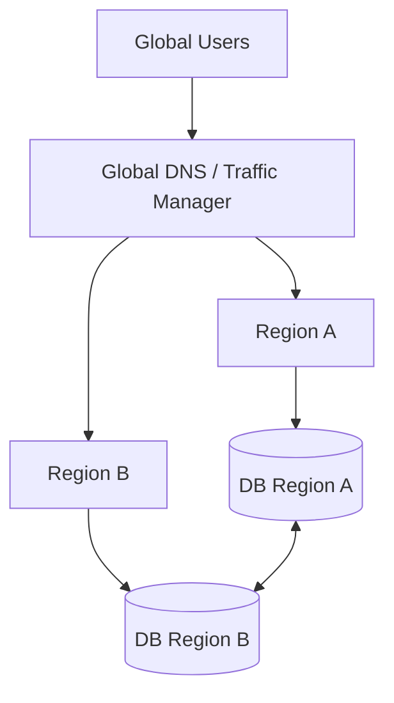
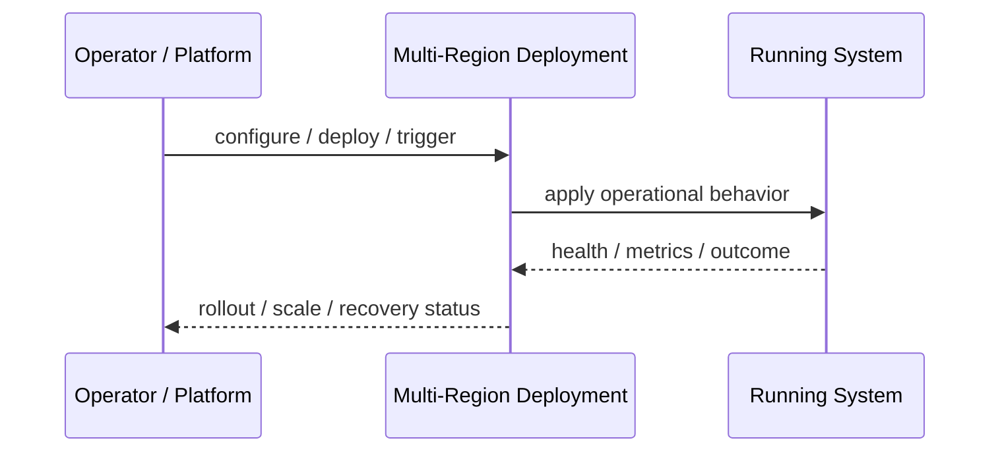
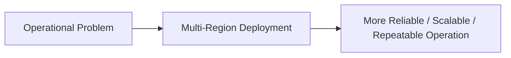

# Multi-Region Deployment

## Core Idea

Multi-Region Deployment runs application infrastructure in more than one geographic/cloud region.

---

## Problem It Solves

A single region failure, high latency, or regional compliance requirement can make one-region architecture insufficient.

---

## 3 Concrete Examples

### Example 1: Active-Passive DR

A standby region is ready for failover if the primary region fails.

### Example 2: Active-Active Global App

Users are routed to the nearest healthy region.

### Example 3: Regional Data Residency

EU users are served from an EU region while US users are served from a US region.

---

## Architect Questions

- Is the goal latency, disaster recovery, or compliance?
- Is the design active-active or active-passive?
- How is data replicated?
- How is failover triggered?
- Can the app tolerate split-brain or stale data?
- How is traffic routed globally?

---

## Main Diagram



---

## Runtime / Operational Flow



---

## Implementation Shape

```txt
1. Identify the operational pressure: scale, reliability, release risk, latency, cost, resilience, or repeatability.
2. Define the boundary where this pattern applies: service, deployment, region, cell, edge, infrastructure, or traffic layer.
3. Define automation rules and rollback rules.
4. Define state ownership and data migration implications.
5. Define health checks, metrics, logs, traces, and alerts.
6. Test failure behavior, rollout behavior, and recovery behavior.
7. Keep the pattern focused. Do not add cloud-native machinery without a real operational reason.
```

---

## When to Use

- Regional failure resilience is required.
- Global latency matters.
- Data residency or regional compliance matters.

---

## When Not to Use

- Single-region availability is acceptable.
- Data replication complexity is not justified.
- The app cannot handle regional consistency issues.

---

## Common Smell That Suggests This Pattern

```txt
The system is becoming hard to deploy, hard to scale, hard to recover,
too fragile under failure,
too slow for users,
or too dependent on manual operations.
```

---

## Common Mistakes

```txt
Using a cloud-native pattern without operational maturity.

Ignoring state and database migration problems.

Adding automation with no rollback.

Scaling the app while the database remains the bottleneck.

Treating deployment strategy as a substitute for testing.

Creating infrastructure that nobody can debug.
```

---

## Best Visual Summary



## Final Meaning

Multi-Region Deployment is useful when it solves a real operational pressure. If the system is small or the risk is not real yet, the pattern can add cost and complexity before it adds value.
