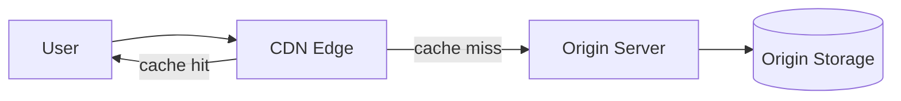
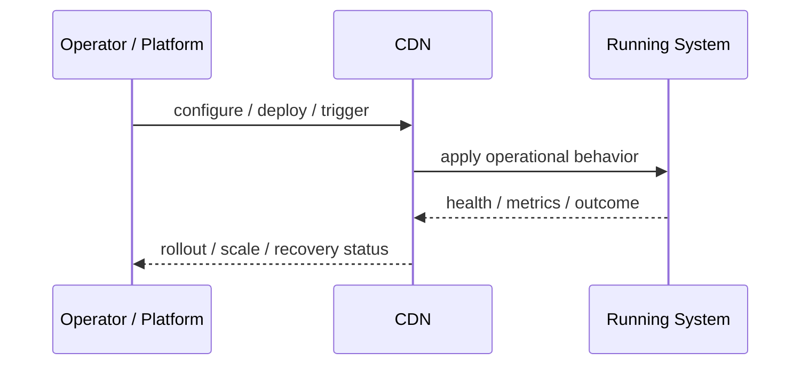
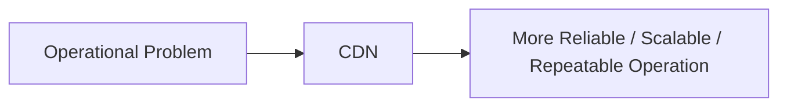

# CDN

## Core Idea

A CDN caches and serves content from edge locations close to users.

---

## Problem It Solves

Serving static or cacheable content from origin servers creates latency, bandwidth cost, and origin load.

---

## 3 Concrete Examples

### Example 1: Static Asset Delivery

Images, CSS, and JavaScript are served from edge caches.

### Example 2: Video Streaming

Video segments are cached near viewers.

### Example 3: API Edge Caching

Cacheable API responses are served from CDN edge nodes.

---

## Architect Questions

- What content is cacheable?
- What TTL and cache keys should be used?
- How is invalidation handled?
- Does content vary by user, region, or language?
- What should bypass the CDN?
- How is origin protected?

---

## Main Diagram



---

## Runtime / Operational Flow



---

## Implementation Shape

```txt
1. Identify the operational pressure: scale, reliability, release risk, latency, cost, resilience, or repeatability.
2. Define the boundary where this pattern applies: service, deployment, region, cell, edge, infrastructure, or traffic layer.
3. Define automation rules and rollback rules.
4. Define state ownership and data migration implications.
5. Define health checks, metrics, logs, traces, and alerts.
6. Test failure behavior, rollout behavior, and recovery behavior.
7. Keep the pattern focused. Do not add cloud-native machinery without a real operational reason.
```

---

## When to Use

- Content is static or cacheable.
- Origin load or global latency is a problem.
- Edge caching improves user experience.

---

## When Not to Use

- Content is highly personalized and non-cacheable.
- Invalidation requirements are too strict.
- Edge caching could leak private data.

---

## Common Smell That Suggests This Pattern

```txt
The system is becoming hard to deploy, hard to scale, hard to recover,
too fragile under failure,
too slow for users,
or too dependent on manual operations.
```

---

## Common Mistakes

```txt
Using a cloud-native pattern without operational maturity.

Ignoring state and database migration problems.

Adding automation with no rollback.

Scaling the app while the database remains the bottleneck.

Treating deployment strategy as a substitute for testing.

Creating infrastructure that nobody can debug.
```

---

## Best Visual Summary



## Final Meaning

CDN is useful when it solves a real operational pressure. If the system is small or the risk is not real yet, the pattern can add cost and complexity before it adds value.
