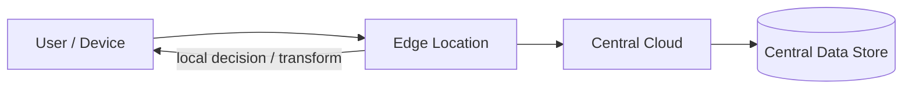
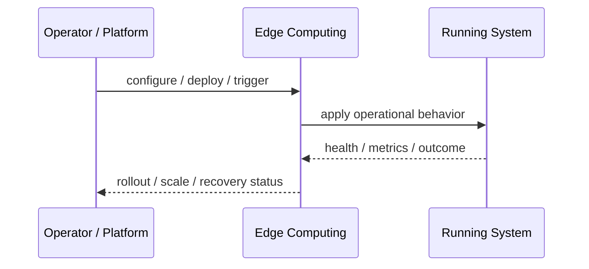
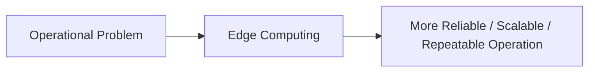

# Edge Computing

## Core Idea

Edge Computing moves computation closer to users, devices, or data sources.

---

## Problem It Solves

Centralized processing creates too much latency, bandwidth usage, or dependency on distant regions.

---

## 3 Concrete Examples

### Example 1: Edge Authentication

A lightweight auth check runs at the edge before reaching origin.

### Example 2: IoT Preprocessing

Sensor gateways filter and aggregate data before sending to cloud.

### Example 3: Personalized Edge Response

Edge functions customize cached pages based on headers or location.

---

## Architect Questions

- What computation benefits from being closer to the user or device?
- What data is available at the edge?
- What state is needed?
- How are edge functions deployed and versioned?
- What latency improvement is required?
- What must still run centrally?

---

## Main Diagram



---

## Runtime / Operational Flow



---

## Implementation Shape

```txt
1. Identify the operational pressure: scale, reliability, release risk, latency, cost, resilience, or repeatability.
2. Define the boundary where this pattern applies: service, deployment, region, cell, edge, infrastructure, or traffic layer.
3. Define automation rules and rollback rules.
4. Define state ownership and data migration implications.
5. Define health checks, metrics, logs, traces, and alerts.
6. Test failure behavior, rollout behavior, and recovery behavior.
7. Keep the pattern focused. Do not add cloud-native machinery without a real operational reason.
```

---

## When to Use

- Low latency matters.
- Data can be processed near users/devices.
- Bandwidth reduction or local decisions are valuable.

---

## When Not to Use

- Central processing is fast enough.
- The edge lacks needed data.
- Debugging and deployment complexity outweigh latency gains.

---

## Common Smell That Suggests This Pattern

```txt
The system is becoming hard to deploy, hard to scale, hard to recover,
too fragile under failure,
too slow for users,
or too dependent on manual operations.
```

---

## Common Mistakes

```txt
Using a cloud-native pattern without operational maturity.

Ignoring state and database migration problems.

Adding automation with no rollback.

Scaling the app while the database remains the bottleneck.

Treating deployment strategy as a substitute for testing.

Creating infrastructure that nobody can debug.
```

---

## Best Visual Summary



## Final Meaning

Edge Computing is useful when it solves a real operational pressure. If the system is small or the risk is not real yet, the pattern can add cost and complexity before it adds value.
