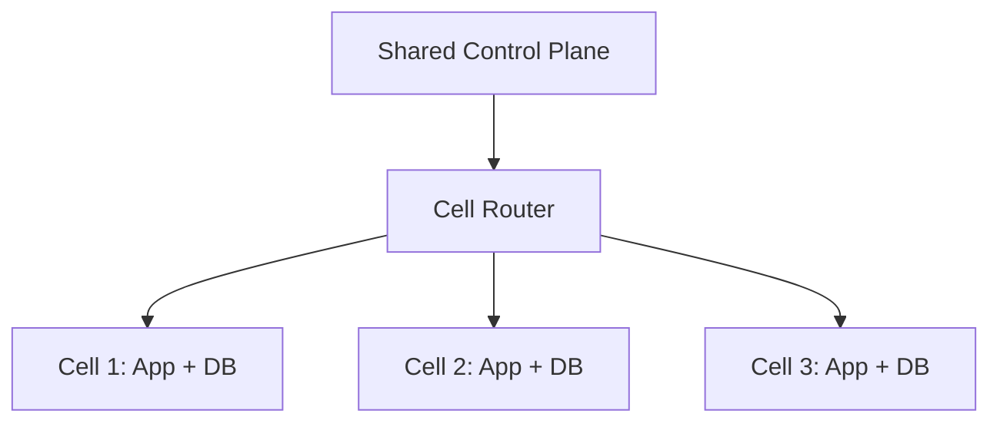
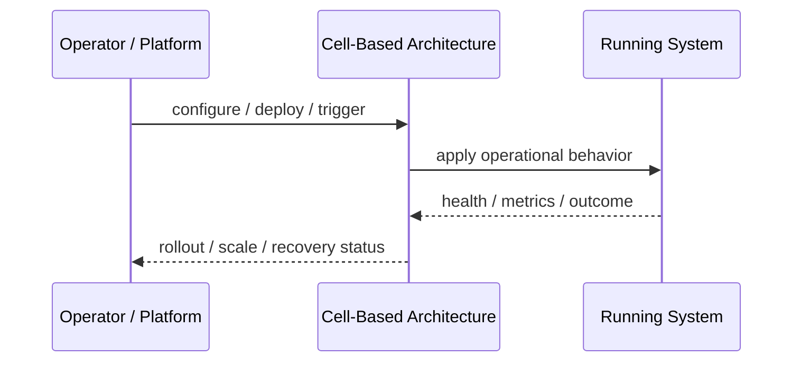
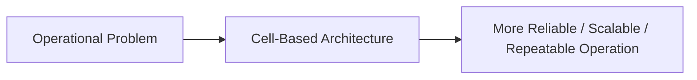

# Cell-Based Architecture

## Core Idea

Cell-Based Architecture partitions a platform into isolated cells, each serving a subset of users, tenants, or traffic.

---

## Problem It Solves

A failure in one part of a large platform should not affect every customer or the whole system.

---

## 3 Concrete Examples

### Example 1: Tenant Cells

Tenant groups are assigned to separate cells with independent app and database resources.

### Example 2: Regional Cells

Each region contains isolated app and data stacks.

### Example 3: Large SaaS Isolation

A noisy or failing customer cell does not affect other cells.

---

## Architect Questions

- What is the cell assignment key?
- What resources are isolated per cell?
- How are tenants/users routed to cells?
- How is capacity managed per cell?
- Can a tenant move between cells?
- What shared services remain outside cells?

---

## Main Diagram



---

## Runtime / Operational Flow



---

## Implementation Shape

```txt
1. Identify the operational pressure: scale, reliability, release risk, latency, cost, resilience, or repeatability.
2. Define the boundary where this pattern applies: service, deployment, region, cell, edge, infrastructure, or traffic layer.
3. Define automation rules and rollback rules.
4. Define state ownership and data migration implications.
5. Define health checks, metrics, logs, traces, and alerts.
6. Test failure behavior, rollout behavior, and recovery behavior.
7. Keep the pattern focused. Do not add cloud-native machinery without a real operational reason.
```

---

## When to Use

- Blast-radius reduction is important.
- Tenants/users can be partitioned.
- Large-scale SaaS isolation is needed.

---

## When Not to Use

- The platform is too small.
- Users/tenants cannot be partitioned cleanly.
- Shared dependencies still create global failure.

---

## Common Smell That Suggests This Pattern

```txt
The system is becoming hard to deploy, hard to scale, hard to recover,
too fragile under failure,
too slow for users,
or too dependent on manual operations.
```

---

## Common Mistakes

```txt
Using a cloud-native pattern without operational maturity.

Ignoring state and database migration problems.

Adding automation with no rollback.

Scaling the app while the database remains the bottleneck.

Treating deployment strategy as a substitute for testing.

Creating infrastructure that nobody can debug.
```

---

## Best Visual Summary



## Final Meaning

Cell-Based Architecture is useful when it solves a real operational pressure. If the system is small or the risk is not real yet, the pattern can add cost and complexity before it adds value.
