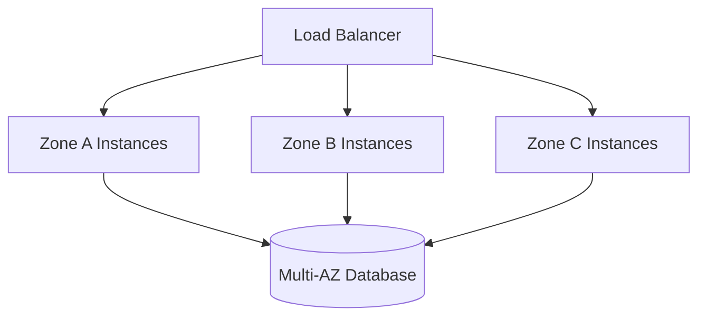
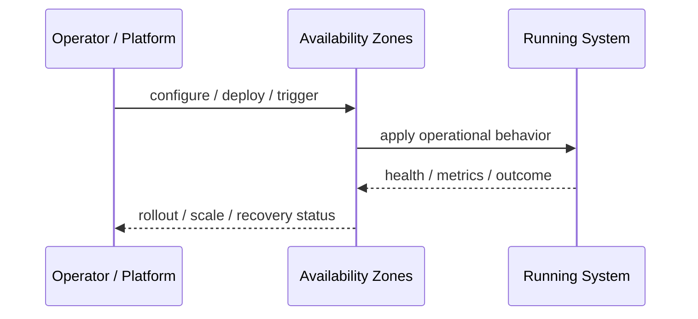
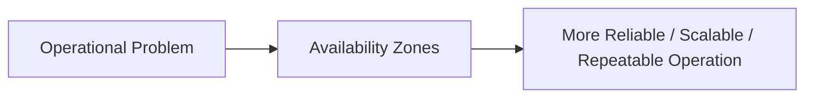

# Availability Zones

## Core Idea

Availability Zones are separate failure domains within a region used to improve resilience.

---

## Problem It Solves

A single datacenter or zone failure can take down services if all resources run in one place.

---

## 3 Concrete Examples

### Example 1: Multi-AZ Web Tier

Application replicas run across at least three zones.

### Example 2: Multi-AZ Database

Database primary and standby are placed in different zones.

### Example 3: Zone-Aware Load Balancing

Traffic is routed to healthy instances across zones.

---

## Architect Questions

- Which resources are spread across zones?
- Can the app survive losing one zone?
- Are databases multi-AZ?
- Is traffic balanced across zones?
- Are dependencies also zone-resilient?
- How is zonal failure tested?

---

## Main Diagram



---

## Runtime / Operational Flow



---

## Implementation Shape

```txt
1. Identify the operational pressure: scale, reliability, release risk, latency, cost, resilience, or repeatability.
2. Define the boundary where this pattern applies: service, deployment, region, cell, edge, infrastructure, or traffic layer.
3. Define automation rules and rollback rules.
4. Define state ownership and data migration implications.
5. Define health checks, metrics, logs, traces, and alerts.
6. Test failure behavior, rollout behavior, and recovery behavior.
7. Keep the pattern focused. Do not add cloud-native machinery without a real operational reason.
```

---

## When to Use

- You need resilience against zone failure.
- The cloud region supports multiple zones.
- Dependencies can be deployed across zones.

---

## When Not to Use

- The workload is non-critical and cost-sensitive.
- Dependencies remain single-zone.
- Zonal traffic and failover are not tested.

---

## Common Smell That Suggests This Pattern

```txt
The system is becoming hard to deploy, hard to scale, hard to recover,
too fragile under failure,
too slow for users,
or too dependent on manual operations.
```

---

## Common Mistakes

```txt
Using a cloud-native pattern without operational maturity.

Ignoring state and database migration problems.

Adding automation with no rollback.

Scaling the app while the database remains the bottleneck.

Treating deployment strategy as a substitute for testing.

Creating infrastructure that nobody can debug.
```

---

## Best Visual Summary



## Final Meaning

Availability Zones is useful when it solves a real operational pressure. If the system is small or the risk is not real yet, the pattern can add cost and complexity before it adds value.
