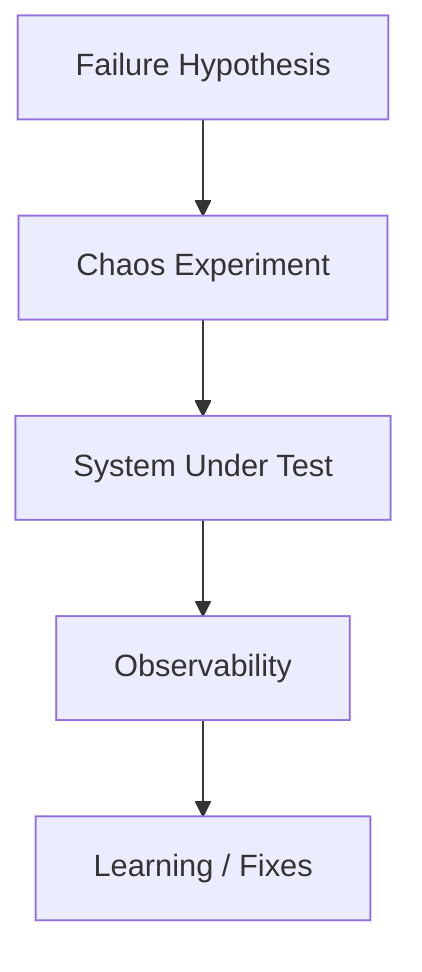
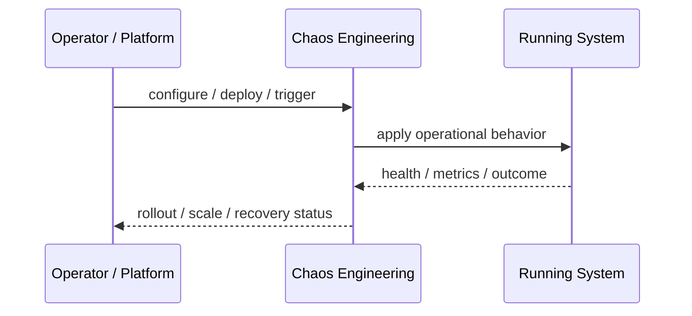
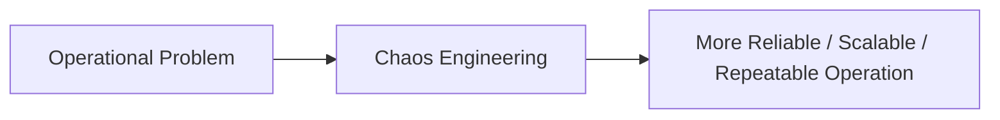

# Chaos Engineering

## Core Idea

Chaos Engineering deliberately injects controlled failures to validate system resilience.

---

## Problem It Solves

Systems often look reliable on paper but fail under real-world faults that were never tested.

---

## 3 Concrete Examples

### Example 1: Instance Termination Test

Randomly terminate service instances and verify auto-recovery.

### Example 2: Network Latency Injection

Add latency between services to test timeout and retry behavior.

### Example 3: Dependency Failure Drill

Disable a downstream dependency and verify graceful degradation.

---

## Architect Questions

- What failure hypothesis are we testing?
- What blast radius is acceptable?
- What safety controls are in place?
- Which metrics prove the system survived?
- Can the experiment be stopped quickly?
- Are we testing in staging, production, or both?

---

## Main Diagram



---

## Runtime / Operational Flow



---

## Implementation Shape

```txt
1. Identify the operational pressure: scale, reliability, release risk, latency, cost, resilience, or repeatability.
2. Define the boundary where this pattern applies: service, deployment, region, cell, edge, infrastructure, or traffic layer.
3. Define automation rules and rollback rules.
4. Define state ownership and data migration implications.
5. Define health checks, metrics, logs, traces, and alerts.
6. Test failure behavior, rollout behavior, and recovery behavior.
7. Keep the pattern focused. Do not add cloud-native machinery without a real operational reason.
```

---

## When to Use

- You already have observability and safety controls.
- You need to validate resilience assumptions.
- Failure drills are valuable.

---

## When Not to Use

- No monitoring or rollback exists.
- The blast radius cannot be controlled.
- The team is still fighting basic reliability fires.

---

## Common Smell That Suggests This Pattern

```txt
The system is becoming hard to deploy, hard to scale, hard to recover,
too fragile under failure,
too slow for users,
or too dependent on manual operations.
```

---

## Common Mistakes

```txt
Using a cloud-native pattern without operational maturity.

Ignoring state and database migration problems.

Adding automation with no rollback.

Scaling the app while the database remains the bottleneck.

Treating deployment strategy as a substitute for testing.

Creating infrastructure that nobody can debug.
```

---

## Best Visual Summary



## Final Meaning

Chaos Engineering is useful when it solves a real operational pressure. If the system is small or the risk is not real yet, the pattern can add cost and complexity before it adds value.
