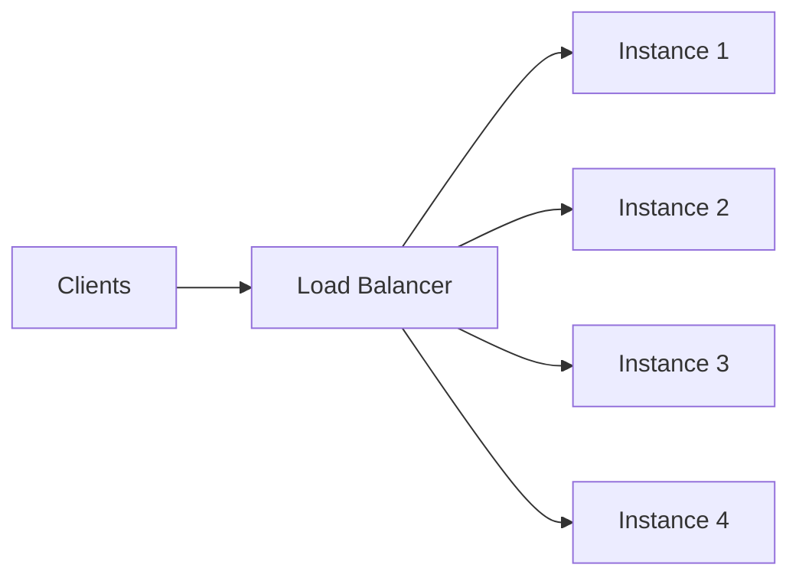
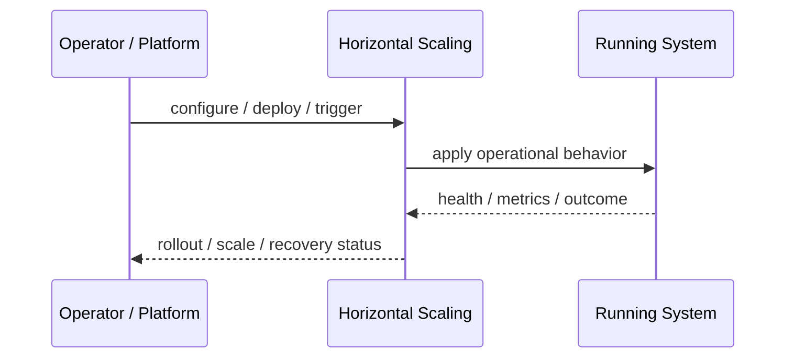
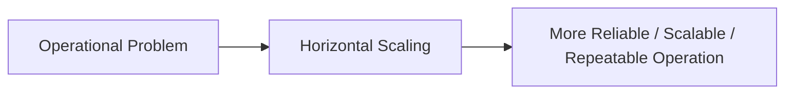

# Horizontal Scaling

## Core Idea

Horizontal Scaling adds more service instances or nodes to handle more load.

---

## Problem It Solves

One instance cannot handle demand, or availability requires multiple instances.

---

## 3 Concrete Examples

### Example 1: API Replicas

Increase API pods from 3 to 20 under traffic load.

### Example 2: Worker Fleet

Add more workers to process queue backlog faster.

### Example 3: Database Read Replicas

Add read replicas to scale read traffic.

---

## Architect Questions

- Can work be distributed across instances?
- Is the service stateless?
- What load balancer or routing is used?
- What shared dependencies become bottlenecks?
- How is scaling automated?
- How are instances monitored?

---

## Main Diagram



---

## Runtime / Operational Flow



---

## Implementation Shape

```txt
1. Identify the operational pressure: scale, reliability, release risk, latency, cost, resilience, or repeatability.
2. Define the boundary where this pattern applies: service, deployment, region, cell, edge, infrastructure, or traffic layer.
3. Define automation rules and rollback rules.
4. Define state ownership and data migration implications.
5. Define health checks, metrics, logs, traces, and alerts.
6. Test failure behavior, rollout behavior, and recovery behavior.
7. Keep the pattern focused. Do not add cloud-native machinery without a real operational reason.
```

---

## When to Use

- Work can be distributed across instances.
- The service is stateless or externalizes state.
- More replicas improve throughput or availability.

---

## When Not to Use

- The app stores local state.
- A shared dependency is the real bottleneck.
- Licensing or architecture prevents multiple instances.

---

## Common Smell That Suggests This Pattern

```txt
The system is becoming hard to deploy, hard to scale, hard to recover,
too fragile under failure,
too slow for users,
or too dependent on manual operations.
```

---

## Common Mistakes

```txt
Using a cloud-native pattern without operational maturity.

Ignoring state and database migration problems.

Adding automation with no rollback.

Scaling the app while the database remains the bottleneck.

Treating deployment strategy as a substitute for testing.

Creating infrastructure that nobody can debug.
```

---

## Best Visual Summary



## Final Meaning

Horizontal Scaling is useful when it solves a real operational pressure. If the system is small or the risk is not real yet, the pattern can add cost and complexity before it adds value.
