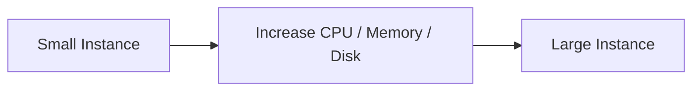
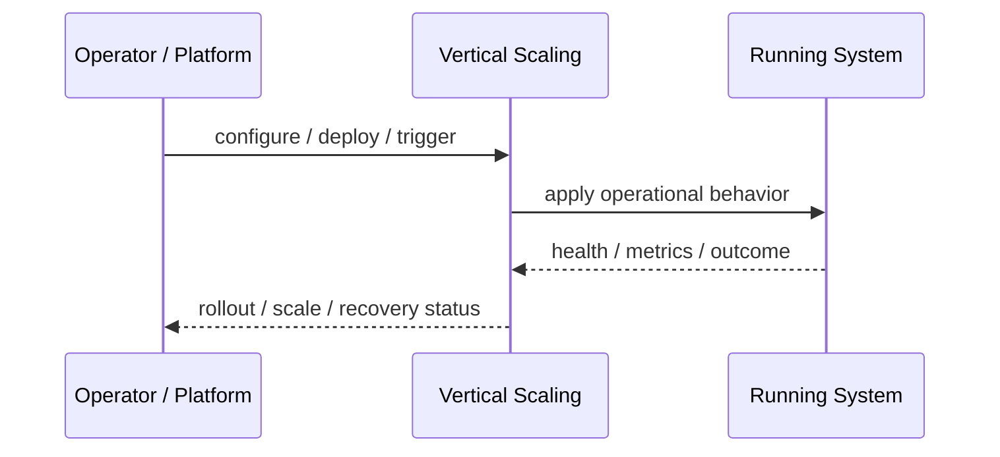
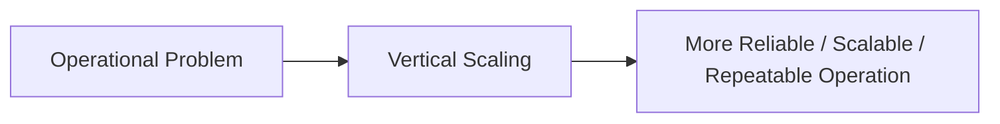

# Vertical Scaling

## Core Idea

Vertical Scaling increases the resources of a single machine or instance, such as CPU, memory, or disk.

---

## Problem It Solves

A workload needs more capacity, and scaling up one node is simpler than distributing the workload.

---

## 3 Concrete Examples

### Example 1: Database Scale-Up

Move a database to a larger instance with more memory and IOPS.

### Example 2: Memory-Heavy Analytics

Run analytics on a larger machine with more RAM.

### Example 3: Legacy App Scaling

Increase CPU and memory for an app that cannot easily run multiple replicas.

---

## Architect Questions

- Is the workload hard to distribute?
- What resource is the bottleneck?
- What is the largest available instance size?
- Does scaling require downtime?
- Is vertical scaling a short-term fix?
- When will horizontal scaling become necessary?

---

## Main Diagram



---

## Runtime / Operational Flow



---

## Implementation Shape

```txt
1. Identify the operational pressure: scale, reliability, release risk, latency, cost, resilience, or repeatability.
2. Define the boundary where this pattern applies: service, deployment, region, cell, edge, infrastructure, or traffic layer.
3. Define automation rules and rollback rules.
4. Define state ownership and data migration implications.
5. Define health checks, metrics, logs, traces, and alerts.
6. Test failure behavior, rollout behavior, and recovery behavior.
7. Keep the pattern focused. Do not add cloud-native machinery without a real operational reason.
```

---

## When to Use

- The workload cannot easily be distributed.
- A single machine resource is the bottleneck.
- Scaling up is simpler and sufficient for now.

---

## When Not to Use

- You are near instance size limits.
- The workload needs high availability.
- Scaling up only postpones a distribution problem.

---

## Common Smell That Suggests This Pattern

```txt
The system is becoming hard to deploy, hard to scale, hard to recover,
too fragile under failure,
too slow for users,
or too dependent on manual operations.
```

---

## Common Mistakes

```txt
Using a cloud-native pattern without operational maturity.

Ignoring state and database migration problems.

Adding automation with no rollback.

Scaling the app while the database remains the bottleneck.

Treating deployment strategy as a substitute for testing.

Creating infrastructure that nobody can debug.
```

---

## Best Visual Summary



## Final Meaning

Vertical Scaling is useful when it solves a real operational pressure. If the system is small or the risk is not real yet, the pattern can add cost and complexity before it adds value.
