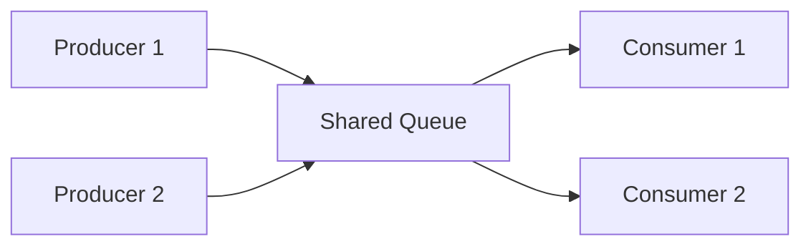
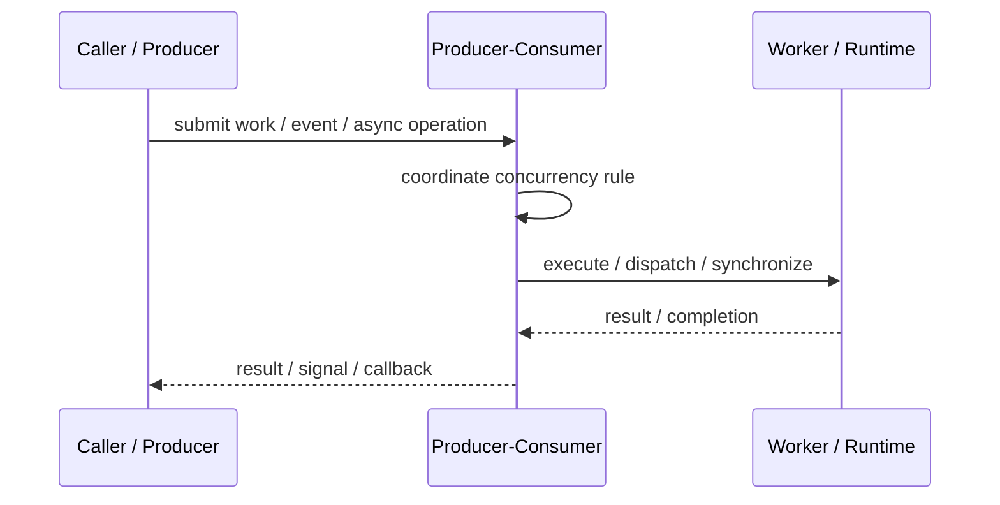

# Producer-Consumer

## Core Idea

Producer-Consumer separates threads or tasks that create work from threads or tasks that process work, usually through a shared queue.

---

## Problem It Solves

Work is produced at a different speed than it can be processed, and producers should not block on slow consumers.

---

## 3 Concrete Examples

### Example 1: Log Processing

Application threads enqueue log records while a background consumer writes them to disk.

### Example 2: Image Processing

Upload handlers produce resize jobs and worker threads consume them.

### Example 3: Sensor Data Handling

A data acquisition thread produces readings while analysis workers consume them.

---

## Architect Questions

- What work is produced?
- How many producers and consumers exist?
- Is the queue bounded or unbounded?
- What happens when the queue is full?
- Does processing order matter?
- How are shutdown and poison messages handled?

---

## Main Diagram



---

## Runtime / Responsibility Flow



---

## Implementation Shape

```txt
1. Identify the concurrency problem: throughput, latency, isolation, synchronization, or resource control.
2. Define the unit of work.
3. Define ownership of shared state.
4. Define execution model: threads, tasks, event loop, actors, workers, or async operations.
5. Define synchronization and backpressure behavior.
6. Define failure behavior: cancellation, timeout, retry, poison work, and shutdown.
7. Add observability: queue depth, worker utilization, latency, deadlocks, blocked time, and error rates.
```

---

## When to Use

- Producers and consumers run at different speeds.
- Work should be buffered and processed asynchronously.
- You need to smooth bursts or decouple components.

---

## When Not to Use

- Processing must be strictly synchronous.
- Queue growth would hide overload.
- Work items depend heavily on shared mutable state.

---

## Common Smell That Suggests This Pattern

```txt
The current design is blocked, overloaded, race-prone, wasting threads,
or mixing work creation, execution, and synchronization in one tangled place.
```

---

## Common Mistakes

```txt
Using concurrency before the bottleneck is real.

Sharing mutable state without clear ownership.

Ignoring backpressure.

Ignoring cancellation and shutdown.

Creating unbounded queues.

Blocking inside event loops or async handlers.

Assuming parallelism always makes code faster.
```

---

## Best Visual Summary


## Final Meaning

Producer-Consumer is useful when it solves a real concurrency pressure. If the workload is simple, this pattern may add complexity without improving correctness or performance.
