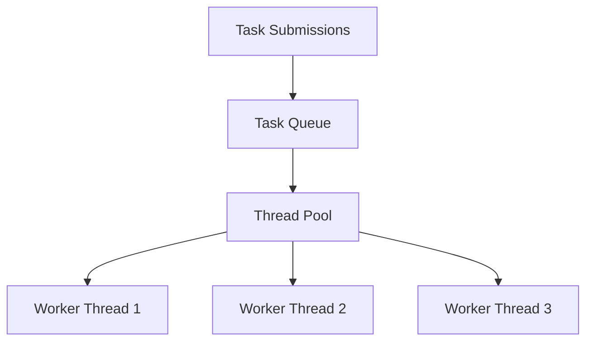
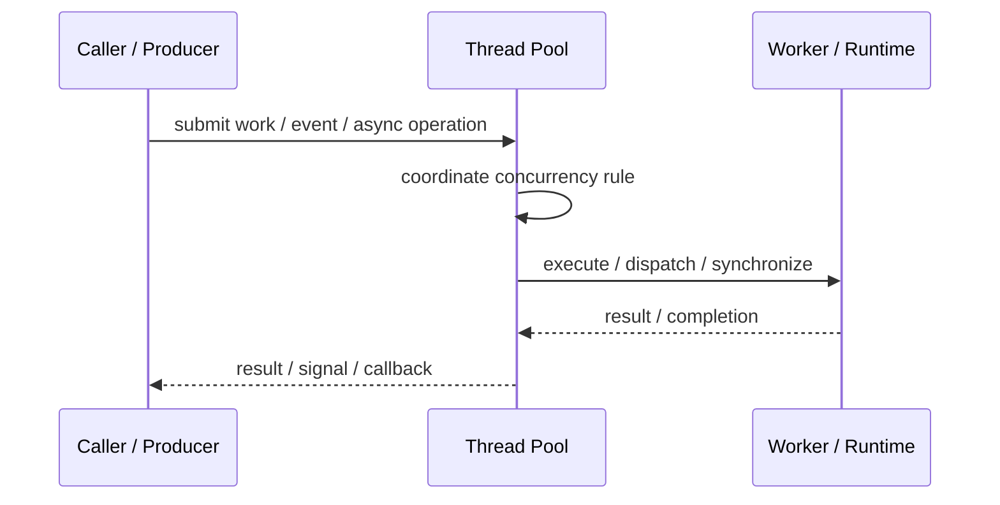
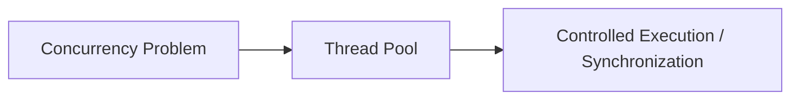

# Thread Pool

## Core Idea

Thread Pool reuses a fixed or managed group of worker threads to execute many submitted tasks.

---

## Problem It Solves

Creating a new thread per task is expensive and can overload the system.

---

## 3 Concrete Examples

### Example 1: Web Server Requests

Incoming requests are handled by a pool of worker threads.

### Example 2: Background Jobs

A fixed pool processes report generation jobs.

### Example 3: Database Task Execution

A limited pool runs database-bound tasks to avoid too many concurrent connections.

---

## Architect Questions

- What is the ideal pool size?
- Are tasks CPU-bound or I/O-bound?
- Should the queue be bounded?
- What happens when the pool is saturated?
- How are task failures handled?
- How is graceful shutdown performed?

---

## Main Diagram



---

## Runtime / Responsibility Flow



---

## Implementation Shape

```txt
1. Identify the concurrency problem: throughput, latency, isolation, synchronization, or resource control.
2. Define the unit of work.
3. Define ownership of shared state.
4. Define execution model: threads, tasks, event loop, actors, workers, or async operations.
5. Define synchronization and backpressure behavior.
6. Define failure behavior: cancellation, timeout, retry, poison work, and shutdown.
7. Add observability: queue depth, worker utilization, latency, deadlocks, blocked time, and error rates.
```

---

## When to Use

- Many short-lived tasks need execution.
- Creating one thread per task is too expensive.
- Concurrency must be bounded.

---

## When Not to Use

- Tasks are long-running and block all workers.
- Unbounded queues hide overload.
- Pool size is guessed with no monitoring.

---

## Common Smell That Suggests This Pattern

```txt
The current design is blocked, overloaded, race-prone, wasting threads,
or mixing work creation, execution, and synchronization in one tangled place.
```

---

## Common Mistakes

```txt
Using concurrency before the bottleneck is real.

Sharing mutable state without clear ownership.

Ignoring backpressure.

Ignoring cancellation and shutdown.

Creating unbounded queues.

Blocking inside event loops or async handlers.

Assuming parallelism always makes code faster.
```

---

## Best Visual Summary



## Final Meaning

Thread Pool is useful when it solves a real concurrency pressure. If the workload is simple, this pattern may add complexity without improving correctness or performance.
