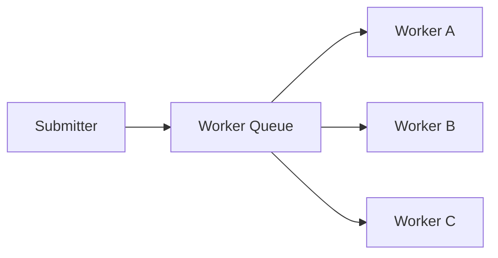
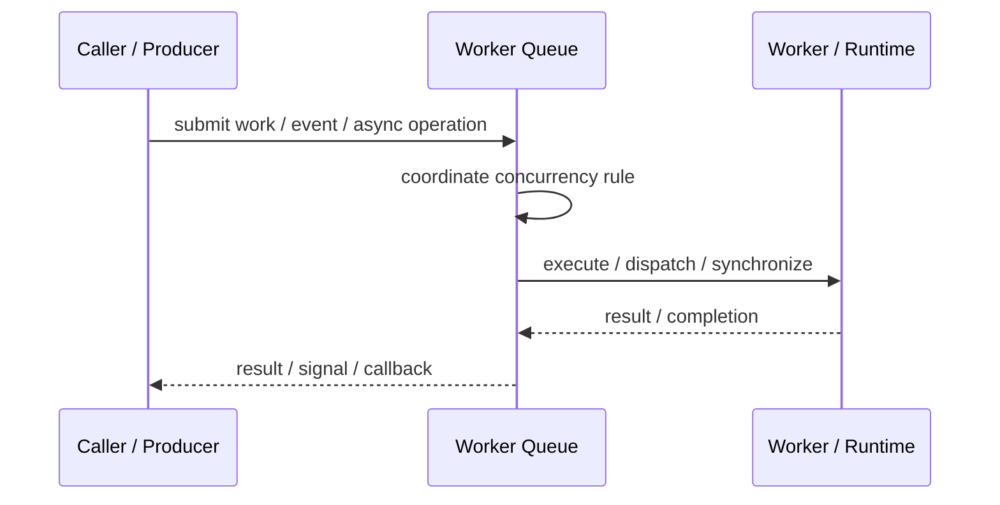
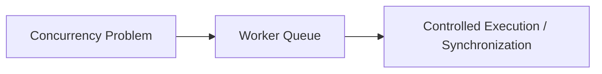

# Worker Queue

## Core Idea

Worker Queue stores units of work that worker threads pull and process independently.

---

## Problem It Solves

A system needs controlled background processing and load smoothing between submitters and workers.

---

## 3 Concrete Examples

### Example 1: Email Sending

Email jobs are queued and processed by worker threads.

### Example 2: File Import

Rows or files are queued for worker processing.

### Example 3: Task Scheduler

Scheduled tasks are placed in a worker queue for execution.

---

## Architect Questions

- What is the unit of work?
- How many workers should run?
- Is the queue persistent or in memory?
- How are failed work items retried?
- Can tasks be processed in parallel safely?
- How is backpressure applied?

---

## Main Diagram



---

## Runtime / Responsibility Flow



---

## Implementation Shape

```txt
1. Identify the concurrency problem: throughput, latency, isolation, synchronization, or resource control.
2. Define the unit of work.
3. Define ownership of shared state.
4. Define execution model: threads, tasks, event loop, actors, workers, or async operations.
5. Define synchronization and backpressure behavior.
6. Define failure behavior: cancellation, timeout, retry, poison work, and shutdown.
7. Add observability: queue depth, worker utilization, latency, deadlocks, blocked time, and error rates.
```

---

## When to Use

- Background tasks need controlled processing.
- Workers should scale independently from submitters.
- Backpressure and retry behavior are needed.

---

## When Not to Use

- Immediate result is required.
- Tasks cannot be retried or made idempotent.
- Ordering requirements conflict with parallel workers.

---

## Common Smell That Suggests This Pattern

```txt
The current design is blocked, overloaded, race-prone, wasting threads,
or mixing work creation, execution, and synchronization in one tangled place.
```

---

## Common Mistakes

```txt
Using concurrency before the bottleneck is real.

Sharing mutable state without clear ownership.

Ignoring backpressure.

Ignoring cancellation and shutdown.

Creating unbounded queues.

Blocking inside event loops or async handlers.

Assuming parallelism always makes code faster.
```

---

## Best Visual Summary



## Final Meaning

Worker Queue is useful when it solves a real concurrency pressure. If the workload is simple, this pattern may add complexity without improving correctness or performance.
