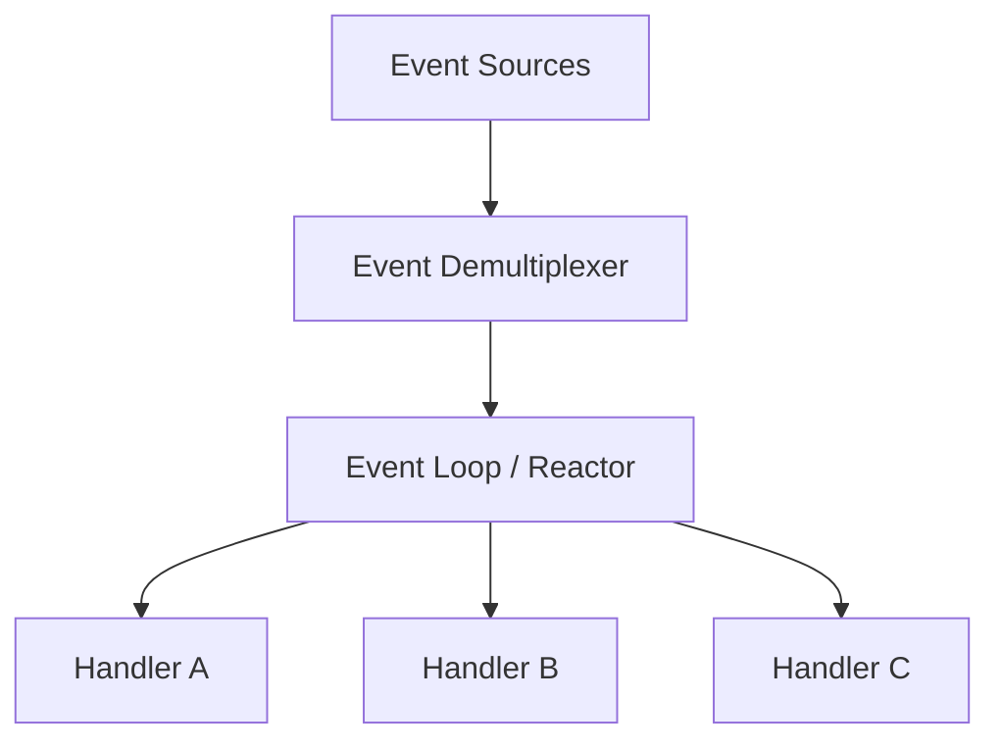
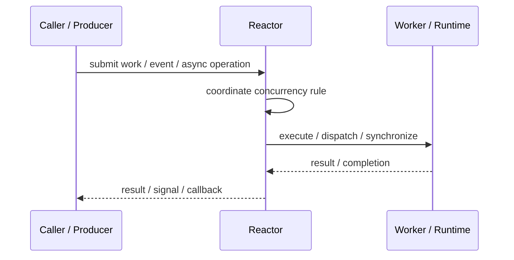
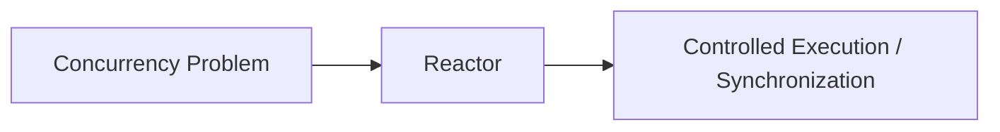

# Reactor

## Core Idea

Reactor waits for events and dispatches them to handlers synchronously, usually using an event loop.

---

## Problem It Solves

A system needs to handle many I/O events without creating one thread per connection.

---

## 3 Concrete Examples

### Example 1: Network Server

A server waits for socket readiness and dispatches read/write handlers.

### Example 2: GUI Event Loop

UI events are dispatched to event handlers.

### Example 3: Node.js-Style I/O

An event loop dispatches callbacks when file or network events are ready.

---

## Architect Questions

- What event source is monitored?
- Are handlers non-blocking?
- What happens if a handler blocks?
- How are errors handled?
- How is backpressure managed?
- Does the system need one loop or multiple loops?

---

## Main Diagram



---

## Runtime / Responsibility Flow



---

## Implementation Shape

```txt
1. Identify the concurrency problem: throughput, latency, isolation, synchronization, or resource control.
2. Define the unit of work.
3. Define ownership of shared state.
4. Define execution model: threads, tasks, event loop, actors, workers, or async operations.
5. Define synchronization and backpressure behavior.
6. Define failure behavior: cancellation, timeout, retry, poison work, and shutdown.
7. Add observability: queue depth, worker utilization, latency, deadlocks, blocked time, and error rates.
```

---

## When to Use

- Many I/O events must be handled efficiently.
- Handlers can remain non-blocking.
- One or few event loops are preferred over many threads.

---

## When Not to Use

- Handlers perform blocking work.
- CPU-heavy work dominates.
- The platform is completion-based and Proactor fits better.

---

## Common Smell That Suggests This Pattern

```txt
The current design is blocked, overloaded, race-prone, wasting threads,
or mixing work creation, execution, and synchronization in one tangled place.
```

---

## Common Mistakes

```txt
Using concurrency before the bottleneck is real.

Sharing mutable state without clear ownership.

Ignoring backpressure.

Ignoring cancellation and shutdown.

Creating unbounded queues.

Blocking inside event loops or async handlers.

Assuming parallelism always makes code faster.
```

---

## Best Visual Summary



## Final Meaning

Reactor is useful when it solves a real concurrency pressure. If the workload is simple, this pattern may add complexity without improving correctness or performance.
