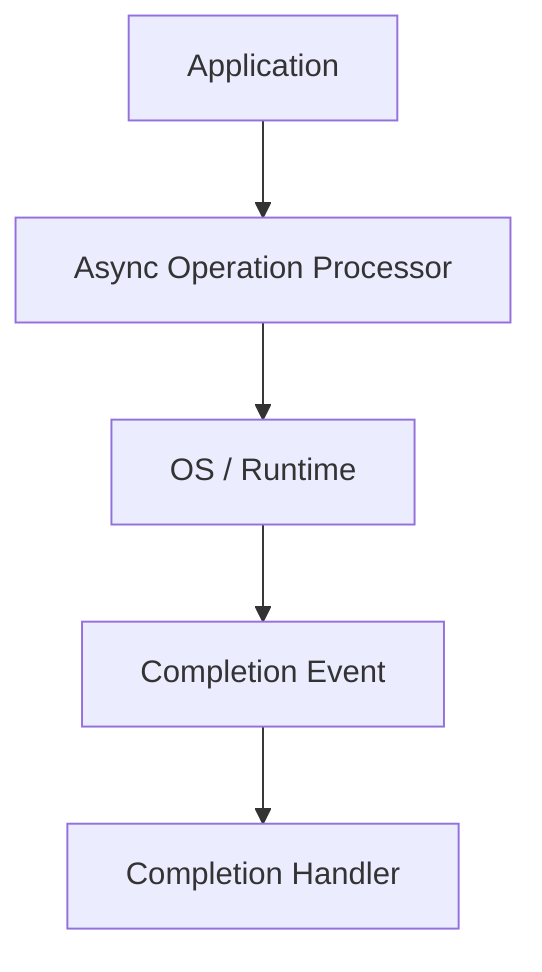
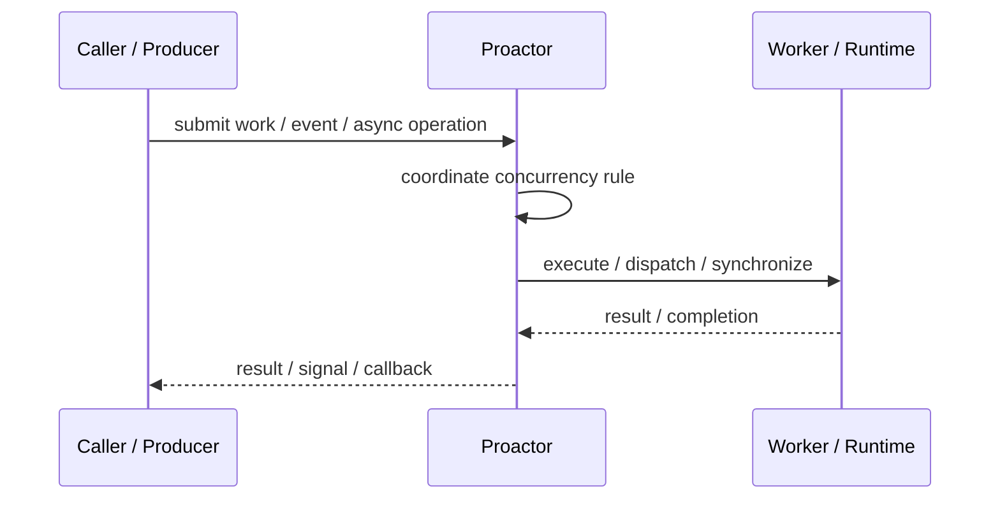
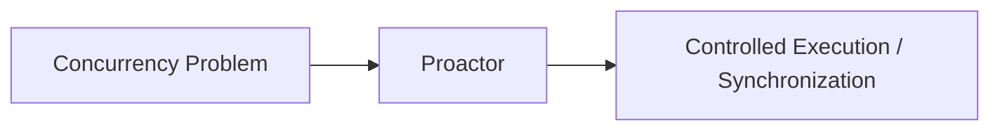

# Proactor

## Core Idea

Proactor starts asynchronous operations and dispatches completion events when the operations finish.

---

## Problem It Solves

A system needs high concurrency where the OS or runtime performs async operations and notifies completion.

---

## 3 Concrete Examples

### Example 1: Async File I/O

Application starts file reads and handles completion callbacks.

### Example 2: High-Performance Network Server

Socket operations complete asynchronously and trigger completion handlers.

### Example 3: Windows IOCP

I/O completion ports notify workers when operations finish.

---

## Architect Questions

- Which operations can run asynchronously?
- Who initiates the async operation?
- Where are completions delivered?
- How are buffers and lifetimes managed?
- How are failures represented in completion events?
- Is the platform better suited to Reactor or Proactor?

---

## Main Diagram



---

## Runtime / Responsibility Flow



---

## Implementation Shape

```txt
1. Identify the concurrency problem: throughput, latency, isolation, synchronization, or resource control.
2. Define the unit of work.
3. Define ownership of shared state.
4. Define execution model: threads, tasks, event loop, actors, workers, or async operations.
5. Define synchronization and backpressure behavior.
6. Define failure behavior: cancellation, timeout, retry, poison work, and shutdown.
7. Add observability: queue depth, worker utilization, latency, deadlocks, blocked time, and error rates.
```

---

## When to Use

- The OS/runtime can perform async operations.
- Completion-based processing fits the platform.
- High concurrency I/O is needed.

---

## When Not to Use

- The platform does not support useful async completions.
- Operation lifetimes are hard to manage safely.
- A Reactor model is simpler.

---

## Common Smell That Suggests This Pattern

```txt
The current design is blocked, overloaded, race-prone, wasting threads,
or mixing work creation, execution, and synchronization in one tangled place.
```

---

## Common Mistakes

```txt
Using concurrency before the bottleneck is real.

Sharing mutable state without clear ownership.

Ignoring backpressure.

Ignoring cancellation and shutdown.

Creating unbounded queues.

Blocking inside event loops or async handlers.

Assuming parallelism always makes code faster.
```

---

## Best Visual Summary



## Final Meaning

Proactor is useful when it solves a real concurrency pressure. If the workload is simple, this pattern may add complexity without improving correctness or performance.
