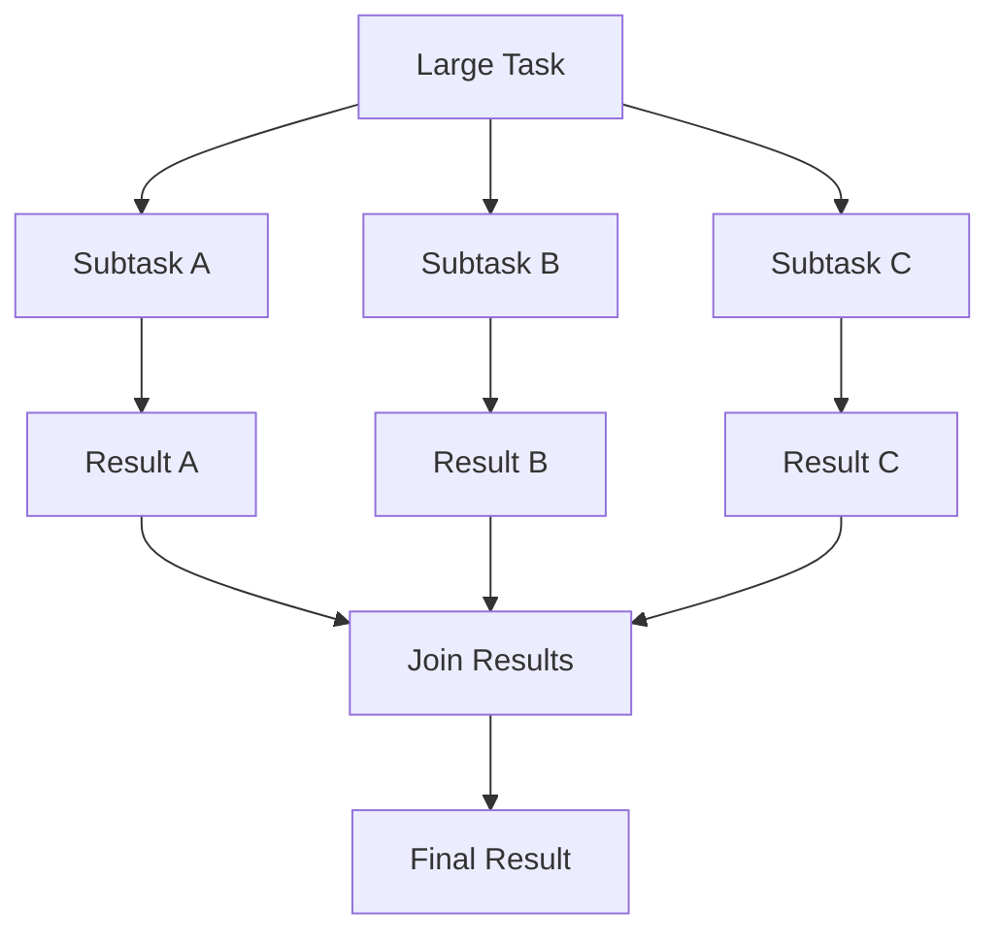
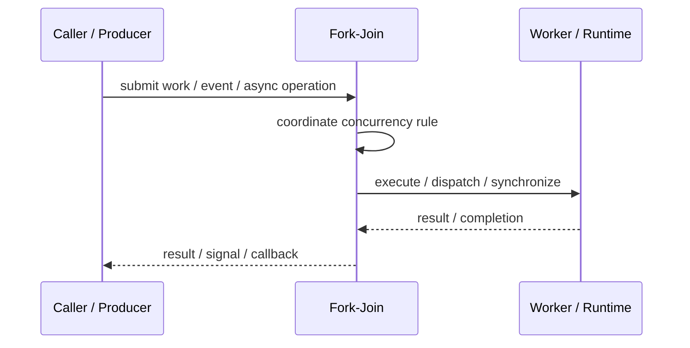
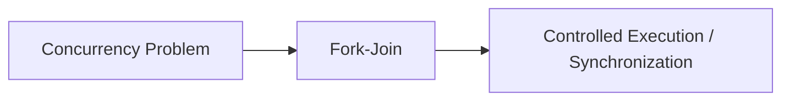

# Fork-Join

## Core Idea

Fork-Join splits a task into smaller subtasks that run in parallel, then joins their results.

---

## Problem It Solves

A large task can be divided into independent pieces that can run concurrently.

---

## 3 Concrete Examples

### Example 1: Parallel Array Sum

Split array into chunks, sum chunks in parallel, combine totals.

### Example 2: Recursive File Search

Search subdirectories in parallel and combine matches.

### Example 3: Parallel Sorting

Split list, sort partitions, merge results.

---

## Architect Questions

- Can the task be split safely?
- What is the minimum useful task size?
- How are partial results combined?
- Is overhead greater than parallel benefit?
- How many workers are available?
- Can subtasks fail independently?

---

## Main Diagram



---

## Runtime / Responsibility Flow



---

## Implementation Shape

```txt
1. Identify the concurrency problem: throughput, latency, isolation, synchronization, or resource control.
2. Define the unit of work.
3. Define ownership of shared state.
4. Define execution model: threads, tasks, event loop, actors, workers, or async operations.
5. Define synchronization and backpressure behavior.
6. Define failure behavior: cancellation, timeout, retry, poison work, and shutdown.
7. Add observability: queue depth, worker utilization, latency, deadlocks, blocked time, and error rates.
```

---

## When to Use

- A task can be recursively split.
- Subtasks are independent.
- Combining partial results is clear.

---

## When Not to Use

- Subtasks are not independent.
- Split/join overhead exceeds benefits.
- Shared state synchronization dominates runtime.

---

## Common Smell That Suggests This Pattern

```txt
The current design is blocked, overloaded, race-prone, wasting threads,
or mixing work creation, execution, and synchronization in one tangled place.
```

---

## Common Mistakes

```txt
Using concurrency before the bottleneck is real.

Sharing mutable state without clear ownership.

Ignoring backpressure.

Ignoring cancellation and shutdown.

Creating unbounded queues.

Blocking inside event loops or async handlers.

Assuming parallelism always makes code faster.
```

---

## Best Visual Summary



## Final Meaning

Fork-Join is useful when it solves a real concurrency pressure. If the workload is simple, this pattern may add complexity without improving correctness or performance.
