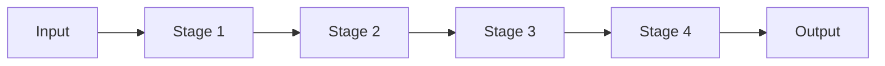
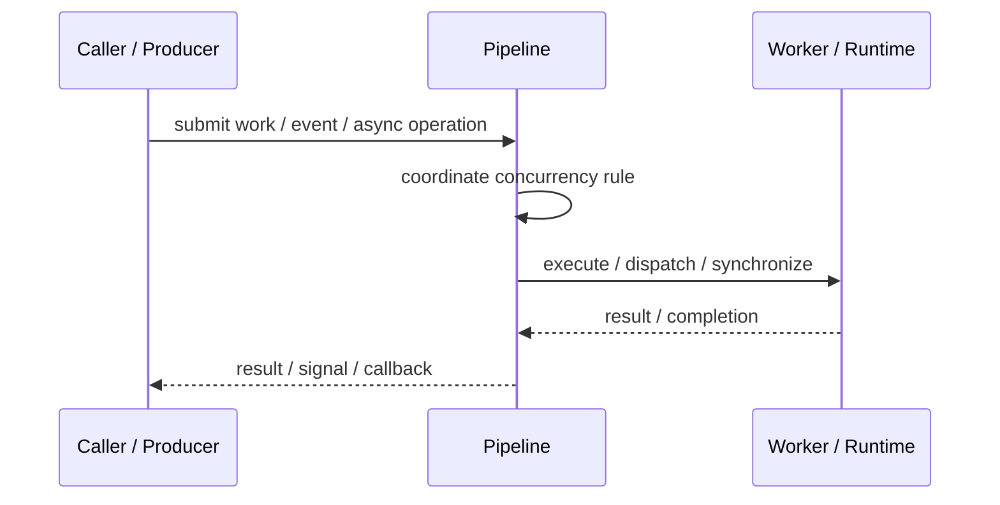
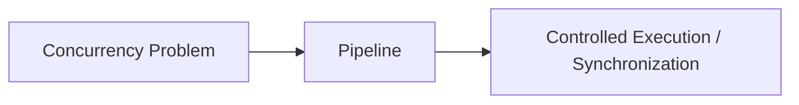

# Pipeline

## Core Idea

Pipeline splits processing into stages where each stage runs independently and passes results to the next stage.

---

## Problem It Solves

A multi-step process needs concurrency and separation of responsibilities between stages.

---

## 3 Concrete Examples

### Example 1: Video Processing

Decode, filter, encode, and upload run as pipeline stages.

### Example 2: Data Import

Read, parse, validate, transform, and save records.

### Example 3: Compiler Pipeline

Lexing, parsing, semantic analysis, optimization, and code generation.

---

## Architect Questions

- What are the processing stages?
- Can stages run concurrently?
- What buffer exists between stages?
- Which stage is the bottleneck?
- How are errors propagated?
- Does ordering need to be preserved?

---

## Main Diagram



---

## Runtime / Responsibility Flow



---

## Implementation Shape

```txt
1. Identify the concurrency problem: throughput, latency, isolation, synchronization, or resource control.
2. Define the unit of work.
3. Define ownership of shared state.
4. Define execution model: threads, tasks, event loop, actors, workers, or async operations.
5. Define synchronization and backpressure behavior.
6. Define failure behavior: cancellation, timeout, retry, poison work, and shutdown.
7. Add observability: queue depth, worker utilization, latency, deadlocks, blocked time, and error rates.
```

---

## When to Use

- Processing has clear stages.
- Stages can run concurrently.
- A staged design improves throughput or clarity.

---

## When Not to Use

- Stages are tightly coupled.
- One stage needs random access to all state.
- A simple sequential process is enough.

---

## Common Smell That Suggests This Pattern

```txt
The current design is blocked, overloaded, race-prone, wasting threads,
or mixing work creation, execution, and synchronization in one tangled place.
```

---

## Common Mistakes

```txt
Using concurrency before the bottleneck is real.

Sharing mutable state without clear ownership.

Ignoring backpressure.

Ignoring cancellation and shutdown.

Creating unbounded queues.

Blocking inside event loops or async handlers.

Assuming parallelism always makes code faster.
```

---

## Best Visual Summary



## Final Meaning

Pipeline is useful when it solves a real concurrency pressure. If the workload is simple, this pattern may add complexity without improving correctness or performance.
