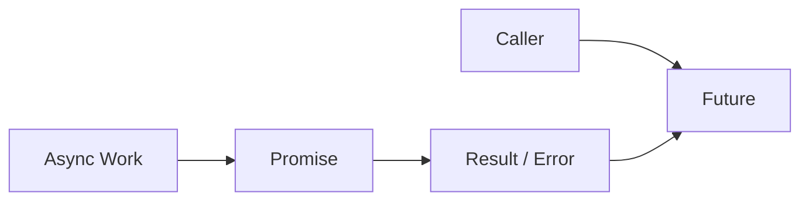
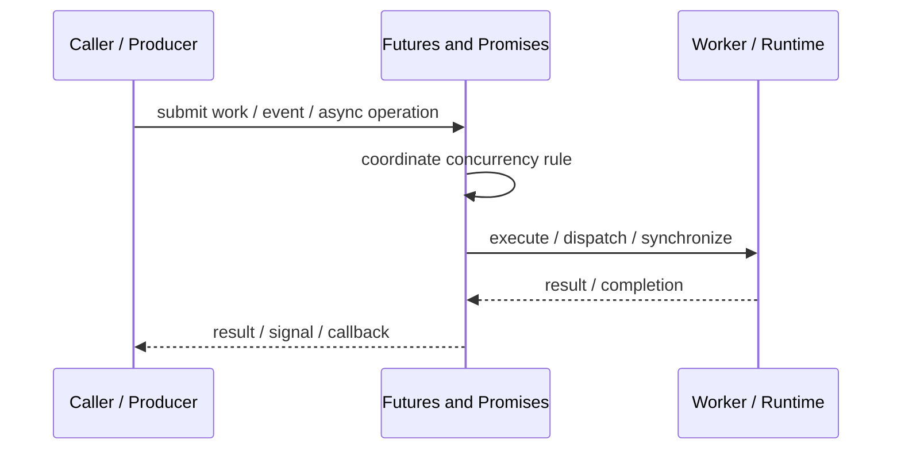

# Futures and Promises

## Core Idea

A Future represents a result that will be available later; a Promise is the writable side that completes that future.

---

## Problem It Solves

A caller needs to start asynchronous work and continue without blocking until the result is needed.

---

## 3 Concrete Examples

### Example 1: Async HTTP Request

A future represents the eventual API response.

### Example 2: Parallel Computation

Several futures compute partial results, then combine.

### Example 3: Background File Load

UI starts file loading and receives the result later.

---

## Architect Questions

- Who creates the promise?
- Who observes the future?
- How are success and failure represented?
- Can the future be cancelled?
- How are multiple futures combined?
- What thread runs continuations?

---

## Main Diagram



---

## Runtime / Responsibility Flow



---

## Implementation Shape

```txt
1. Identify the concurrency problem: throughput, latency, isolation, synchronization, or resource control.
2. Define the unit of work.
3. Define ownership of shared state.
4. Define execution model: threads, tasks, event loop, actors, workers, or async operations.
5. Define synchronization and backpressure behavior.
6. Define failure behavior: cancellation, timeout, retry, poison work, and shutdown.
7. Add observability: queue depth, worker utilization, latency, deadlocks, blocked time, and error rates.
```

---

## When to Use

- Async results need to be represented explicitly.
- Callers should compose or wait for results later.
- Failure and success can be modeled as result completion.

---

## When Not to Use

- The result is needed immediately.
- Async complexity adds no value.
- Cancellation and error handling are ignored.

---

## Common Smell That Suggests This Pattern

```txt
The current design is blocked, overloaded, race-prone, wasting threads,
or mixing work creation, execution, and synchronization in one tangled place.
```

---

## Common Mistakes

```txt
Using concurrency before the bottleneck is real.

Sharing mutable state without clear ownership.

Ignoring backpressure.

Ignoring cancellation and shutdown.

Creating unbounded queues.

Blocking inside event loops or async handlers.

Assuming parallelism always makes code faster.
```

---

## Best Visual Summary


## Final Meaning

Futures and Promises is useful when it solves a real concurrency pressure. If the workload is simple, this pattern may add complexity without improving correctness or performance.
