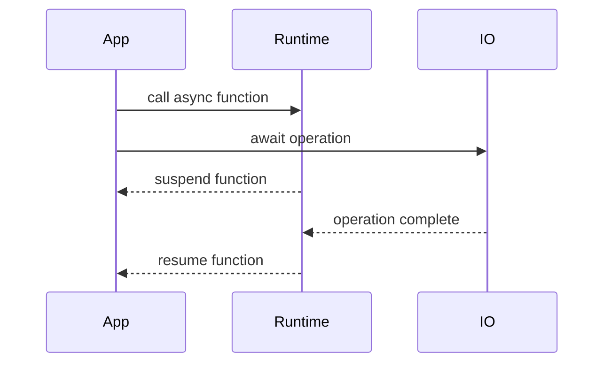
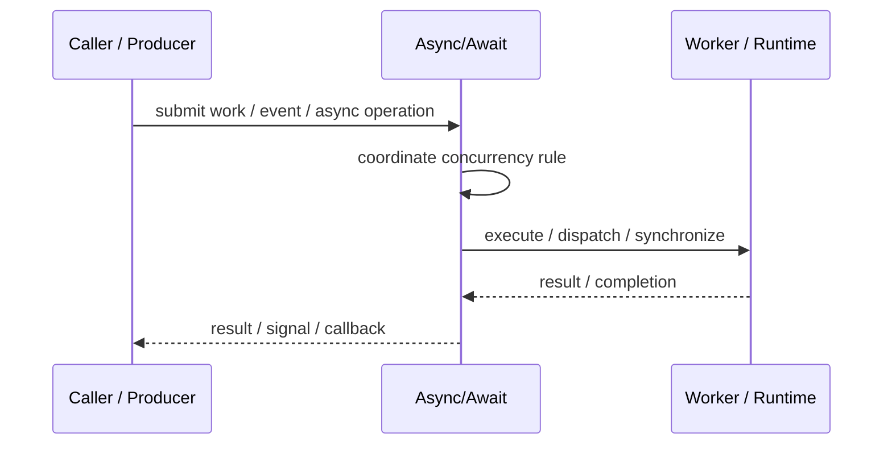
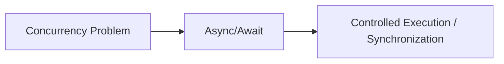

# Async/Await

## Core Idea

Async/Await writes asynchronous code in a sequential style while the runtime handles suspension and resumption.

---

## Problem It Solves

Callback or promise chains make asynchronous logic hard to read and error-prone.

---

## 3 Concrete Examples

### Example 1: API Call Flow

Fetch user, then fetch orders, then return combined response using await.

### Example 2: File Processing

Await file read, transform content, then await file write.

### Example 3: UI Data Loading

Async function loads data without freezing the UI thread.

---

## Architect Questions

- Which operations are truly asynchronous?
- What context resumes after await?
- How are errors handled?
- Can awaits run concurrently where possible?
- Could sequential awaits accidentally reduce performance?
- How is cancellation handled?

---

## Main Diagram



---

## Runtime / Responsibility Flow



---

## Implementation Shape

```txt
1. Identify the concurrency problem: throughput, latency, isolation, synchronization, or resource control.
2. Define the unit of work.
3. Define ownership of shared state.
4. Define execution model: threads, tasks, event loop, actors, workers, or async operations.
5. Define synchronization and backpressure behavior.
6. Define failure behavior: cancellation, timeout, retry, poison work, and shutdown.
7. Add observability: queue depth, worker utilization, latency, deadlocks, blocked time, and error rates.
```

---

## When to Use

- Async workflows need readable control flow.
- The runtime supports suspension/resumption.
- I/O-bound operations should not block threads.

---

## When Not to Use

- Operations are CPU-bound and should use workers instead.
- Sequential awaits accidentally serialize independent work.
- Blocking calls are hidden inside async functions.

---

## Common Smell That Suggests This Pattern

```txt
The current design is blocked, overloaded, race-prone, wasting threads,
or mixing work creation, execution, and synchronization in one tangled place.
```

---

## Common Mistakes

```txt
Using concurrency before the bottleneck is real.

Sharing mutable state without clear ownership.

Ignoring backpressure.

Ignoring cancellation and shutdown.

Creating unbounded queues.

Blocking inside event loops or async handlers.

Assuming parallelism always makes code faster.
```

---

## Best Visual Summary



## Final Meaning

Async/Await is useful when it solves a real concurrency pressure. If the workload is simple, this pattern may add complexity without improving correctness or performance.
