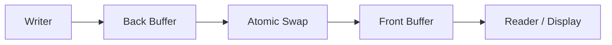
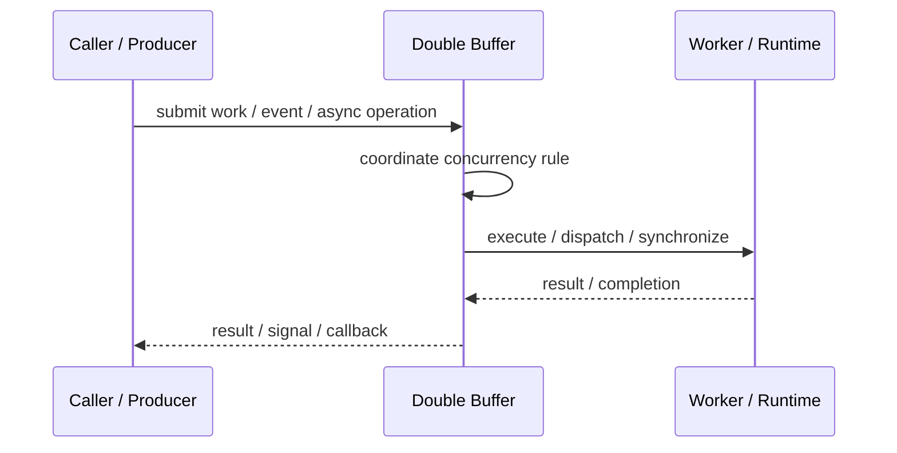
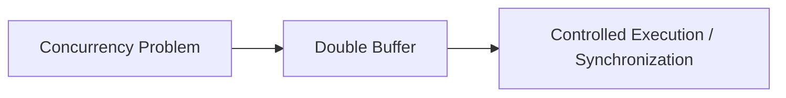

# Double Buffer

## Core Idea

Double Buffer uses two buffers so one can be read/displayed while the other is written/updated.

---

## Problem It Solves

Readers can see partially updated data or displays can flicker while data is being changed.

---

## 3 Concrete Examples

### Example 1: Graphics Rendering

Render next frame into a back buffer, then swap to display.

### Example 2: Telemetry Snapshot

Writer fills one buffer while readers read a stable previous snapshot.

### Example 3: Audio Processing

One buffer plays while the next buffer is filled.

---

## Architect Questions

- What data must be stable while being read?
- When is the buffer swap safe?
- Who owns the front buffer and back buffer?
- Is locking needed during swap?
- What happens if producer is faster than consumer?
- Is two buffers enough or is a ring buffer needed?

---

## Main Diagram



---

## Runtime / Responsibility Flow



---

## Implementation Shape

```txt
1. Identify the concurrency problem: throughput, latency, isolation, synchronization, or resource control.
2. Define the unit of work.
3. Define ownership of shared state.
4. Define execution model: threads, tasks, event loop, actors, workers, or async operations.
5. Define synchronization and backpressure behavior.
6. Define failure behavior: cancellation, timeout, retry, poison work, and shutdown.
7. Add observability: queue depth, worker utilization, latency, deadlocks, blocked time, and error rates.
```

---

## When to Use

- Readers need stable snapshots while writers update.
- Rendering or streaming should avoid partial updates.
- Atomic swapping is practical.

---

## When Not to Use

- One buffer is enough.
- Memory overhead is unacceptable.
- Swap consistency cannot be guaranteed.

---

## Common Smell That Suggests This Pattern

```txt
The current design is blocked, overloaded, race-prone, wasting threads,
or mixing work creation, execution, and synchronization in one tangled place.
```

---

## Common Mistakes

```txt
Using concurrency before the bottleneck is real.

Sharing mutable state without clear ownership.

Ignoring backpressure.

Ignoring cancellation and shutdown.

Creating unbounded queues.

Blocking inside event loops or async handlers.

Assuming parallelism always makes code faster.
```

---

## Best Visual Summary



## Final Meaning

Double Buffer is useful when it solves a real concurrency pressure. If the workload is simple, this pattern may add complexity without improving correctness or performance.
