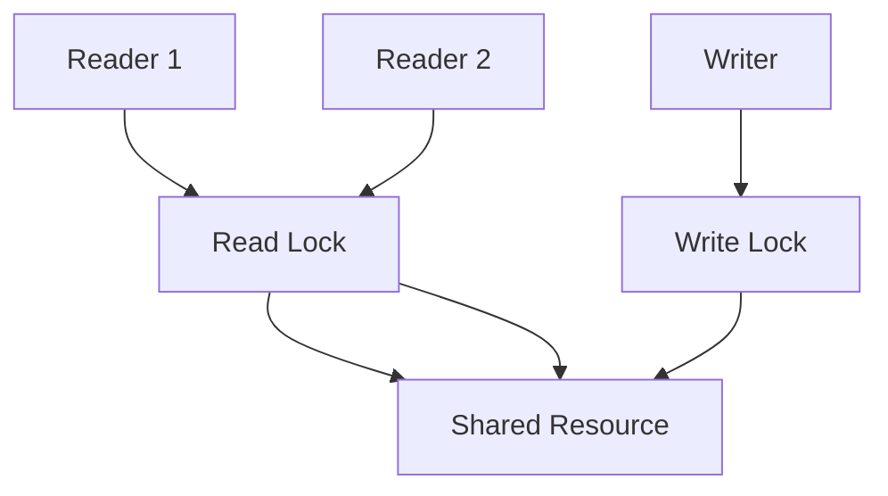
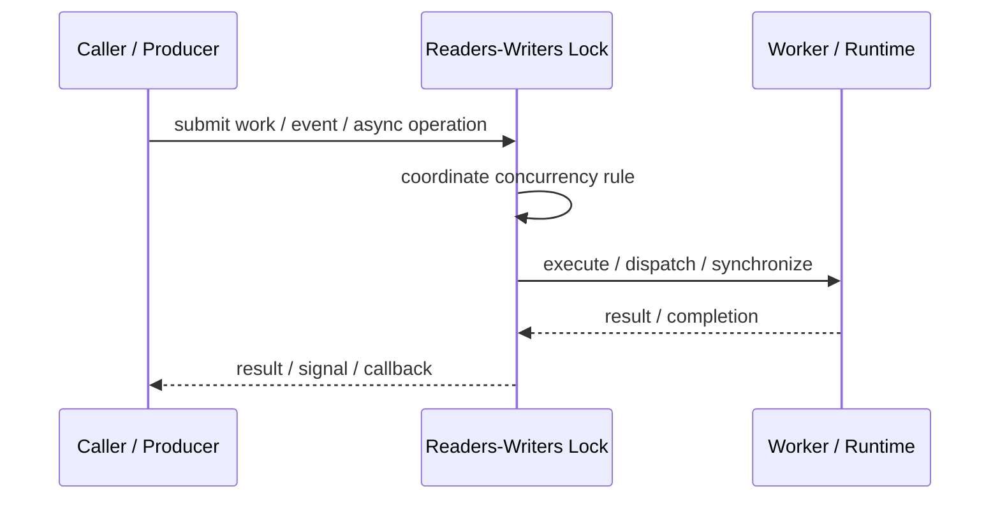

# Readers-Writers Lock

## Core Idea

Readers-Writers Lock allows multiple readers at the same time but gives writers exclusive access.

---

## Problem It Solves

A shared resource has many reads and fewer writes, and normal mutex locking would reduce read concurrency.

---

## 3 Concrete Examples

### Example 1: Configuration Store

Many threads read config while rare updates take exclusive lock.

### Example 2: In-Memory Cache

Many readers access cache entries while writers update them.

### Example 3: Routing Table

Network threads read routing data while occasional updates modify it.

---

## Architect Questions

- Is the workload read-heavy?
- Can multiple reads safely occur together?
- How are writers prevented from starving?
- How are lock upgrades/downgrades handled?
- Is a simpler mutex enough?
- How long are read and write locks held?

---

## Main Diagram



---

## Runtime / Responsibility Flow



---

## Implementation Shape

```txt
1. Identify the concurrency problem: throughput, latency, isolation, synchronization, or resource control.
2. Define the unit of work.
3. Define ownership of shared state.
4. Define execution model: threads, tasks, event loop, actors, workers, or async operations.
5. Define synchronization and backpressure behavior.
6. Define failure behavior: cancellation, timeout, retry, poison work, and shutdown.
7. Add observability: queue depth, worker utilization, latency, deadlocks, blocked time, and error rates.
```

---

## When to Use

- Reads are frequent and writes are rare.
- Concurrent reads are safe.
- Exclusive writes are required.

---

## When Not to Use

- Writes are frequent.
- Writer starvation is likely.
- A simple mutex is clearer and fast enough.

---

## Common Smell That Suggests This Pattern

```txt
The current design is blocked, overloaded, race-prone, wasting threads,
or mixing work creation, execution, and synchronization in one tangled place.
```

---

## Common Mistakes

```txt
Using concurrency before the bottleneck is real.

Sharing mutable state without clear ownership.

Ignoring backpressure.

Ignoring cancellation and shutdown.

Creating unbounded queues.

Blocking inside event loops or async handlers.

Assuming parallelism always makes code faster.
```

---

## Best Visual Summary


## Final Meaning

Readers-Writers Lock is useful when it solves a real concurrency pressure. If the workload is simple, this pattern may add complexity without improving correctness or performance.
