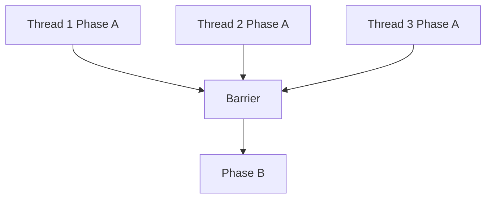
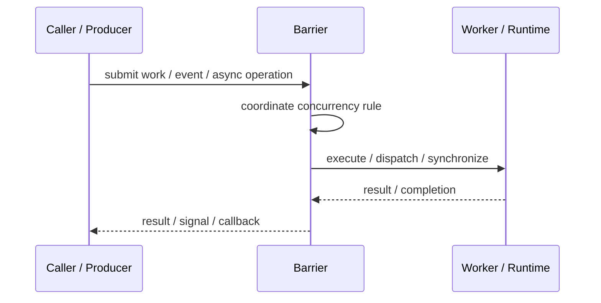
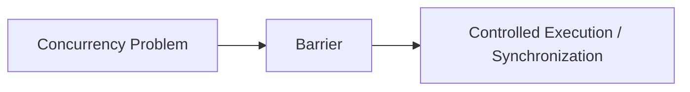

# Barrier

## Core Idea

Barrier makes multiple threads wait until all participating threads reach the same point before continuing.

---

## Problem It Solves

Parallel tasks must complete a phase before any task starts the next phase.

---

## 3 Concrete Examples

### Example 1: Simulation Step

All worker threads finish computing the current timestep before the next timestep begins.

### Example 2: Parallel Matrix Operation

Each worker finishes its block before the merge phase starts.

### Example 3: Game Physics

All physics workers synchronize before rendering reads results.

---

## Architect Questions

- How many participants must arrive?
- What happens if one participant fails?
- Is the barrier reusable?
- Can timeouts occur?
- What work runs after the barrier trips?
- Could barrier synchronization become a bottleneck?

---

## Main Diagram



---

## Runtime / Responsibility Flow



---

## Implementation Shape

```txt
1. Identify the concurrency problem: throughput, latency, isolation, synchronization, or resource control.
2. Define the unit of work.
3. Define ownership of shared state.
4. Define execution model: threads, tasks, event loop, actors, workers, or async operations.
5. Define synchronization and backpressure behavior.
6. Define failure behavior: cancellation, timeout, retry, poison work, and shutdown.
7. Add observability: queue depth, worker utilization, latency, deadlocks, blocked time, and error rates.
```

---

## When to Use

- Parallel phases must synchronize.
- No thread should enter the next phase early.
- The number of participants is known.

---

## When Not to Use

- Participants are dynamic or unreliable.
- One slow thread would block all progress.
- Phases do not actually require synchronization.

---

## Common Smell That Suggests This Pattern

```txt
The current design is blocked, overloaded, race-prone, wasting threads,
or mixing work creation, execution, and synchronization in one tangled place.
```

---

## Common Mistakes

```txt
Using concurrency before the bottleneck is real.

Sharing mutable state without clear ownership.

Ignoring backpressure.

Ignoring cancellation and shutdown.

Creating unbounded queues.

Blocking inside event loops or async handlers.

Assuming parallelism always makes code faster.
```

---

## Best Visual Summary



## Final Meaning

Barrier is useful when it solves a real concurrency pressure. If the workload is simple, this pattern may add complexity without improving correctness or performance.
