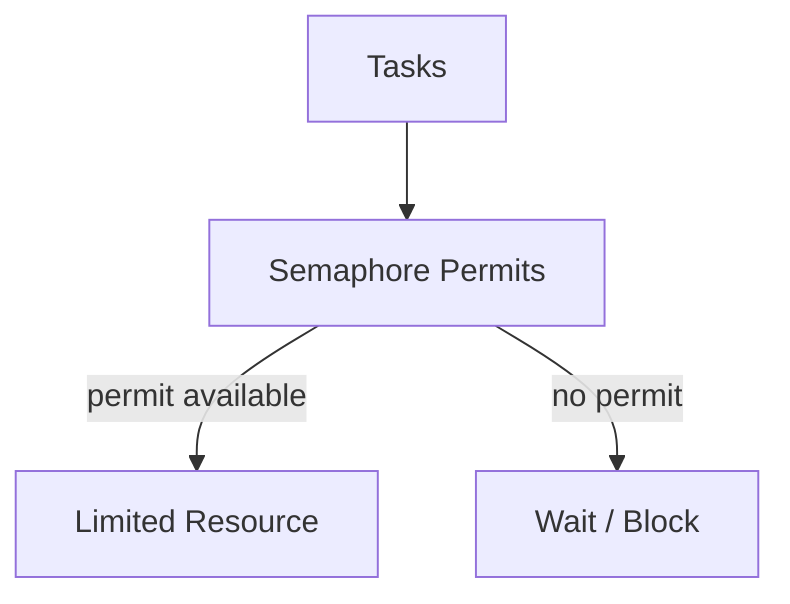
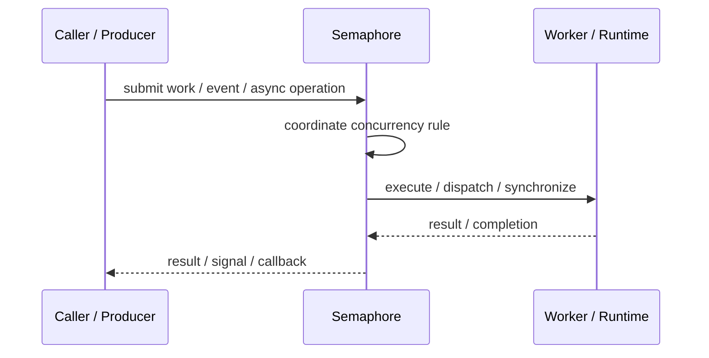
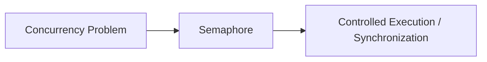

# Semaphore

## Core Idea

Semaphore controls access to a limited number of permits for a shared resource.

---

## Problem It Solves

Only a fixed number of tasks should access a resource concurrently.

---

## 3 Concrete Examples

### Example 1: Database Connections

Only 20 concurrent operations can use DB connections.

### Example 2: API Rate Slot Control

Only 5 threads can call a slow external API at once.

### Example 3: File Upload Slots

Only 3 uploads can run concurrently per user.

---

## Architect Questions

- What resource is limited?
- How many permits are available?
- What happens when permits are exhausted?
- Are permits always released?
- Can starvation happen?
- Is a semaphore better than a queue or pool?

---

## Main Diagram



---

## Runtime / Responsibility Flow



---

## Implementation Shape

```txt
1. Identify the concurrency problem: throughput, latency, isolation, synchronization, or resource control.
2. Define the unit of work.
3. Define ownership of shared state.
4. Define execution model: threads, tasks, event loop, actors, workers, or async operations.
5. Define synchronization and backpressure behavior.
6. Define failure behavior: cancellation, timeout, retry, poison work, and shutdown.
7. Add observability: queue depth, worker utilization, latency, deadlocks, blocked time, and error rates.
```

---

## When to Use

- A limited resource needs bounded concurrent access.
- Permits model resource capacity well.
- Blocking or waiting is acceptable.

---

## When Not to Use

- Ownership must be tied to a specific lock holder.
- A pool or queue is clearer.
- Permits may leak due to poor release handling.

---

## Common Smell That Suggests This Pattern

```txt
The current design is blocked, overloaded, race-prone, wasting threads,
or mixing work creation, execution, and synchronization in one tangled place.
```

---

## Common Mistakes

```txt
Using concurrency before the bottleneck is real.

Sharing mutable state without clear ownership.

Ignoring backpressure.

Ignoring cancellation and shutdown.

Creating unbounded queues.

Blocking inside event loops or async handlers.

Assuming parallelism always makes code faster.
```

---

## Best Visual Summary



## Final Meaning

Semaphore is useful when it solves a real concurrency pressure. If the workload is simple, this pattern may add complexity without improving correctness or performance.
