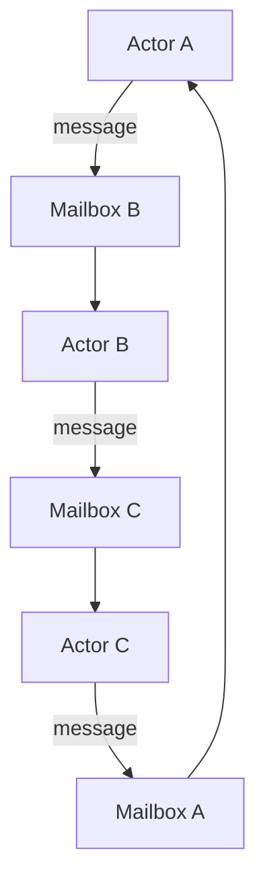
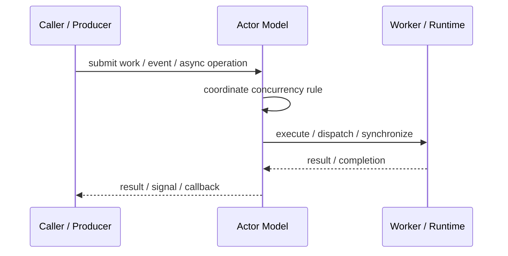
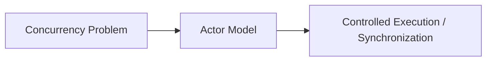

# Actor Model

## Core Idea

Actor Model organizes concurrency around isolated actors that own state and communicate by messages.

---

## Problem It Solves

Shared mutable state and locks make concurrent code hard to reason about.

---

## 3 Concrete Examples

### Example 1: Chat Room Actor

Each chat room actor owns messages and participants.

### Example 2: Game Entity Actor

Each game entity processes its own movement and interaction messages.

### Example 3: IoT Device Actor

Each device actor owns state and receives commands/readings.

---

## Architect Questions

- What entities should become actors?
- What state does each actor own?
- What messages can it receive?
- How are actors supervised?
- How are slow actors handled?
- What ordering guarantees exist per actor mailbox?

---

## Main Diagram



---

## Runtime / Responsibility Flow



---

## Implementation Shape

```txt
1. Identify the concurrency problem: throughput, latency, isolation, synchronization, or resource control.
2. Define the unit of work.
3. Define ownership of shared state.
4. Define execution model: threads, tasks, event loop, actors, workers, or async operations.
5. Define synchronization and backpressure behavior.
6. Define failure behavior: cancellation, timeout, retry, poison work, and shutdown.
7. Add observability: queue depth, worker utilization, latency, deadlocks, blocked time, and error rates.
```

---

## When to Use

- State should be isolated per actor.
- Message passing fits the domain.
- You want to reduce shared-memory locking.

---

## When Not to Use

- Strong transactions across many actors are required.
- Message ordering and supervision are not understood.
- The workflow is simple synchronous code.

---

## Common Smell That Suggests This Pattern

```txt
The current design is blocked, overloaded, race-prone, wasting threads,
or mixing work creation, execution, and synchronization in one tangled place.
```

---

## Common Mistakes

```txt
Using concurrency before the bottleneck is real.

Sharing mutable state without clear ownership.

Ignoring backpressure.

Ignoring cancellation and shutdown.

Creating unbounded queues.

Blocking inside event loops or async handlers.

Assuming parallelism always makes code faster.
```

---

## Best Visual Summary



## Final Meaning

Actor Model is useful when it solves a real concurrency pressure. If the workload is simple, this pattern may add complexity without improving correctness or performance.
