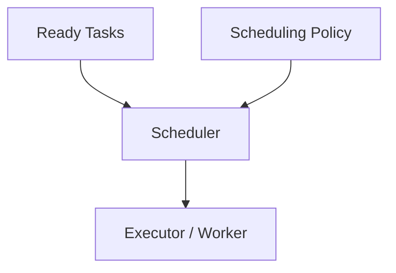
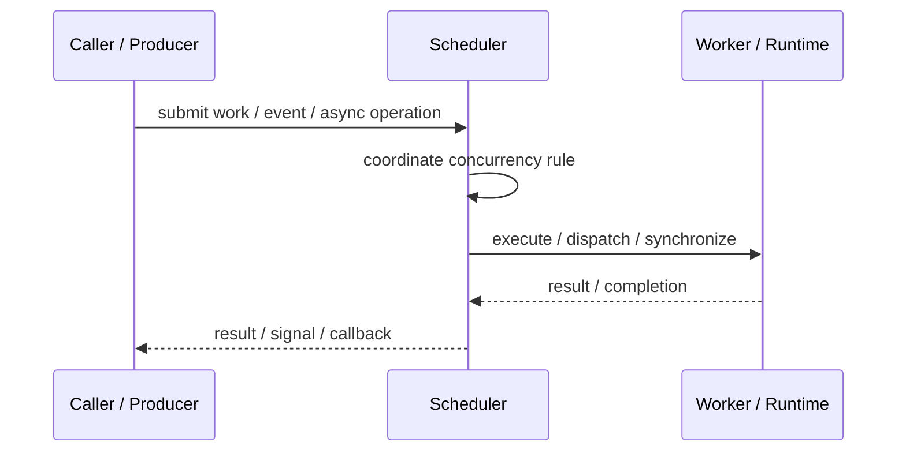
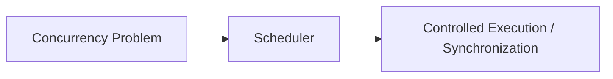

# Scheduler

## Core Idea

Scheduler decides when tasks run, where they run, and in what priority order.

---

## Problem It Solves

Many tasks compete for limited execution resources and need policy-based coordination.

---

## 3 Concrete Examples

### Example 1: Job Scheduler

Runs background jobs based on time, priority, and dependencies.

### Example 2: Coroutine Scheduler

Chooses which coroutine resumes next.

### Example 3: Real-Time Scheduler

Prioritizes time-sensitive tasks over background tasks.

---

## Architect Questions

- What tasks are scheduled?
- What policy decides priority?
- Are tasks preemptive or cooperative?
- Are deadlines involved?
- How is starvation avoided?
- How are cancellations and retries handled?

---

## Main Diagram



---

## Runtime / Responsibility Flow



---

## Implementation Shape

```txt
1. Identify the concurrency problem: throughput, latency, isolation, synchronization, or resource control.
2. Define the unit of work.
3. Define ownership of shared state.
4. Define execution model: threads, tasks, event loop, actors, workers, or async operations.
5. Define synchronization and backpressure behavior.
6. Define failure behavior: cancellation, timeout, retry, poison work, and shutdown.
7. Add observability: queue depth, worker utilization, latency, deadlocks, blocked time, and error rates.
```

---

## When to Use

- Tasks need execution policy.
- Priorities, deadlines, or fairness matter.
- Execution resources are limited.

---

## When Not to Use

- Natural runtime scheduling is enough.
- Custom scheduling policy is not needed.
- The scheduler becomes a hidden god component.

---

## Common Smell That Suggests This Pattern

```txt
The current design is blocked, overloaded, race-prone, wasting threads,
or mixing work creation, execution, and synchronization in one tangled place.
```

---

## Common Mistakes

```txt
Using concurrency before the bottleneck is real.

Sharing mutable state without clear ownership.

Ignoring backpressure.

Ignoring cancellation and shutdown.

Creating unbounded queues.

Blocking inside event loops or async handlers.

Assuming parallelism always makes code faster.
```

---

## Best Visual Summary



## Final Meaning

Scheduler is useful when it solves a real concurrency pressure. If the workload is simple, this pattern may add complexity without improving correctness or performance.
