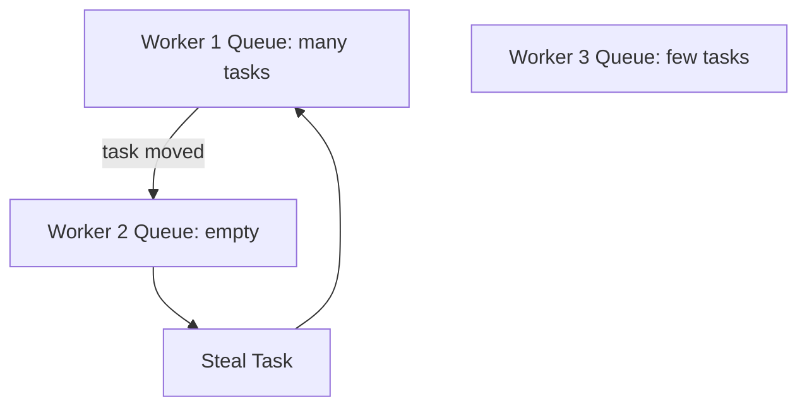
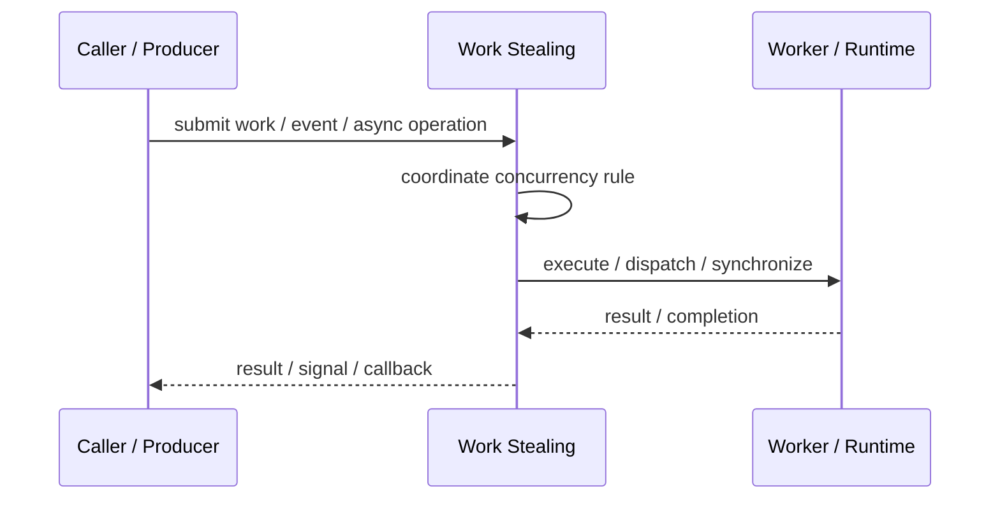
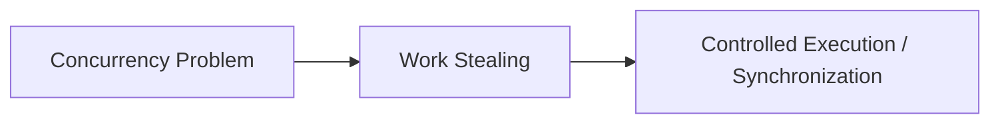

# Work Stealing

## Core Idea

Work Stealing lets idle workers take tasks from busy workers' queues to improve load balancing.

---

## Problem It Solves

Parallel workloads can become imbalanced when some workers finish early while others still have many tasks.

---

## 3 Concrete Examples

### Example 1: Fork-Join Pool

Idle worker steals recursive subtasks from another worker.

### Example 2: Parallel Search

Workers steal unexplored branches from busy workers.

### Example 3: Task Runtime

A runtime balances uneven tasks across CPU cores.

---

## Architect Questions

- Does workload size vary unpredictably?
- Does each worker have a local deque?
- Which side of the queue is stolen from?
- How is synchronization handled?
- Is stealing overhead worth it?
- How are task priorities preserved?

---

## Main Diagram



---

## Runtime / Responsibility Flow



---

## Implementation Shape

```txt
1. Identify the concurrency problem: throughput, latency, isolation, synchronization, or resource control.
2. Define the unit of work.
3. Define ownership of shared state.
4. Define execution model: threads, tasks, event loop, actors, workers, or async operations.
5. Define synchronization and backpressure behavior.
6. Define failure behavior: cancellation, timeout, retry, poison work, and shutdown.
7. Add observability: queue depth, worker utilization, latency, deadlocks, blocked time, and error rates.
```

---

## When to Use

- Parallel task sizes are uneven.
- Workers can run independent tasks.
- Load balancing should happen dynamically.

---

## When Not to Use

- Tasks are uniform and static partitioning is enough.
- Stealing overhead is too high.
- Task priority/order must be strict.

---

## Common Smell That Suggests This Pattern

```txt
The current design is blocked, overloaded, race-prone, wasting threads,
or mixing work creation, execution, and synchronization in one tangled place.
```

---

## Common Mistakes

```txt
Using concurrency before the bottleneck is real.

Sharing mutable state without clear ownership.

Ignoring backpressure.

Ignoring cancellation and shutdown.

Creating unbounded queues.

Blocking inside event loops or async handlers.

Assuming parallelism always makes code faster.
```

---

## Best Visual Summary



## Final Meaning

Work Stealing is useful when it solves a real concurrency pressure. If the workload is simple, this pattern may add complexity without improving correctness or performance.
