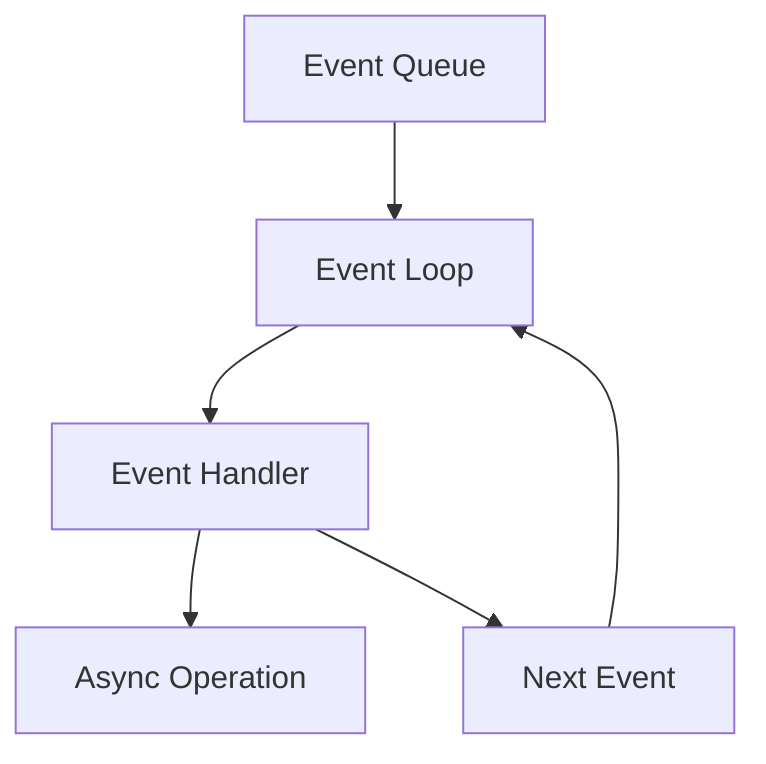
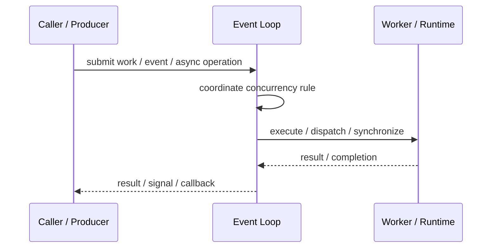
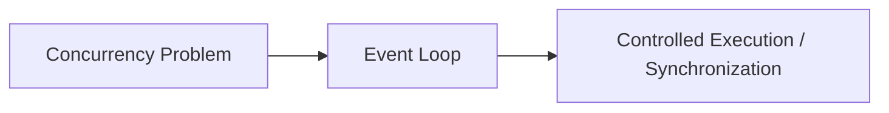

# Event Loop

## Core Idea

Event Loop repeatedly waits for events, dispatches handlers, and continues without blocking the main execution thread.

---

## Problem It Solves

A program needs to handle many asynchronous events using a small number of threads.

---

## 3 Concrete Examples

### Example 1: JavaScript Runtime

The event loop handles timers, network callbacks, and UI events.

### Example 2: GUI Application

The UI event loop dispatches clicks, keyboard input, and repaint events.

### Example 3: Async Server

A server event loop handles many socket events.

---

## Architect Questions

- What events enter the loop?
- Are handlers non-blocking?
- What queues exist: timers, I/O, microtasks?
- How are long-running tasks offloaded?
- How is starvation avoided?
- What happens when a handler throws?

---

## Main Diagram



---

## Runtime / Responsibility Flow



---

## Implementation Shape

```txt
1. Identify the concurrency problem: throughput, latency, isolation, synchronization, or resource control.
2. Define the unit of work.
3. Define ownership of shared state.
4. Define execution model: threads, tasks, event loop, actors, workers, or async operations.
5. Define synchronization and backpressure behavior.
6. Define failure behavior: cancellation, timeout, retry, poison work, and shutdown.
7. Add observability: queue depth, worker utilization, latency, deadlocks, blocked time, and error rates.
```

---

## When to Use

- Many async events must be handled with few threads.
- Handlers can avoid blocking.
- The platform uses event-driven execution.

---

## When Not to Use

- Handlers block or do CPU-heavy work.
- Long tasks freeze the loop.
- Multi-threaded blocking design is simpler for the problem.

---

## Common Smell That Suggests This Pattern

```txt
The current design is blocked, overloaded, race-prone, wasting threads,
or mixing work creation, execution, and synchronization in one tangled place.
```

---

## Common Mistakes

```txt
Using concurrency before the bottleneck is real.

Sharing mutable state without clear ownership.

Ignoring backpressure.

Ignoring cancellation and shutdown.

Creating unbounded queues.

Blocking inside event loops or async handlers.

Assuming parallelism always makes code faster.
```

---

## Best Visual Summary



## Final Meaning

Event Loop is useful when it solves a real concurrency pressure. If the workload is simple, this pattern may add complexity without improving correctness or performance.
