# Abstract Factory Pattern Using Diagrams

## Core Idea

Abstract Factory is used when the system needs to create **families of related objects** without the main application knowing the exact concrete classes.

Instead of this:

```txt
Application directly creates:
- WindowsButton
- WindowsCheckbox
- WindowsDropdown
```

The application talks to a factory:

```txt
Application asks:
- createButton()
- createCheckbox()
- createDropdown()
```

The selected factory decides which family to create.

---

# 1. Abstract Factory: General Structure

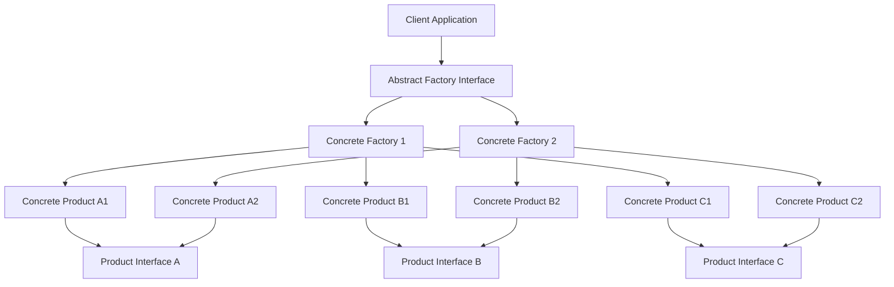

## What This Means

The application does **not** create concrete objects directly.

The application only knows:

```txt
Factory Interface
Product Interfaces
```

It does **not** know:

```txt
Concrete Factory
Concrete Product Classes
```

That is the whole point.

---

# 2. Example: Cross-Platform UI

## Problem

The application needs UI components for different platforms:

```txt
Windows
macOS
Linux
```

Each platform has related UI components:

```txt
Button
Checkbox
Dropdown
```

The danger is mixing incompatible UI components.

Bad situation:

```txt
Windows Button
macOS Checkbox
Linux Dropdown
```

That creates inconsistent design and behavior.

---

## Abstract Factory Diagram

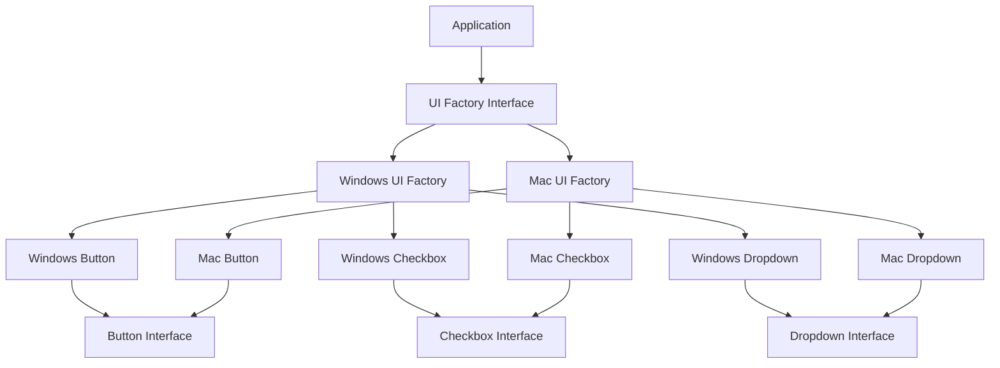

---

## Architect Questions

An architect would ask:

```txt
Do these UI objects belong to a family?

Can these objects be mixed safely?

Will the application support more platforms later?

Should the business logic know about Windows or macOS classes?

Can the selected platform come from configuration?

What happens if a developer accidentally mixes Windows and Mac components?
```

---

## Runtime Flow

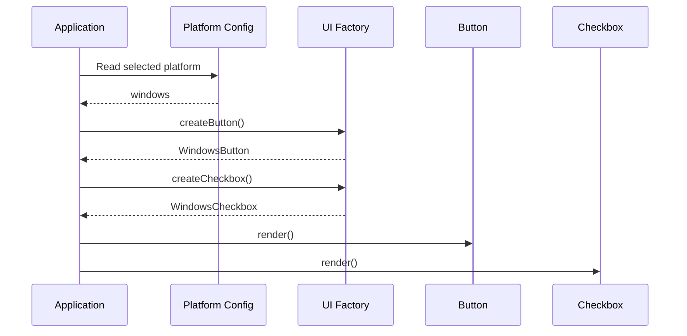

---

## Architectural Meaning

The application does not care whether it receives:

```txt
WindowsButton
MacButton
LinuxButton
```

It only cares that the object behaves like a:

```txt
Button
```

---

# 3. Example: Payment Provider System

## Problem

A SaaS application supports multiple payment providers:

```txt
Stripe
PayPal
Square
```

Each provider has related services:

```txt
Payment Processor
Refund Processor
Subscription Manager
Invoice Generator
```

The dangerous design is mixing providers:

```txt
Stripe Payment Processor
PayPal Refund Processor
Square Subscription Manager
```

That is a serious business and data consistency problem.

---

## Abstract Factory Diagram

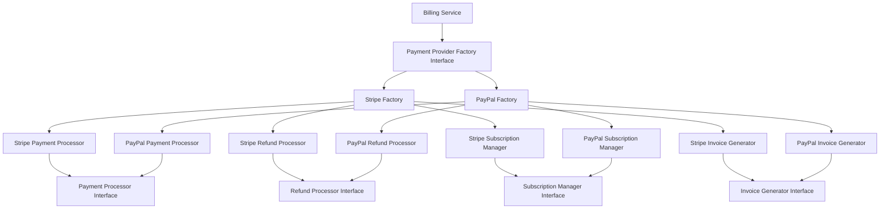

---

## Architect Questions

An architect would ask:

```txt
Does each provider have multiple related services?

Should all billing operations use the same provider family?

Can the payment provider change by tenant, country, or environment?

Should billing logic know Stripe-specific or PayPal-specific classes?

How do we prevent mixing Stripe charge logic with PayPal refund logic?

Will we add more providers later?
```

---

## Runtime Flow

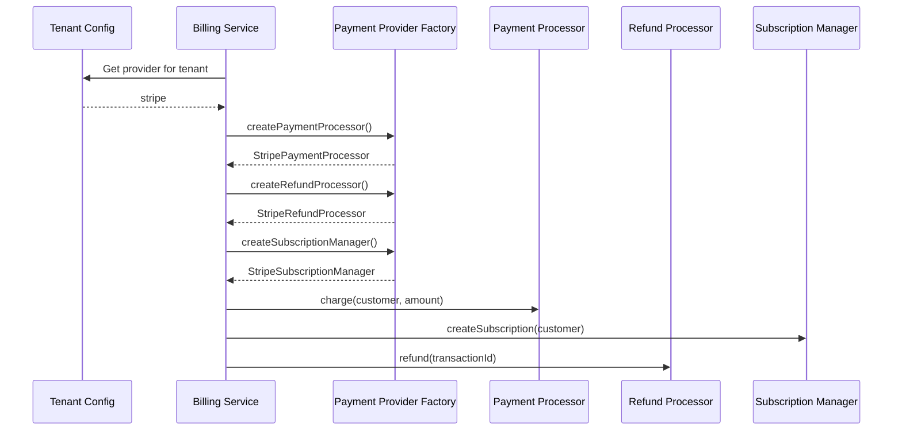

---

## Architectural Meaning

The billing service should not be full of logic like this:

```txt
if provider is Stripe, use StripePaymentProcessor
if provider is PayPal, use PayPalRefundProcessor
if provider is Square, use SquareSubscriptionManager
```

That spreads provider-specific logic everywhere.

Instead, provider selection happens once:

```txt
Select factory
Use factory-created services
```

---

# 4. Example: Cloud Provider Abstraction

## Problem

A SaaS system may run on different cloud providers:

```txt
AWS
Azure
Google Cloud
```

Each cloud provider has related infrastructure services:

```txt
Storage
Queue
Notification
Secrets Manager
```

The dangerous design is mixing cloud implementations:

```txt
AWS S3 Storage
Azure Queue
Google Secrets Manager
```

That makes deployment hard to reason about.

---

## Abstract Factory Diagram

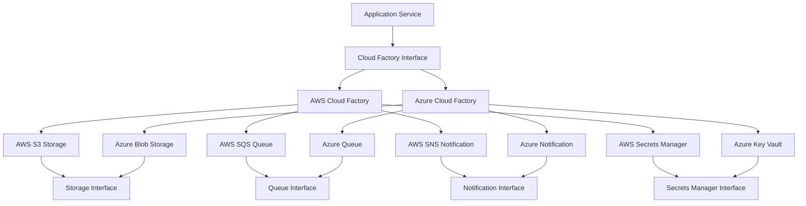

---

## Architect Questions

An architect would ask:

```txt
Do cloud services need to be selected as a consistent family?

Will different deployments use different cloud providers?

Should application logic depend directly on AWS, Azure, or GCP SDKs?

Do we need local or mock implementations for testing?

How do we prevent AWS storage from being used with Azure queues?

Is cloud portability actually required, or are we overengineering?
```

---

## Runtime Flow

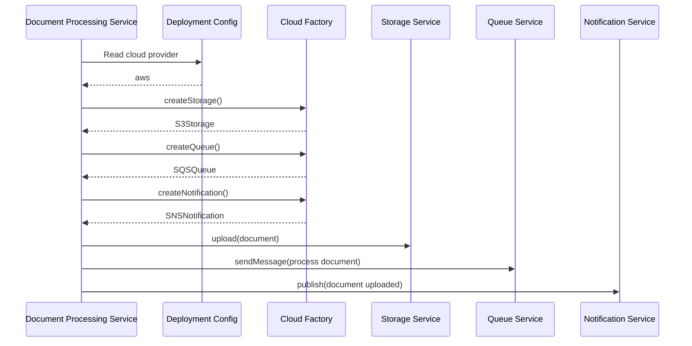

---

# 5. What the Pattern Is Really Protecting You From

## Without Abstract Factory

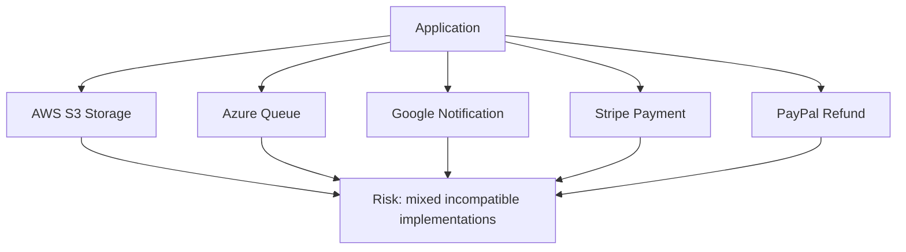

The application is directly responsible for choosing concrete classes.

That means the application can accidentally combine the wrong objects.

---

## With Abstract Factory

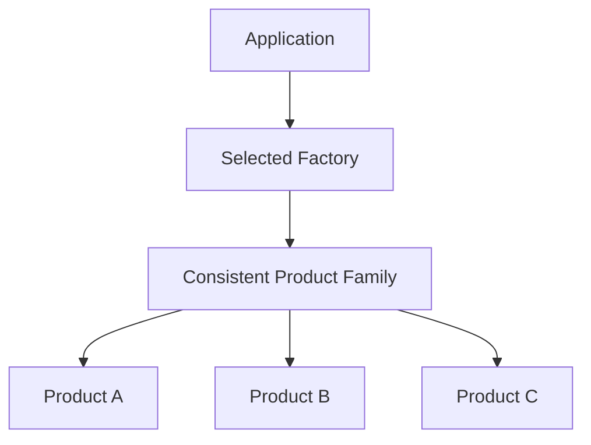

The factory becomes the gatekeeper.

It guarantees that related objects come from the same family.

---

# 6. Mental Model

Think of Abstract Factory like choosing a kit.

```txt
Windows UI Kit:
- Windows Button
- Windows Checkbox
- Windows Dropdown

Mac UI Kit:
- Mac Button
- Mac Checkbox
- Mac Dropdown

AWS Cloud Kit:
- S3 Storage
- SQS Queue
- SNS Notification

Azure Cloud Kit:
- Blob Storage
- Azure Queue
- Azure Notification
```

You do not pick each object manually.

You pick the kit.

The kit gives you compatible parts.

---

# 7. Implementation Shape Without Code

## Step 1: Define Product Interfaces

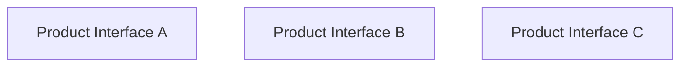

Example:

```txt
Button
Checkbox
Dropdown
```

---

## Step 2: Define Product Families

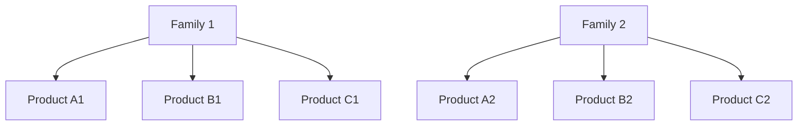

Example:

```txt
Windows Family:
- Windows Button
- Windows Checkbox
- Windows Dropdown

Mac Family:
- Mac Button
- Mac Checkbox
- Mac Dropdown
```

---

## Step 3: Create Factory Interface

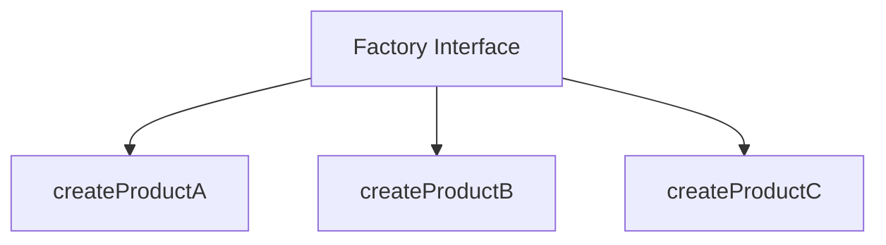

Example:

```txt
UIFactory:
- createButton
- createCheckbox
- createDropdown
```

---

## Step 4: Create Concrete Factories

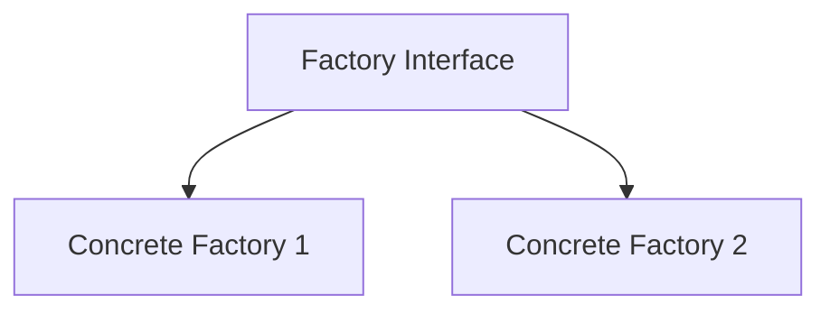

Example:

```txt
WindowsUIFactory
MacUIFactory
LinuxUIFactory
```

---

## Step 5: Client Uses Only the Factory

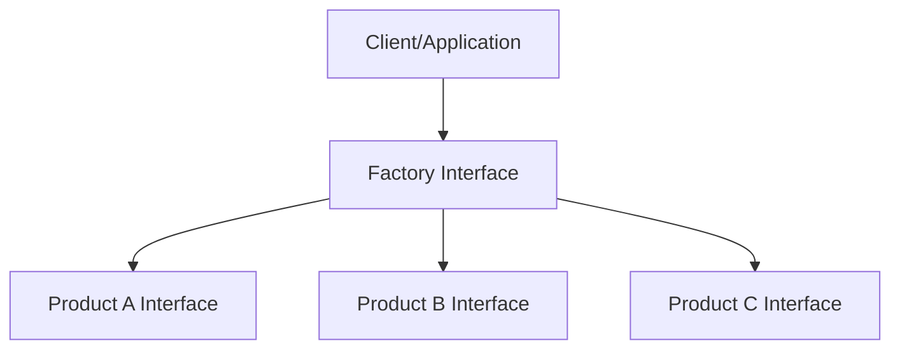

The client does not know the concrete classes.

That is the main architectural win.

---

# 8. Decision Rule

Use Abstract Factory when this is true:

```txt
I need to create multiple related objects,
and the selected group must stay consistent.
```

Do not use Abstract Factory when this is true:

```txt
I only need to create one object.
```

For one object, a simple factory or dependency injection is usually enough.

---

# 9. Simple Pattern Summary

| Concept           | Meaning                                     |
| ----------------- | ------------------------------------------- |
| Product Interface | Common contract for one type of object      |
| Concrete Product  | Actual implementation                       |
| Abstract Factory  | Interface for creating a family of products |
| Concrete Factory  | Creates one specific family                 |
| Client            | Uses the factory, not concrete classes      |

---

# 10. Best Visual Summary


## Final Meaning

Abstract Factory is not mainly about creating objects.

It is about controlling **which group of related objects** the system is allowed to use together.
