# Builder Pattern Using Diagrams

## Core Idea

The **Builder Pattern** is a creational design pattern used when creating an object requires many steps, options, or configurations.

Instead of building a complex object with a huge constructor like this:

```txt
new Report(title, author, sections, charts, footer, theme, exportFormat, permissions, metadata)
```

You build it step by step:

```txt
Builder:
- setTitle()
- addSection()
- addChart()
- setTheme()
- setExportFormat()
- build()
```

The Builder Pattern separates:

```txt
How the object is built
from
What the final object is
```

---

# 1. Builder Pattern: General Structure

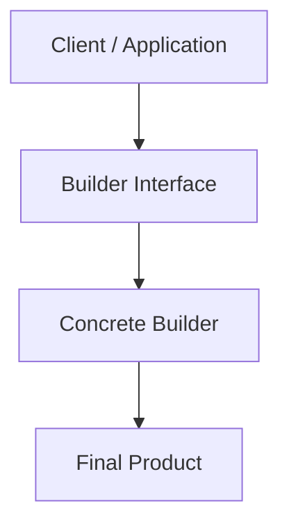

## What This Means

The client does not manually assemble the final object.

The client tells the builder what it wants.

The builder handles construction details.

---

# 2. Builder With Director

Sometimes, a **Director** controls the construction steps.

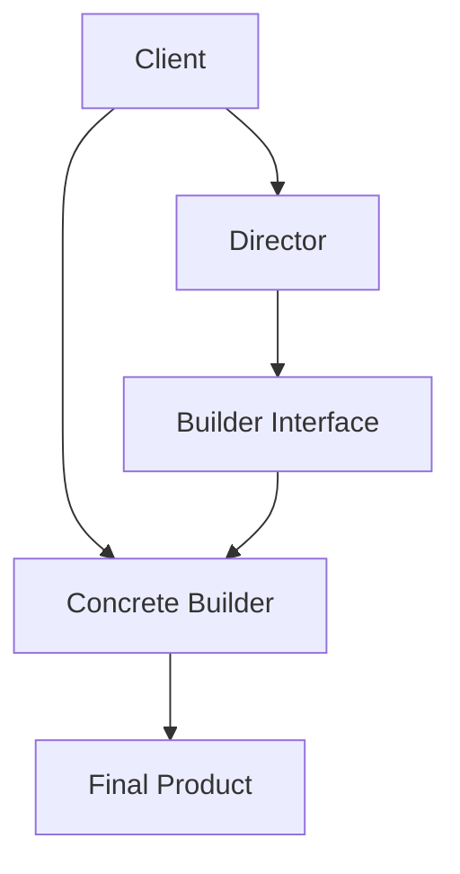

## What the Director Does

The Director knows the sequence of construction.

For example:

```txt
Build Standard Report:
1. Add title
2. Add summary
3. Add charts
4. Add footer
5. Export as PDF
```

The builder knows how to perform each step.

The director knows which steps to call and in what order.

---

# 3. When Builder Solves a Real Problem

## Without Builder

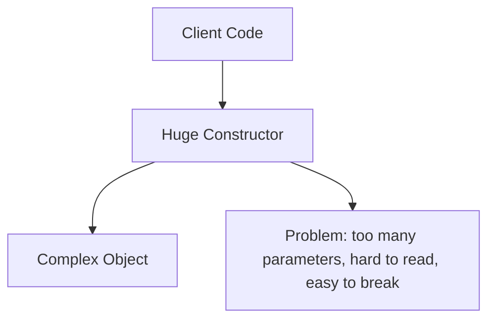

Bad construction style:

```txt
Create object with:
- many parameters
- optional parameters
- confusing order
- null values
- default values
- conditional logic
```

Example problem:

```txt
new UserAccount(
  "John",
  "john@email.com",
  true,
  null,
  "admin",
  false,
  true,
  "dark",
  null
)
```

This is ugly and risky.

You cannot easily tell what each value means.

---

## With Builder

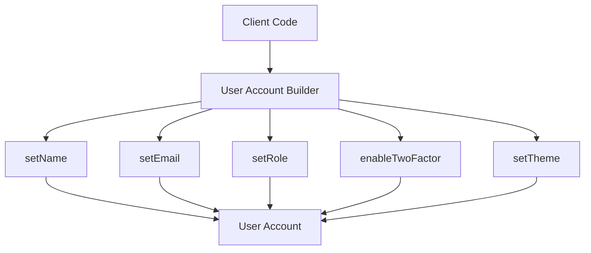

Now the construction becomes readable:

```txt
Build User Account:
- set name
- set email
- set role
- enable two-factor authentication
- set theme
- build final account
```

---

# 4. Example 1: Report Builder

## Problem

You are building a reporting system.

A report can have:

```txt
Title
Author
Summary
Tables
Charts
Filters
Footer
Export format
Theme
Permissions
```

Not every report has the same structure.

One report may be a simple summary.

Another report may be a full executive report with charts, tables, and export settings.

Using one large constructor becomes painful.

---

## Architect Questions

An architect would ask:

```txt
Does this object require many construction steps?

Are some fields optional?

Are there different versions of the same object?

Does object creation have business rules?

Is constructor parameter order becoming dangerous?

Do we need reusable construction recipes?

Should the final object be immutable after construction?
```

---

## Report Builder Diagram

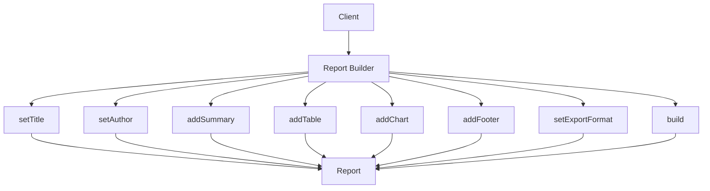

---

## Runtime Flow

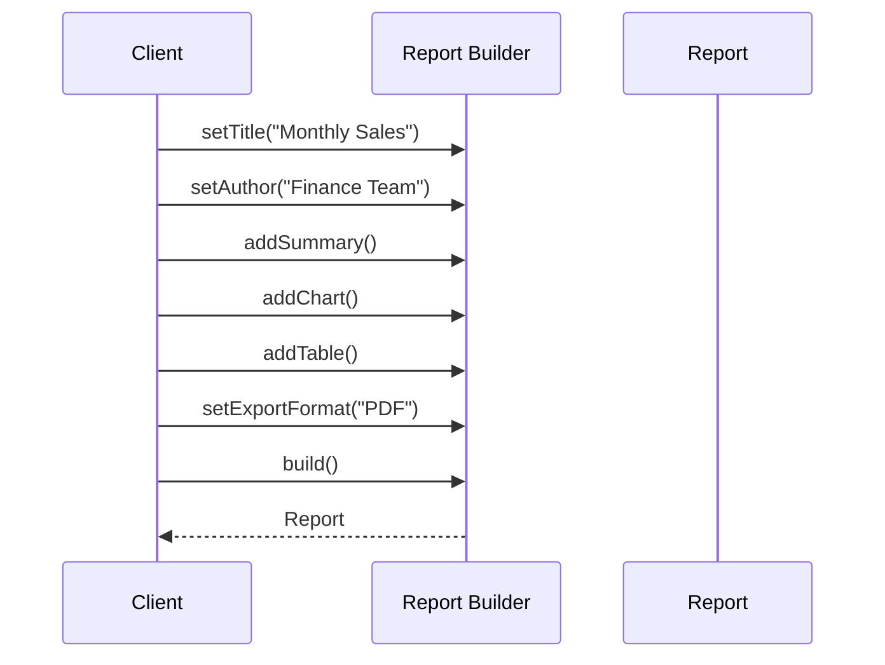

---

## Architectural Meaning

The report is not created in one dangerous constructor call.

It is assembled step by step.

This makes the construction logic easier to read, validate, and reuse.

---

# 5. Report Builder With Director

A Director is useful when the system has standard report types.

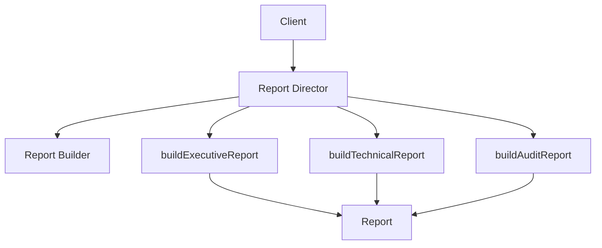

## Example Construction Recipes

```txt
Executive Report:
- title
- summary
- KPIs
- charts
- recommendations

Technical Report:
- title
- system details
- raw data tables
- logs
- diagnostics

Audit Report:
- title
- compliance section
- evidence
- signatures
- export as PDF
```

The Director prevents every developer from inventing their own construction sequence.

---

# 6. Example 2: Test Plan Builder

## Problem

Imagine a battery testing application.

A test plan can include different steps:

```txt
Charge
Discharge
Rest
Repeat cycle
RPT step
Safety limits
Temperature rules
Voltage limits
Current limits
Logging configuration
```

Some tests are simple.

Some are complex.

For example:

```txt
Simple Cycle Test:
- Charge
- Rest
- Discharge
- Rest

ECL + RPT Test:
- Charge
- Rest
- Discharge
- Rest
- Every N cycles, run RPT sequence
```

Trying to create this with one constructor becomes messy.

---

## Architect Questions

An architect would ask:

```txt
Is the test plan built from ordered steps?

Can steps vary by test mode?

Are there optional sections like RPT?

Are safety limits required before execution?

Should invalid test plans be blocked before running?

Do we need reusable templates for common test plans?

Can users build plans dynamically from the UI?
```

---

## Test Plan Builder Diagram

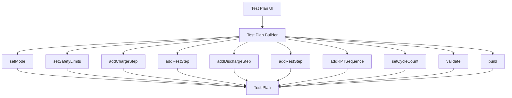

---

## Runtime Flow

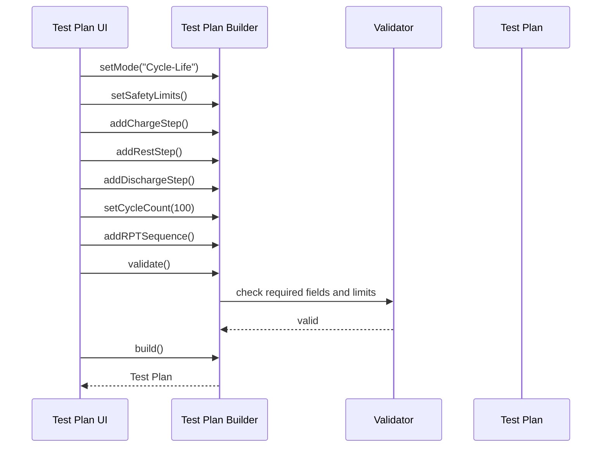

---

## Architectural Meaning

The test plan is a complex object.

It has ordered steps, optional sections, and validation rules.

Builder is a good fit because the system needs controlled construction, not just object creation.

---

# 7. Example 3: HTTP Request Builder

## Problem

An HTTP request may contain many optional parts:

```txt
URL
Method
Headers
Query parameters
Body
Timeout
Authentication
Retry policy
Cache settings
```

A constructor like this is a bad idea:

```txt
new HttpRequest(url, method, headers, queryParams, body, timeout, auth, retry, cache)
```

Most requests do not need all of those options.

The order is easy to confuse.

---

## Architect Questions

An architect would ask:

```txt
Does the object have many optional parameters?

Are there safe defaults?

Should the object be immutable after creation?

Do we need validation before sending?

Do we need reusable request templates?

Can construction be made more readable?
```

---

## HTTP Request Builder Diagram

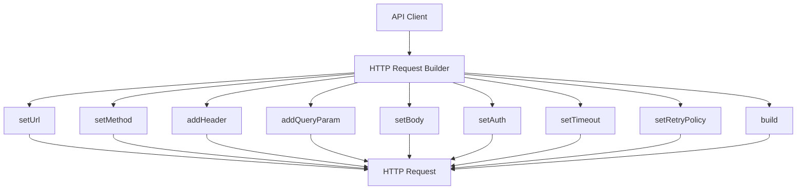

---

## Runtime Flow

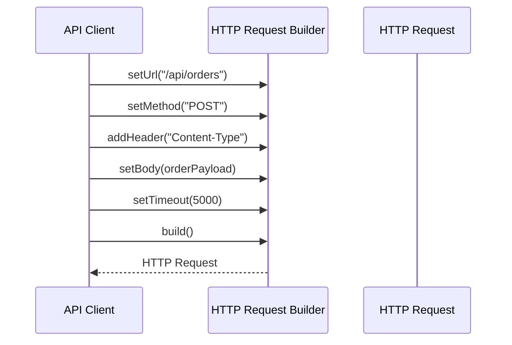

---

## Architectural Meaning

Builder makes request creation readable and safe.

The request object can be finalized only after required fields are present.

---

# 8. What Builder Protects You From

## Problem 1: Constructor Explosion

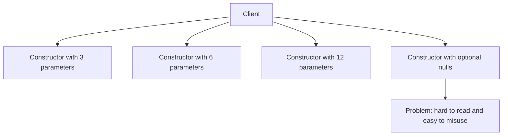

---

## Problem 2: Invalid Object State

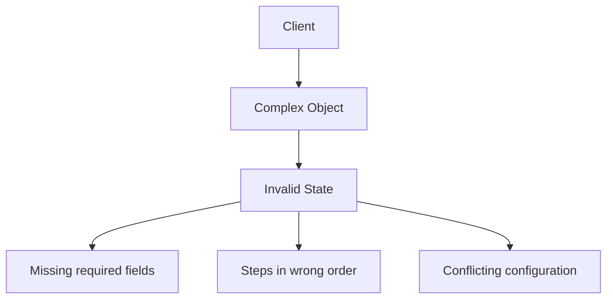

Without Builder, the object may be created before it is valid.

---

## Builder Solution

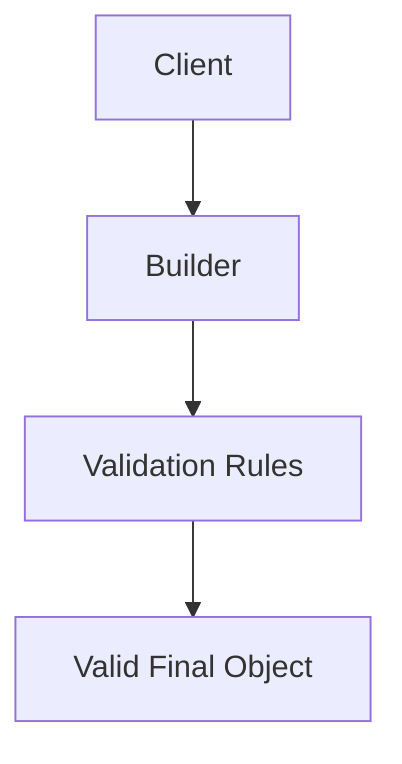

The builder controls when the final object is allowed to exist.

---

# 9. Builder vs Abstract Factory

## Abstract Factory

Abstract Factory is about choosing a **family of related objects**.

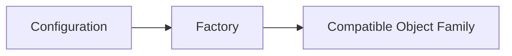

Example:

```txt
Choose AWS family:
- S3
- SQS
- SNS
```

---

## Builder

Builder is about constructing **one complex object step by step**.

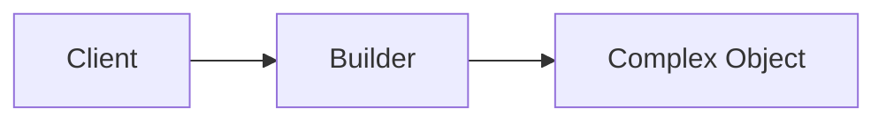

Example:

```txt
Build Report:
- title
- sections
- charts
- footer
- export settings
```

---

## Main Difference

| Pattern          | Main Question                                        |
| ---------------- | ---------------------------------------------------- |
| Abstract Factory | Which family of objects should I create?             |
| Builder          | How do I construct this complex object step by step? |

---

# 10. Builder Pattern Mental Model

Think of Builder like ordering a custom laptop.

```txt
Laptop Builder:
- choose processor
- choose RAM
- choose storage
- choose GPU
- choose operating system
- choose warranty
- build final laptop
```

You are not calling one giant constructor.

You are configuring the object step by step.

---

# 11. Implementation Shape Without Code

## Step 1: Identify the Complex Product

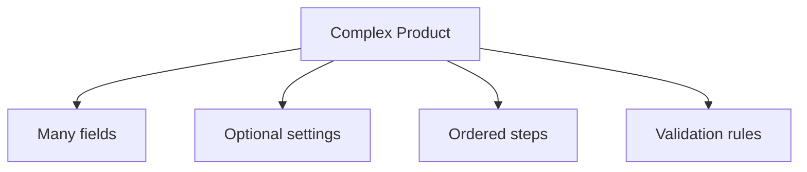

Examples:

```txt
Report
Test Plan
HTTP Request
User Account
Query Object
Deployment Configuration
```

---

## Step 2: Create Builder Operations

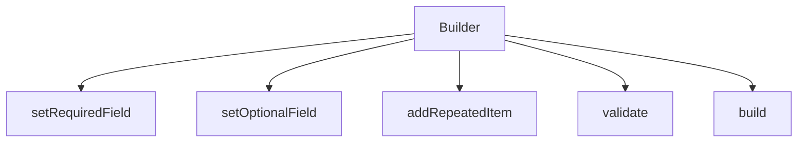

---

## Step 3: Build the Object Step by Step

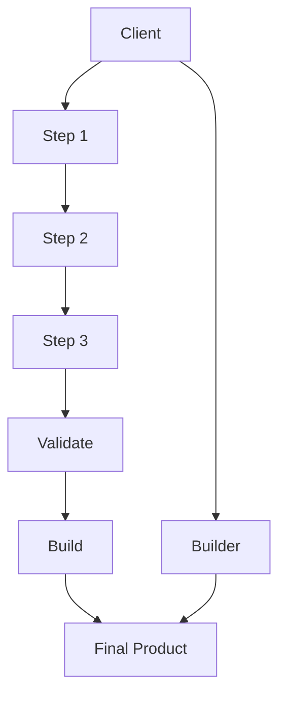

---

## Step 4: Return the Final Product

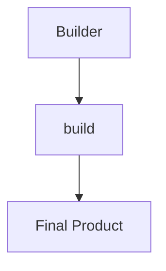

After `build`, the final product should be ready to use.

No missing required data.

No invalid configuration.

---

# 12. When to Use Builder

Use Builder when:

```txt
The object has many constructor parameters.

The object has optional parameters.

The object must be assembled in steps.

The object has validation rules before it can be used.

There are multiple construction recipes.

The construction process should be readable.

The final object should be immutable or protected from partial state.
```

---

# 13. When Not to Use Builder

Do not use Builder when:

```txt
The object is simple.

The object has only two or three obvious fields.

There is no complex construction process.

A normal constructor is clear enough.

The builder adds more complexity than value.
```

Bad use:

```txt
User:
- id
- name
```

This probably does not need a builder.

A normal constructor or object literal is enough.

---

# 14. Simple Pattern Summary

| Concept          | Meaning                                                  |
| ---------------- | -------------------------------------------------------- |
| Product          | The final complex object being built                     |
| Builder          | Provides step-by-step construction methods               |
| Concrete Builder | Actual implementation of the construction process        |
| Director         | Optional object that defines common construction recipes |
| Client           | Uses the builder to create the product                   |

---

# 15. Best Visual Summary

```mermaid
flowchart LR
    CLIENT[Client decides desired configuration]

    BUILDER[Builder collects construction steps]

    VALIDATE[Builder validates required rules]

    PRODUCT[Builder returns final object]

    CLIENT --> BUILDER
    BUILDER --> VALIDATE
    VALIDATE --> PRODUCT
```

## Final Meaning

Builder is not mainly about creating objects.

It is about creating **complex objects safely, clearly, and step by step**.

Use it when construction has too many options, too many steps, or too much validation to fit cleanly inside a normal constructor.
