# Factory Method Pattern Using Diagrams

## Core Idea

The **Factory Method Pattern** is a creational design pattern that lets a class defer object creation to subclasses or specialized creator classes.

Instead of the client directly creating a concrete object:

```txt
Client creates:
- PdfDocument
- WordDocument
- HtmlDocument
```

The client uses a creator:

```txt
DocumentCreator creates:
- Document
```

The client depends on the common interface, not the concrete class.

---

# 1. Factory Method: General Structure

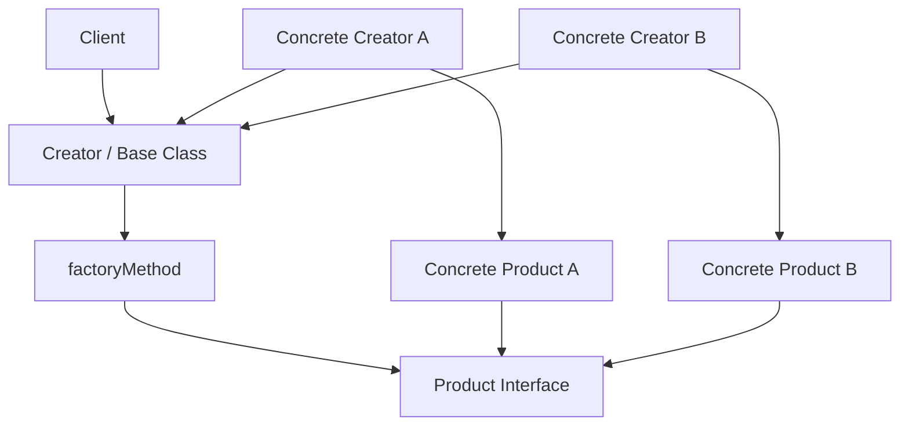

## What This Means

The client does not say:

```txt
new PdfDocument()
```

The client says:

```txt
creator.createDocument()
```

The selected creator decides what concrete object gets created.

---

# 2. Simple Mental Model

Think of Factory Method like a restaurant kitchen.

```txt
Customer orders food.

Kitchen decides which specific dish object to create.

Customer does not build the dish directly.
```

The customer asks for a meal.

The kitchen handles the object creation.

---

# 3. What Problem Factory Method Solves

## Without Factory Method

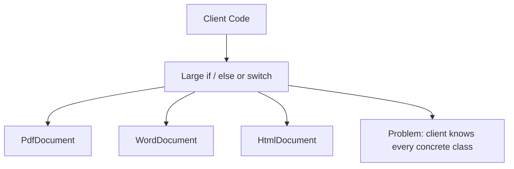

Bad design:

```txt
If type is PDF, create PDF document.
If type is Word, create Word document.
If type is HTML, create HTML document.
```

The client becomes responsible for knowing all concrete classes.

That is bad because every new type forces the client code to change.

---

## With Factory Method

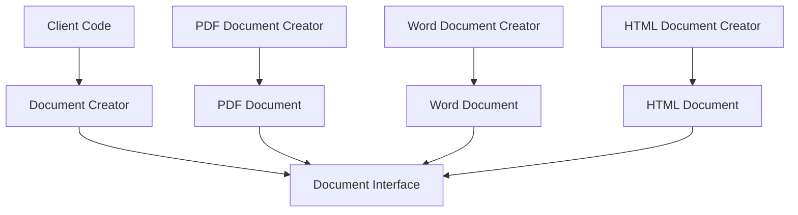

Now the client works with:

```txt
Document
```

not:

```txt
PdfDocument
WordDocument
HtmlDocument
```

---

# 4. Example 1: Document Export System

## Problem

A publishing application needs to export documents in different formats:

```txt
PDF
Word
HTML
Markdown
```

Each format has its own export behavior.

A bad implementation puts all creation logic inside the export service:

```txt
ExportService:
- if format is PDF, create PDF exporter
- if format is Word, create Word exporter
- if format is HTML, create HTML exporter
- if format is Markdown, create Markdown exporter
```

That design becomes ugly as formats grow.

---

## Architect Questions

An architect would ask:

```txt
Are we creating one type of product with multiple concrete variations?

Does the client need to avoid knowing concrete classes?

Will new export formats be added later?

Is creation logic currently spreading across the application?

Do all products share a common interface?

Can the selected implementation be based on configuration or user choice?

Would a switch statement keep growing every time we add a new format?
```

---

## Factory Method Diagram

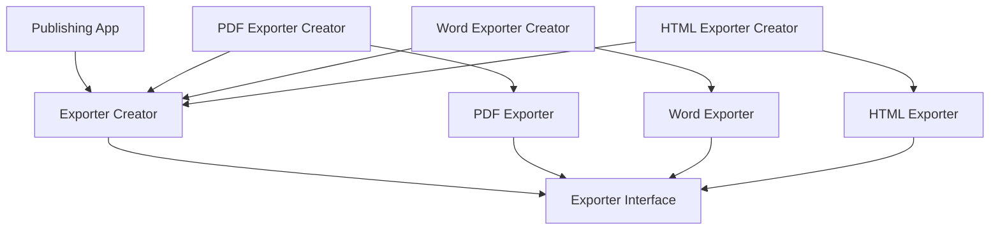

---

## Runtime Flow

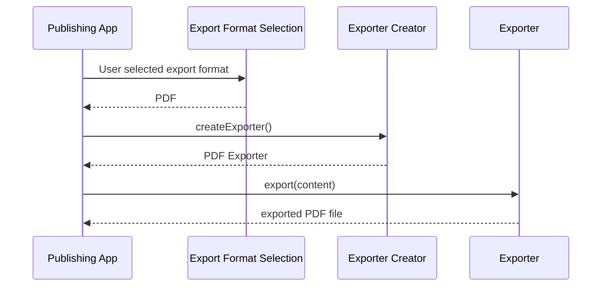

---

## Architectural Meaning

The app should not know how to create every exporter.

It should only know that it needs an exporter.

The creator owns the decision of which exporter to create.

---

# 5. Example 2: Notification Sender

## Problem

A system sends notifications through different channels:

```txt
Email
SMS
Push Notification
Slack Message
```

Each notification channel has different sending rules.

Without Factory Method, the notification service becomes full of conditional logic:

```txt
If channel is email, create EmailSender.
If channel is sms, create SmsSender.
If channel is push, create PushSender.
If channel is slack, create SlackSender.
```

That gets worse as new channels are added.

---

## Architect Questions

An architect would ask:

```txt
Do all notification senders share the same operation?

Are there multiple concrete implementations of one product type?

Will new channels be added later?

Should the notification workflow care about the sender implementation?

Is channel-specific setup leaking into business logic?

Can sender creation be isolated from sender usage?
```

---

## Factory Method Diagram

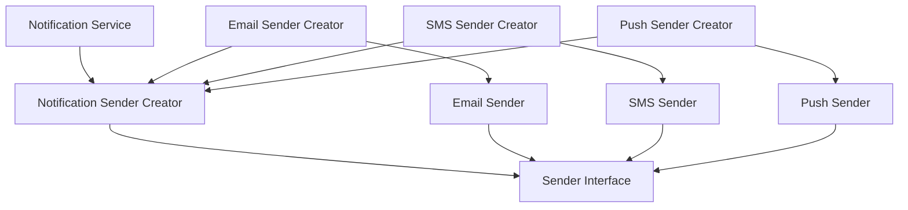

---

## Runtime Flow

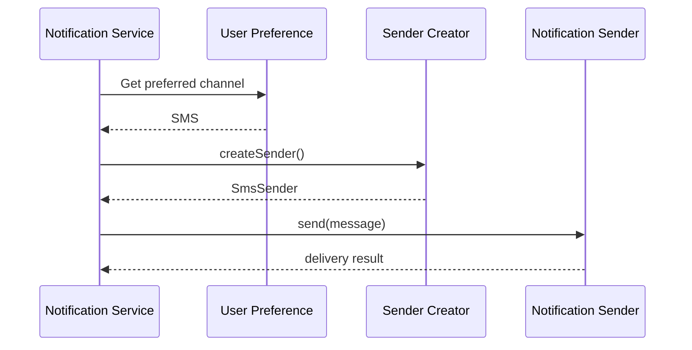

---

## Architectural Meaning

The notification service should not need to know whether it is sending email, SMS, push, or Slack.

It should know only this:

```txt
I have a Sender.
I can call send().
```

The factory method decides which sender implementation exists.

---

# 6. Example 3: Game Enemy Spawner

## Problem

A game needs to spawn different enemy types:

```txt
Zombie
Robot
Dragon
Alien
```

Different game levels may spawn different enemies.

A bad design puts all enemy creation inside the level logic:

```txt
Level:
- if level is forest, create Zombie
- if level is factory, create Robot
- if level is volcano, create Dragon
- if level is space, create Alien
```

That makes level logic tightly coupled to enemy classes.

---

## Architect Questions

An architect would ask:

```txt
Does each level need to create an enemy without knowing exact enemy classes?

Do all enemies share a common interface?

Will new enemy types be added later?

Should level gameplay logic be separated from enemy creation?

Can different levels override the creation behavior?

Is the current creation logic becoming a large switch statement?
```

---

## Factory Method Diagram

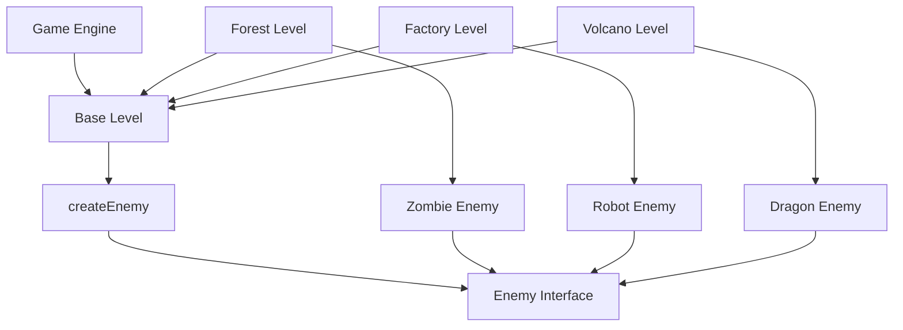

---

## Runtime Flow

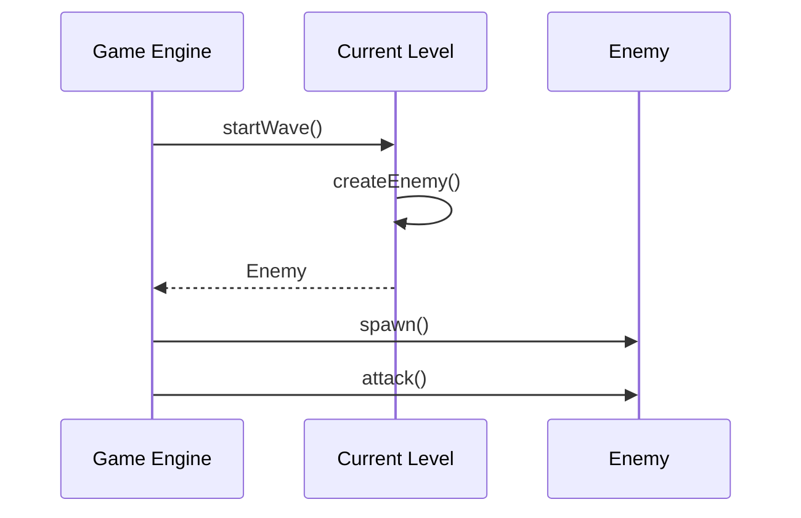

---

## Architectural Meaning

The game engine can run any level using the same workflow:

```txt
Start level.
Create enemy.
Spawn enemy.
Run enemy behavior.
```

The specific level decides what enemy to create.

That is Factory Method.

---

# 7. Example 4: Logistics Delivery System

## Problem

A logistics app supports different delivery methods:

```txt
Truck Delivery
Ship Delivery
Drone Delivery
Bike Delivery
```

Each delivery method creates a different transport object.

Bad design:

```txt
DeliveryService:
- if delivery type is truck, create Truck
- if delivery type is ship, create Ship
- if delivery type is drone, create Drone
```

This makes the delivery service depend on every transport type.

---

## Architect Questions

An architect would ask:

```txt
Are we creating one product type with different implementations?

Do all transport types share a common delivery operation?

Will more delivery methods be added later?

Should routing logic be separate from transport creation?

Can different delivery services override the transport they create?

Is there a growing switch statement around object creation?
```

---

## Factory Method Diagram

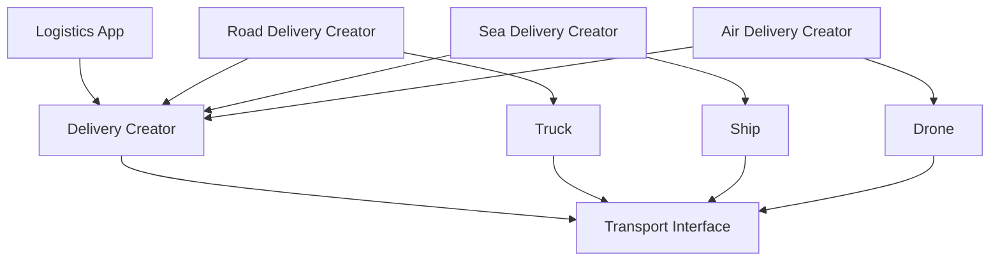

---

## Runtime Flow

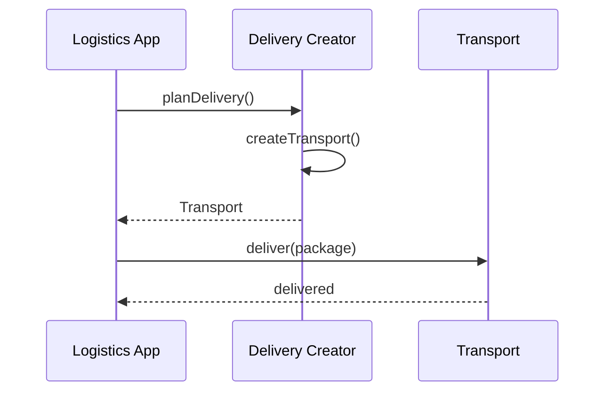

---

## Architectural Meaning

The app does not need to know whether the package is delivered by truck, ship, or drone.

It only works with:

```txt
Transport
```

The creator decides which transport object to create.

---

# 8. What Factory Method Protects You From

## Problem: Concrete Class Coupling

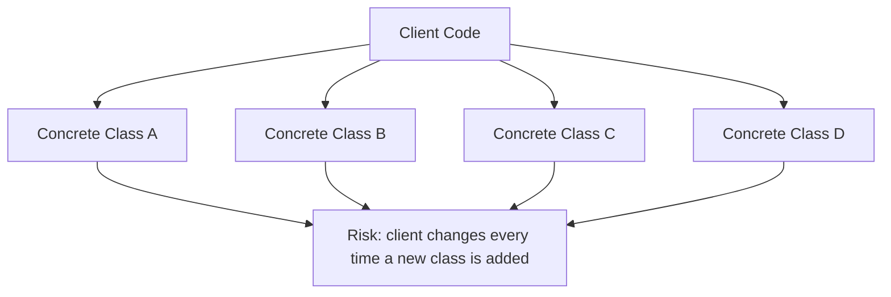

The client knows too much.

It knows all concrete classes.

That makes the client fragile.

---

## Solution: Depend on Product Interface

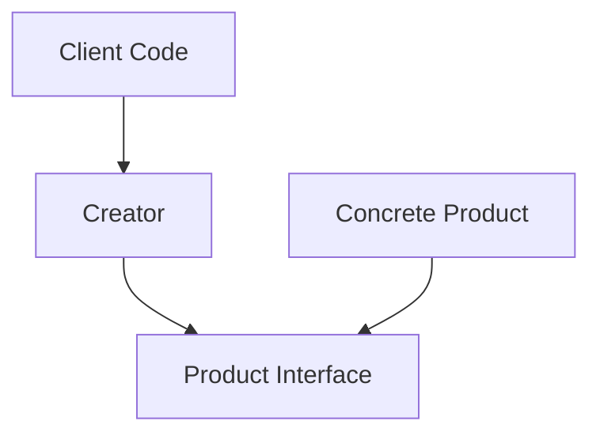

The client depends on the creator and the product interface.

The concrete product is hidden behind the factory method.

---

# 9. Factory Method vs Abstract Factory

## Factory Method

Factory Method creates **one product type**.

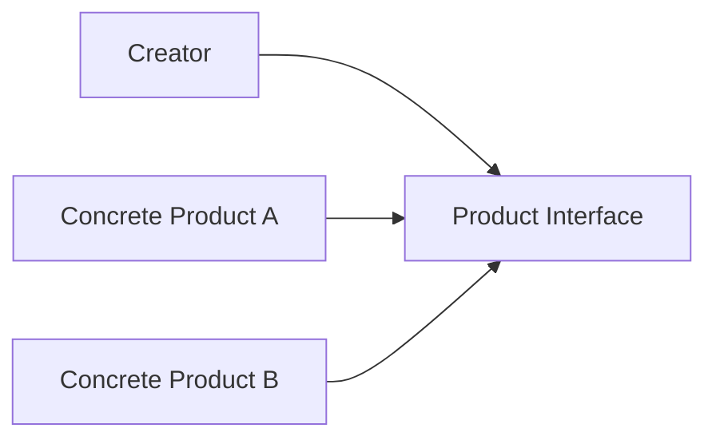

Example:

```txt
Create one Exporter:
- PDF Exporter
- Word Exporter
- HTML Exporter
```

---

## Abstract Factory

Abstract Factory creates **a family of related product types**.

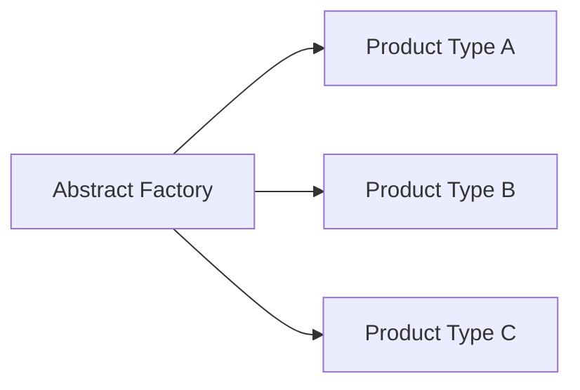

Example:

```txt
Create a whole UI family:
- Button
- Checkbox
- Dropdown
```

---

## Main Difference

| Pattern          | Main Question                                               |
| ---------------- | ----------------------------------------------------------- |
| Factory Method   | Which concrete version of this one product should I create? |
| Abstract Factory | Which family of related products should I create?           |

---

# 10. Factory Method vs Builder

## Factory Method

Factory Method is about choosing the concrete type.

```txt
I need a NotificationSender.
Should it be EmailSender, SmsSender, or PushSender?
```

## Builder

Builder is about assembling a complex object step by step.

```txt
I need to construct a Report with title, sections, charts, filters, and export settings.
```

## Difference

| Pattern        | Focus                       |
| -------------- | --------------------------- |
| Factory Method | Object selection            |
| Builder        | Object construction process |

---

# 11. Implementation Shape Without Code

## Step 1: Identify the Product Interface

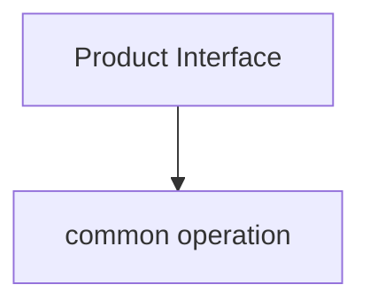

Examples:

```txt
Exporter:
- export()

Sender:
- send()

Enemy:
- attack()

Transport:
- deliver()
```

---

## Step 2: Create Concrete Products

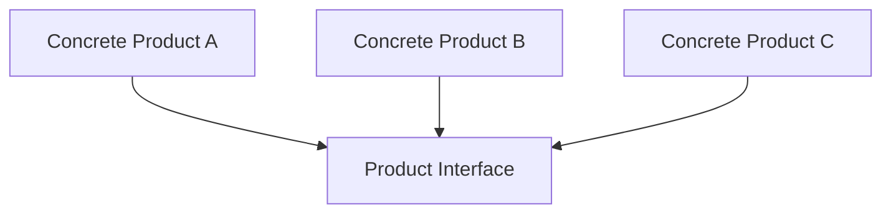

Examples:

```txt
PDF Exporter
Word Exporter
HTML Exporter
```

---

## Step 3: Define the Creator

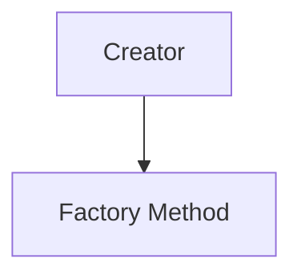

The creator declares a method like:

```txt
createProduct()
```

or:

```txt
createExporter()
createSender()
createEnemy()
createTransport()
```

---

## Step 4: Create Concrete Creators

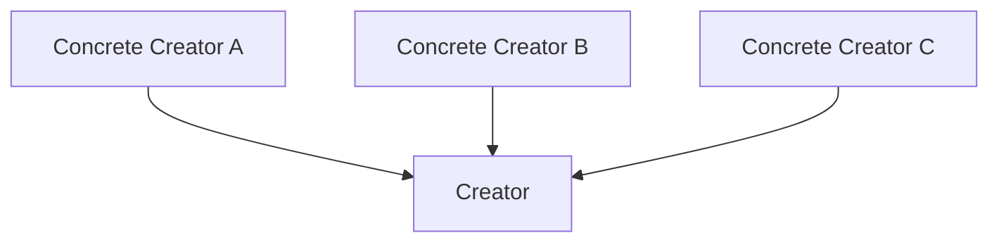

Each concrete creator returns one concrete product.

```txt
PDFExporterCreator creates PDFExporter

SmsSenderCreator creates SmsSender

ForestLevel creates ZombieEnemy

RoadDeliveryCreator creates Truck
```

---

## Step 5: Client Uses the Creator

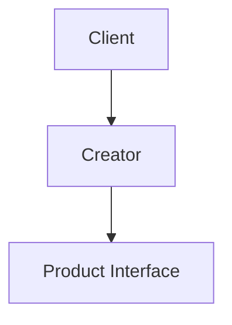

The client uses the result through the product interface.

The client does not directly depend on the concrete product class.

---

# 12. When to Use Factory Method

Use Factory Method when:

```txt
You need to create one product type with multiple concrete implementations.

The client should not know concrete classes.

Object creation logic is becoming a switch statement.

New concrete products are expected later.

Subclasses should decide which object to create.

The product has a shared interface.

You want to isolate creation logic from usage logic.
```

---

# 13. When Not to Use Factory Method

Do not use Factory Method when:

```txt
There is only one concrete product.

Object creation is simple and unlikely to change.

A normal constructor is clear enough.

The factory adds indirection without reducing complexity.

You do not have a common product interface.
```

Bad use:

```txt
Create User object:
- id
- name
- email
```

If there is only one `User`, a factory method probably adds nothing.

---

# 14. Common Smell That Suggests Factory Method

Factory Method is often useful when you see this repeated:

```txt
switch type:
  case A:
    create A
  case B:
    create B
  case C:
    create C
```

Especially when that switch appears in multiple places.

That is usually a sign that object creation needs to be centralized or delegated.

---

# 15. Simple Pattern Summary

| Concept           | Meaning                                                      |
| ----------------- | ------------------------------------------------------------ |
| Product Interface | Common interface for the object being created                |
| Concrete Product  | Specific implementation of the product                       |
| Creator           | Declares the factory method                                  |
| Concrete Creator  | Implements the factory method and returns a concrete product |
| Client            | Uses the creator and product interface                       |

---

# 16. Best Visual Summary

```mermaid
flowchart LR
    CLIENT[Client needs one product]

    CREATOR[Creator with factory method]

    PRODUCT[Product Interface]

    CONCRETE[Concrete Product selected by creator]

    CLIENT --> CREATOR
    CREATOR --> PRODUCT
    CONCRETE --> PRODUCT
```

## Final Meaning

Factory Method is not mainly about avoiding `new`.

It is about moving the decision of **which concrete product to create** out of the client and into a creator.

Use it when the client should work with an interface, while subclasses or creator classes decide the concrete implementation.
