# Prototype Pattern Using Diagrams

## Core Idea

The **Prototype Pattern** is a creational design pattern used when creating a new object from scratch is expensive, repetitive, or complicated.

Instead of building a new object manually every time:

```txt
Create new object from zero:
- set field A
- set field B
- set field C
- set default rules
- set nested objects
- set configuration
```

You copy an existing object:

```txt
Clone existing prototype
Modify only what is different
Use the new object
```

The original object acts as a template.

---

# 1. Prototype Pattern: General Structure

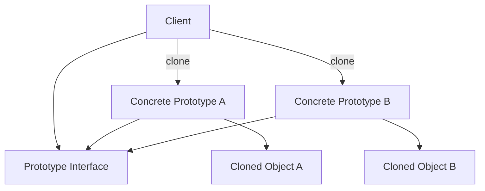

## What This Means

The client does not need to know how to rebuild the object.

The client only asks:

```txt
clone()
```

The prototype creates a copy of itself.

---

# 2. Simple Mental Model

Think of Prototype like duplicating a document template.

```txt
Original template:
- layout
- fonts
- headers
- sections
- default styling

Copy template:
- same layout
- same fonts
- same headers
- same sections

Then edit only the unique content.
```

You do not redesign the document from scratch every time.

You duplicate and modify.

---

# 3. What Problem Prototype Solves

## Without Prototype

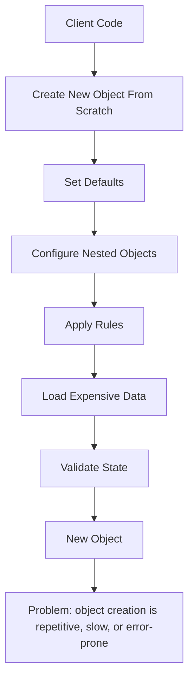

The client has to know too much about how the object is created.

That means object creation logic gets duplicated.

---

## With Prototype

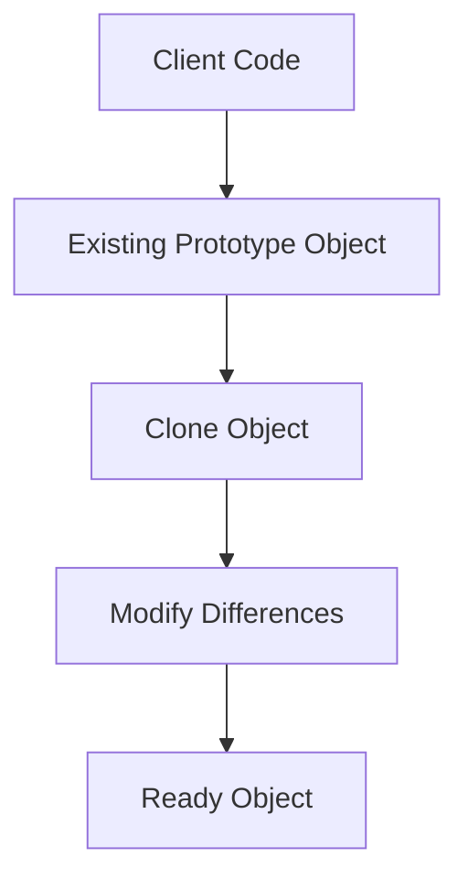

The complicated setup already exists inside the prototype.

The client copies it and changes only what is different.

---

# 4. Example 1: Graphic Design Shapes

## Problem

A drawing application lets users create shapes:

```txt
Circle
Rectangle
Text Box
Arrow
Icon
```

Each shape can have many properties:

```txt
Position
Size
Color
Border style
Shadow
Opacity
Layer
Rotation
Text style
Animation
```

If the user duplicates a shape, the app should preserve all settings.

Creating a new shape from scratch would lose details.

---

## Architect Questions

An architect would ask:

```txt
Do users need to duplicate existing objects?

Do objects have many properties that should be preserved?

Is object creation more complicated than a simple constructor?

Do we need to copy runtime state?

Should copied objects be independent from the original?

Do we need shallow copy or deep copy?

Can new objects start from preconfigured templates?
```

---

## Prototype Diagram

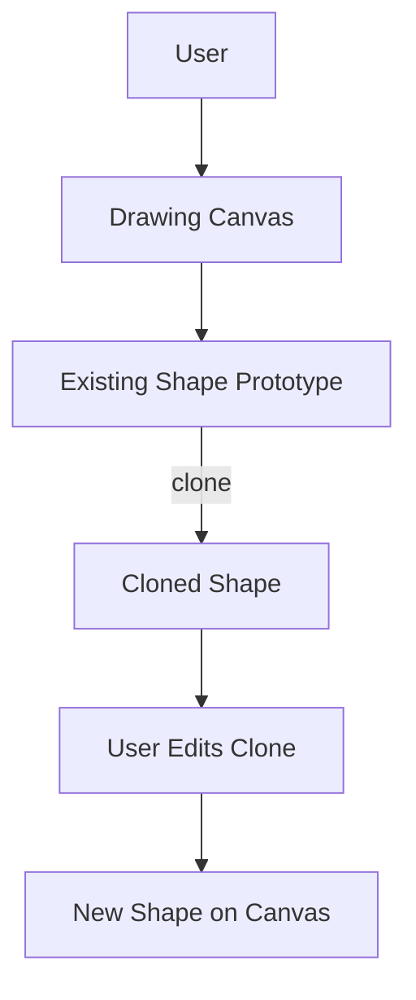

---

## Runtime Flow

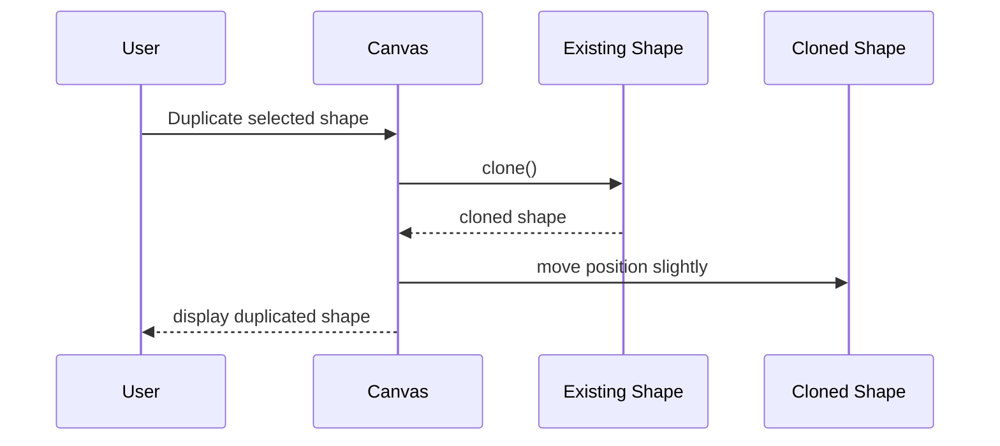

---

## Architectural Meaning

The app does not recreate the shape manually.

It copies the existing shape with all its styling and behavior.

Then it changes only the position so the duplicate appears offset from the original.

---

# 5. Example 2: Video Game Characters

## Problem

A game creates many characters based on predefined templates:

```txt
Basic Soldier
Elite Soldier
Mage
Archer
Boss Enemy
```

Each character has a lot of setup:

```txt
Health
Speed
Attack power
Armor
Inventory
Skills
AI behavior
Animations
Sound effects
Loot table
```

Creating every enemy from scratch during gameplay can be expensive and repetitive.

---

## Architect Questions

An architect would ask:

```txt
Are many similar objects created during runtime?

Is object creation expensive?

Can objects be preconfigured ahead of time?

Do new objects mostly differ by a few fields?

Should enemies copy default stats and behavior?

Do cloned objects need independent inventory, health, and position?

What state should be shared, and what state should be copied?
```

---

## Prototype Diagram

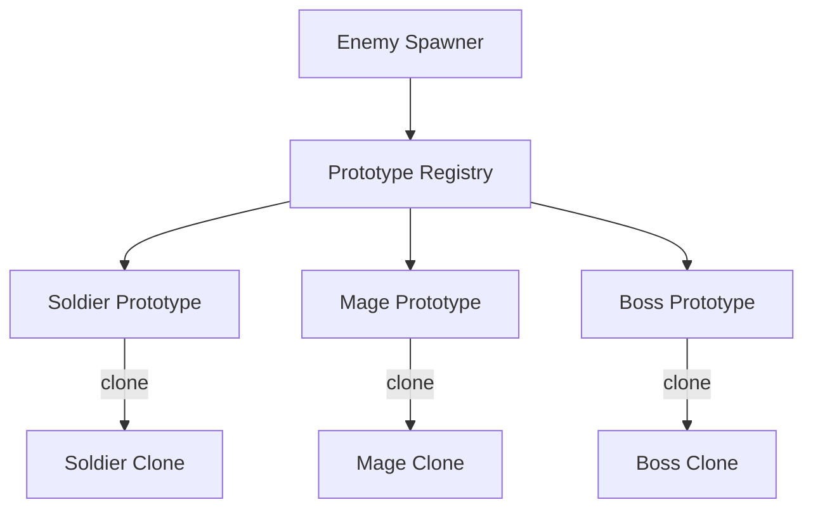

---

## Runtime Flow

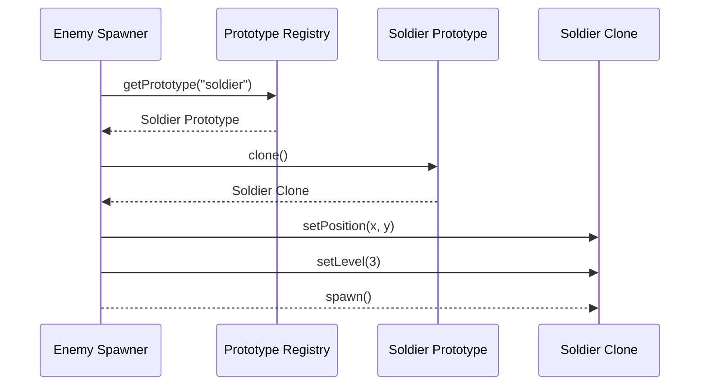

---

## Architectural Meaning

The game keeps preconfigured enemy prototypes.

When it needs a new enemy, it clones the prototype and customizes small details:

```txt
Position
Level
Current health
Spawn behavior
```

This avoids rebuilding the whole enemy setup repeatedly.

---

# 6. Example 3: E-Commerce Product Listings

## Problem

An online marketplace lets sellers create many similar product listings.

For example, a seller may sell:

```txt
Same shirt
Different size
Different color
Different price
Different stock count
```

Each listing may include:

```txt
Title
Description
Category
Images
Shipping rules
Return policy
Tax settings
SEO metadata
Variant options
```

Creating every listing manually is slow and error-prone.

---

## Architect Questions

An architect would ask:

```txt
Do users create many similar records?

Can one object serve as a template for another?

Are most fields reused with only a few differences?

Would duplication reduce user effort?

Should copied listings share media references or duplicate media?

Should copied records keep IDs, timestamps, or audit history?

Which fields must be reset during cloning?
```

---

## Prototype Diagram

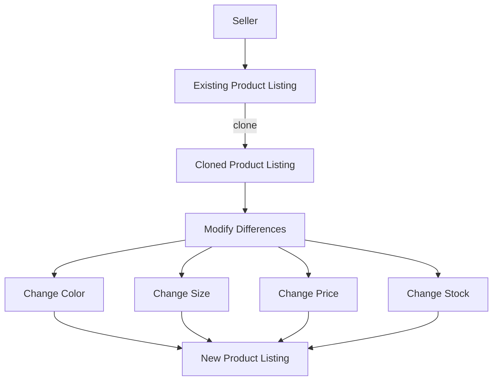

---

## Runtime Flow

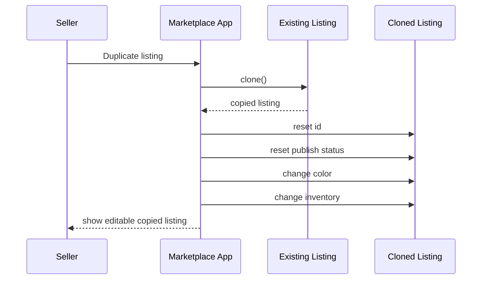

---

## Architectural Meaning

The cloned listing should copy reusable fields:

```txt
Title
Description
Category
Images
Shipping rules
Return policy
SEO fields
```

But it should reset identity fields:

```txt
Product ID
Created date
Sales history
Reviews
Inventory transactions
Published status
```

That reset logic is critical.

Prototype is useful, but careless cloning can create bad data.

---

# 7. Prototype Registry

A common variation is a **Prototype Registry**.

The registry stores named prototypes.

The client asks for a prototype by key.

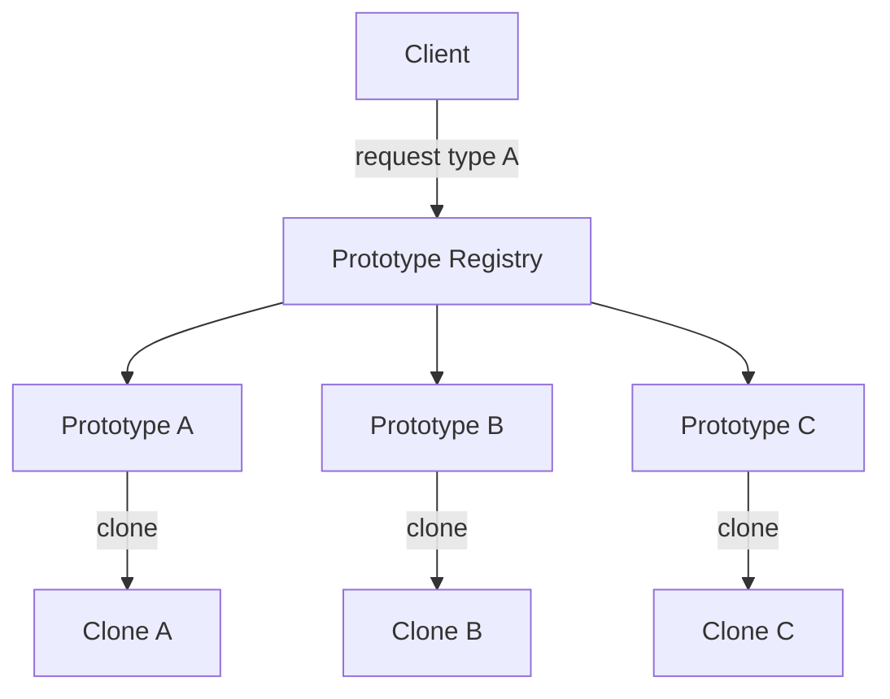

## What the Registry Solves

Without a registry, the client must know where prototypes live.

With a registry, the client says:

```txt
Give me a clone of "premium-listing"
Give me a clone of "boss-enemy"
Give me a clone of "invoice-template"
```

The registry finds the prototype and returns a clone.

---

# 8. Shallow Copy vs Deep Copy

This is the part people mess up.

## Shallow Copy

A shallow copy duplicates the top-level object but keeps references to nested objects.

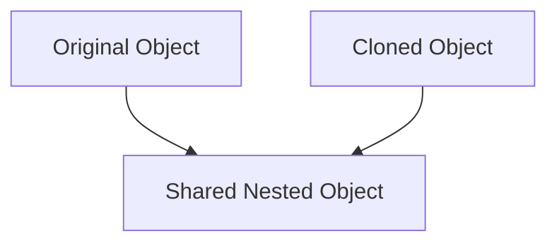

## Meaning

Both objects point to the same nested object.

That can be dangerous.

Example:

```txt
Original product listing and cloned listing share the same inventory object.
Changing stock in one changes the other.
```

That is usually bad.

---

## Deep Copy

A deep copy duplicates the top-level object and nested objects.

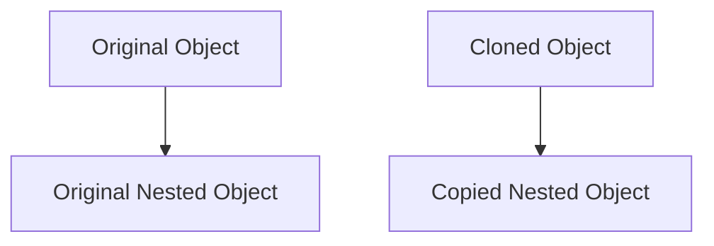

## Meaning

The clone gets its own independent nested objects.

Example:

```txt
Original character and cloned character each have separate health, inventory, and position.
```

That is usually safer when state can change.

---

# 9. What Prototype Protects You From

## Problem: Rebuilding Similar Objects Repeatedly

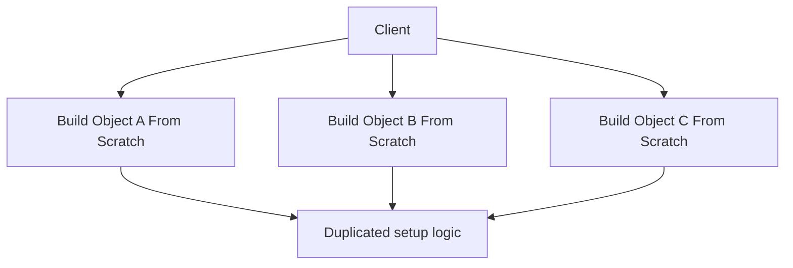

If many objects share the same setup, creating them from scratch repeats work.

---

## Solution: Clone From Prototype

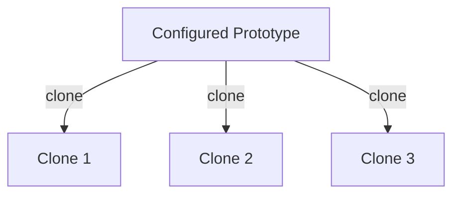

The setup exists once in the prototype.

Each clone starts with the same setup.

---

# 10. Prototype vs Factory Method

## Factory Method

Factory Method chooses which concrete type to create.

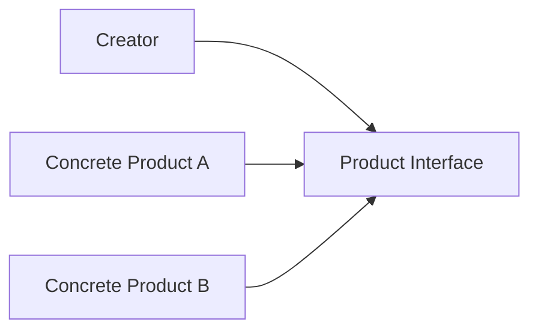

Example:

```txt
Create EmailSender or SmsSender.
```

---

## Prototype

Prototype copies an existing object.

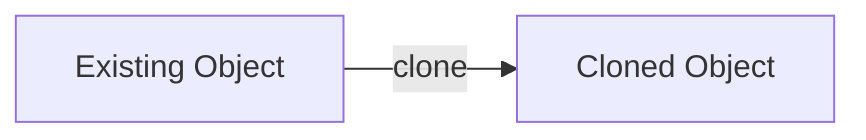

Example:

```txt
Duplicate an existing product listing.
```

---

## Main Difference

| Pattern        | Main Question                         |
| -------------- | ------------------------------------- |
| Factory Method | Which concrete class should I create? |
| Prototype      | Which existing object should I copy?  |

---

# 11. Prototype vs Builder

## Builder

Builder constructs one complex object step by step.

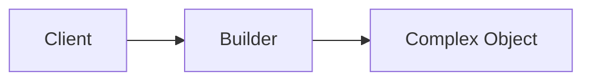

Example:

```txt
Build a custom report from selected sections.
```

---

## Prototype

Prototype clones a pre-existing configured object.

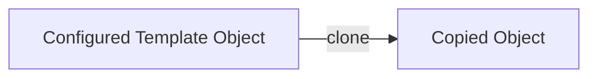

Example:

```txt
Copy an existing report template and change the title.
```

---

## Main Difference

| Pattern   | Main Question                                |
| --------- | -------------------------------------------- |
| Builder   | How do I assemble this object step by step?  |
| Prototype | Can I copy an existing object and modify it? |

---

# 12. Implementation Shape Without Code

## Step 1: Identify Cloneable Objects

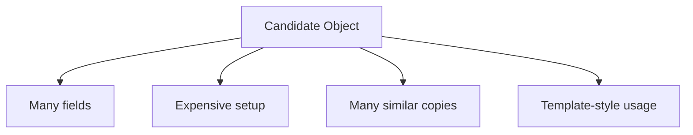

Good candidates:

```txt
Graphic shapes
Game characters
Product listings
Document templates
Workflow templates
UI layout templates
Configuration presets
```

---

## Step 2: Define Clone Behavior

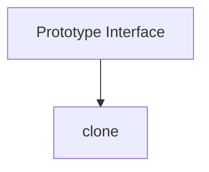

The important decision is not just “copy everything.”

The important decision is:

```txt
What should be copied?
What should be shared?
What should be reset?
```

---

## Step 3: Implement Concrete Prototypes

```mermaid
flowchart TD
    PROTOTYPE[Prototype Interface]

    A[Concrete Prototype A]
    B[Concrete Prototype B]
    C[Concrete Prototype C]

    A --> PROTOTYPE
    B --> PROTOTYPE
    C --> PROTOTYPE
```

Each prototype controls how it copies itself.

---

## Step 4: Clone and Customize

```mermaid
flowchart TD
    CLIENT[Client]

    PROTOTYPE[Prototype]

    CLONE[Clone]

    CUSTOMIZE[Customize Differences]

    FINAL[Final Object]

    CLIENT --> PROTOTYPE
    PROTOTYPE -->|clone| CLONE
    CLONE --> CUSTOMIZE
    CUSTOMIZE --> FINAL
```

---

# 13. When to Use Prototype

Use Prototype when:

```txt
You need many similar objects.

Object creation is expensive.

Objects have complex default configuration.

Users duplicate existing objects.

You want template-based object creation.

The exact concrete class should not matter to the client.

New objects differ only slightly from existing ones.

You need runtime-created templates, not only hardcoded classes.
```

---

# 14. When Not to Use Prototype

Do not use Prototype when:

```txt
Objects are simple.

A constructor is clear enough.

Copying state is risky or unclear.

Object identity is important and hard to reset.

Nested mutable objects make cloning dangerous.

The object contains resources that should not be copied, like file handles, sockets, or database connections.

You cannot clearly define deep-copy vs shallow-copy rules.
```

Prototype can become dangerous when developers blindly copy everything.

---

# 15. Common Smell That Suggests Prototype

Prototype is often useful when users or code repeatedly do this:

```txt
Create something similar to this existing thing.
```

Examples:

```txt
Duplicate this slide.
Copy this listing.
Clone this workflow.
Create another enemy like this one.
Start from this template.
```

That usually means a prototype-style copy makes sense.

---

# 16. Simple Pattern Summary

| Concept             | Meaning                                              |
| ------------------- | ---------------------------------------------------- |
| Prototype           | Existing object used as a template                   |
| Clone               | New object copied from the prototype                 |
| Prototype Interface | Defines clone behavior                               |
| Concrete Prototype  | Object that knows how to copy itself                 |
| Prototype Registry  | Optional catalog of named prototypes                 |
| Shallow Copy        | Copies top-level object but shares nested references |
| Deep Copy           | Copies top-level object and nested objects           |

---

# 17. Best Visual Summary

```mermaid
flowchart LR
    EXISTING[Existing configured object]

    CLONE[Clone object]

    MODIFY[Modify differences]

    FINAL[Ready-to-use new object]

    EXISTING -->|clone| CLONE
    CLONE --> MODIFY
    MODIFY --> FINAL
```

## Final Meaning

Prototype is not mainly about avoiding constructors.

It is about using an existing configured object as a template.

Use it when copying and modifying is safer, faster, or clearer than rebuilding from scratch.
