# Singleton Pattern Using Diagrams

## Core Idea

The **Singleton Pattern** is a creational design pattern that ensures a class has **only one instance** and provides a **single global access point** to that instance.

Instead of allowing the system to create many copies:

```txt
new ConfigManager()
new ConfigManager()
new ConfigManager()
```

The system uses one shared instance:

```txt
ConfigManager.getInstance()
```

The object controls its own creation.

---

# 1. Singleton Pattern: General Structure

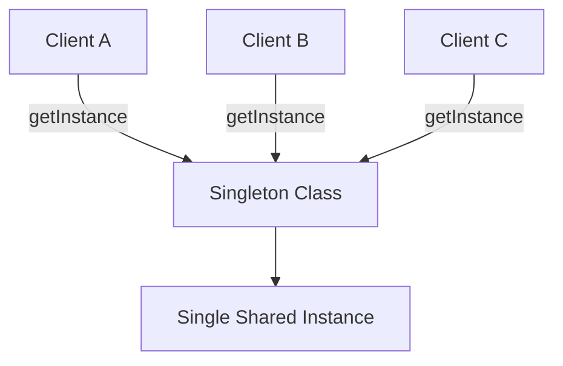

## What This Means

Every client asks for the same object.

The class prevents multiple instances from being created.

---

# 2. Simple Mental Model

Think of Singleton like the main control room in a building.

```txt
There should be one control room.

Many people may access it.

But the building should not accidentally create five different control rooms with conflicting information.
```

Singleton is useful when duplicate instances would cause inconsistent state or wasted resources.

---

# 3. What Problem Singleton Solves

## Without Singleton

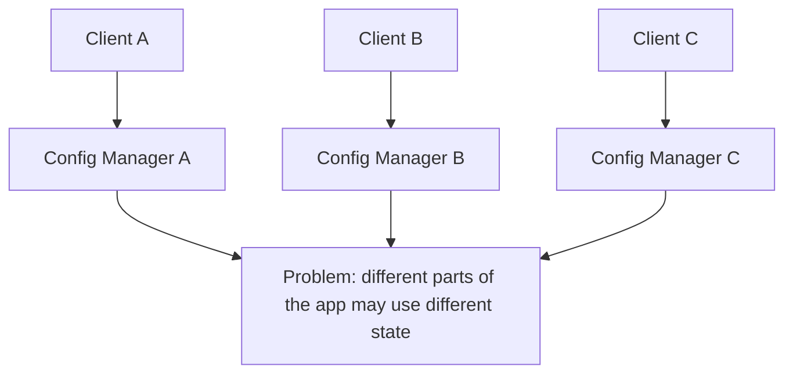

Each part of the application may create its own object.

That can cause inconsistent settings, duplicate connections, or conflicting state.

---

## With Singleton

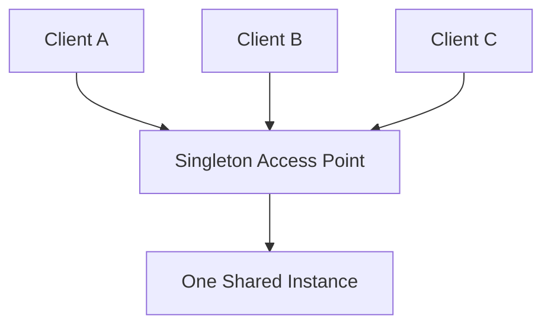

Now every client uses the same instance.

---

# 4. Example 1: Application Configuration Manager

## Problem

An application loads configuration settings:

```txt
API base URL
Feature flags
Environment name
Log level
Timeout values
Theme defaults
```

If multiple configuration managers exist, different parts of the app may read different settings.

Bad situation:

```txt
Frontend reads config from ConfigManager A.

Backend client reads config from ConfigManager B.

Logger reads config from ConfigManager C.
```

Now one part of the system may think logging is enabled while another thinks it is disabled.

---

## Architect Questions

An architect would ask:

```txt
Should there be only one source of configuration at runtime?

Would multiple instances cause inconsistent behavior?

Is the object expensive to initialize?

Does the state need to be shared globally?

Can dependency injection solve this better?

Do we need to reset or replace this instance during tests?

Is the singleton hiding dependencies from the system?
```

---

## Singleton Diagram

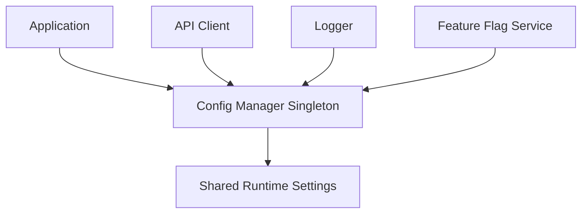

---

## Runtime Flow

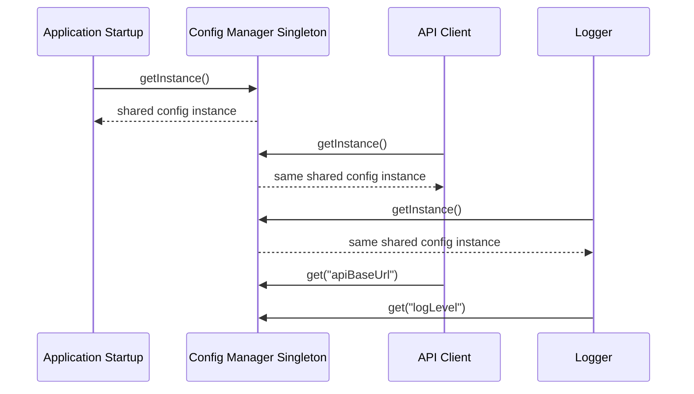

---

## Architectural Meaning

The configuration manager is centralized.

Every part of the system reads from the same runtime configuration.

That can be useful, but it also creates a global dependency.

Use it carefully.

---

# 5. Example 2: Logger

## Problem

An application needs logging across many modules:

```txt
Authentication
Payments
Notifications
Admin dashboard
Background jobs
```

If each module creates its own logger, logging behavior may become inconsistent.

Bad situation:

```txt
Auth logger writes to console.

Payment logger writes to file.

Background job logger has a different log level.

Notification logger has no formatter.
```

That makes debugging harder.

---

## Architect Questions

An architect would ask:

```txt
Should all modules share the same logging configuration?

Would multiple loggers duplicate output or write conflicting formats?

Does the logger manage an expensive resource like a file stream?

Can the logger be injected instead of accessed globally?

Will global logger state make testing harder?

Should logging be centralized but still configurable by environment?
```

---

## Singleton Diagram

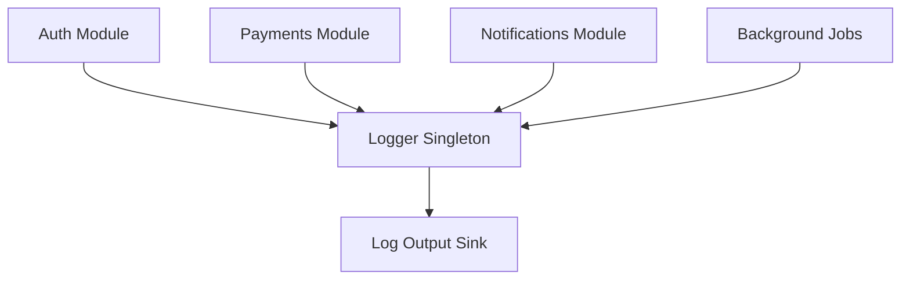

---

## Runtime Flow

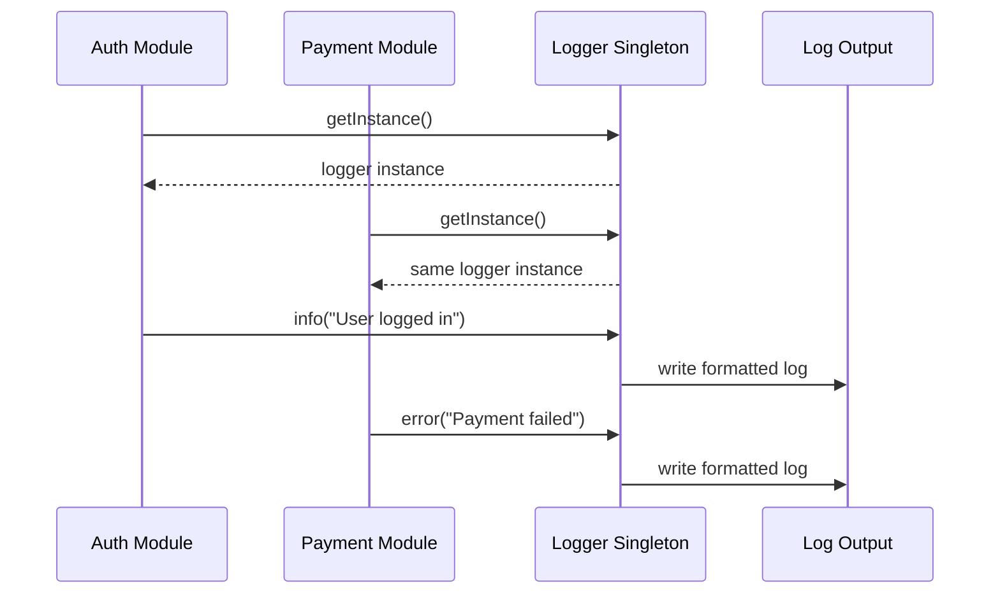

---

## Architectural Meaning

The logger can be a reasonable Singleton candidate because logging is cross-cutting and usually needs consistent configuration.

But the logger should not become a dumping ground for random shared state.

That is how Singleton becomes a disguised global variable.

---

# 6. Example 3: Database Connection Pool Manager

## Problem

A server application needs database access.

Creating a new database connection pool in every service is bad.

Bad situation:

```txt
UserService creates its own pool.

OrderService creates its own pool.

InventoryService creates its own pool.

ReportService creates its own pool.
```

This can waste memory, exhaust database connections, and make monitoring harder.

---

## Architect Questions

An architect would ask:

```txt
Should the application have one shared database pool?

Is the resource expensive to create?

Would duplicate instances overload the database?

Does the pool need controlled startup and shutdown?

Should the pool be injected into services instead of fetched globally?

How will this behave in tests, workers, or serverless environments?
```

---

## Singleton Diagram

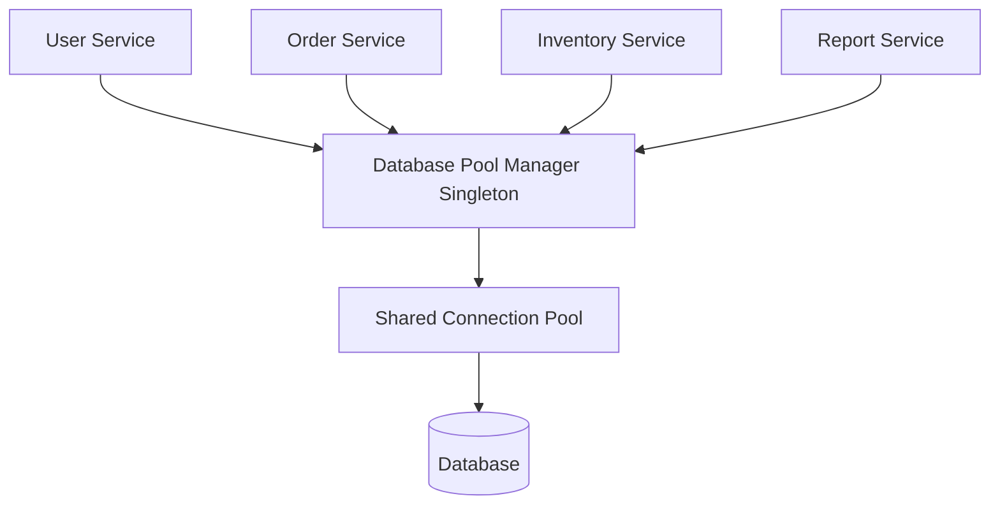

---

## Runtime Flow

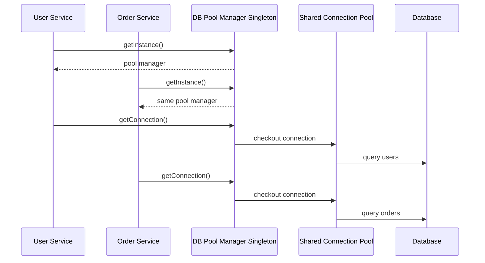

---

## Architectural Meaning

A connection pool is expensive and should usually be shared.

Singleton can enforce one manager.

But in many modern systems, dependency injection is cleaner:

```txt
Create one pool at application startup.
Inject it into services.
```

That gives you the same single-instance behavior without hard global access.

---

# 7. Example 4: Print Queue Manager

## Problem

A desktop application sends jobs to a printer.

If multiple print queue managers exist, they may fight over job order.

Bad situation:

```txt
Manager A sends document 3 first.

Manager B sends document 1 first.

Manager C cancels a job that Manager A thinks is still active.
```

The print queue becomes inconsistent.

---

## Architect Questions

An architect would ask:

```txt
Is there a shared resource that must be coordinated?

Should jobs be ordered in exactly one queue?

Would multiple managers create race conditions?

Does the system need centralized access control?

Can the queue manager be created once and injected?

What happens if the singleton crashes or holds stale state?
```

---

## Singleton Diagram

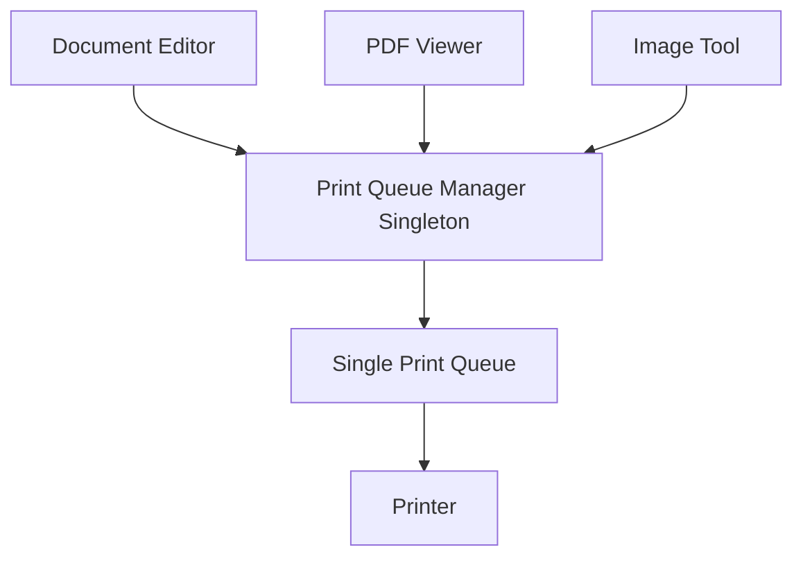

---

## Runtime Flow

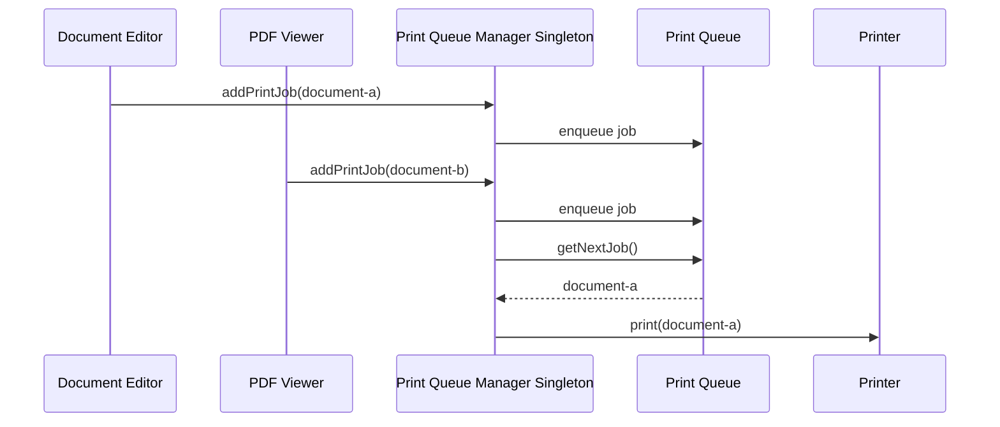

---

## Architectural Meaning

The printer is a shared resource.

The queue manager controls access and ordering.

Singleton can make sense because there should be one print queue coordinator.

---

# 8. What Singleton Protects You From

## Problem: Duplicate Shared State

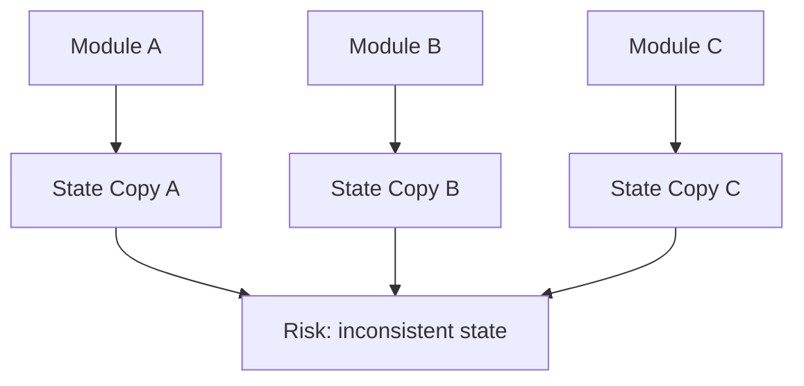

Multiple instances can mean multiple versions of what should be one shared state.

---

## Solution: One Controlled Instance

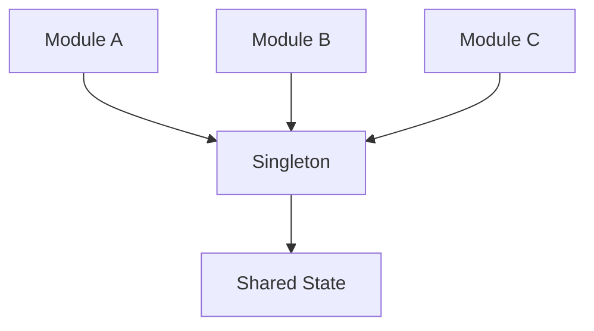

All modules go through the same access point.

---

# 9. The Dangerous Side of Singleton

Singleton can become an anti-pattern when abused.

## Problem: Hidden Global Dependency

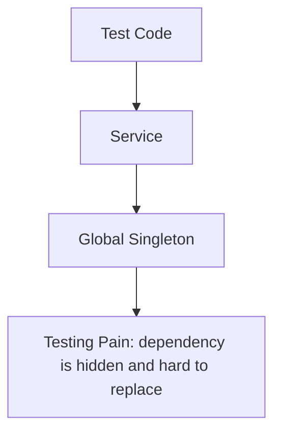

The service does not clearly show what it depends on.

That makes testing harder.

---

## Problem: Global Mutable State

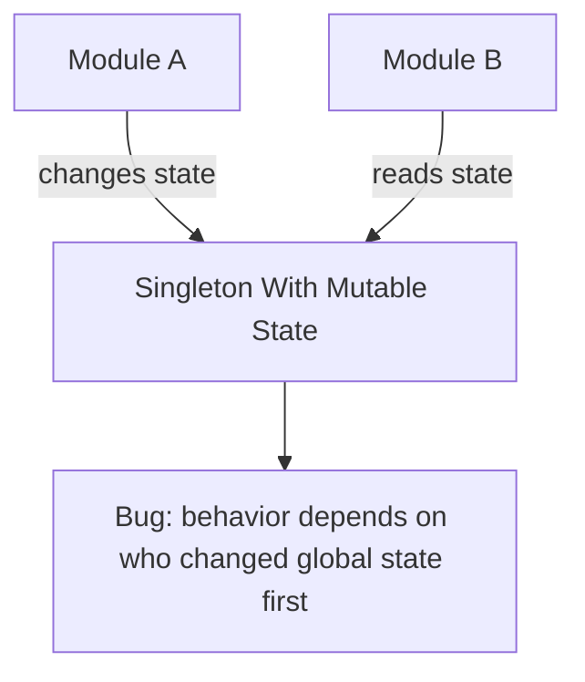

This is where Singleton gets dangerous.

If many parts of the system can mutate it, debugging becomes painful.

---

# 10. Singleton vs Dependency Injection

## Singleton

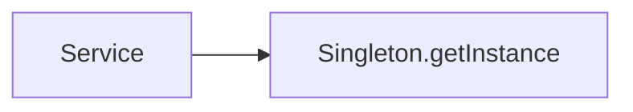

The service pulls the dependency from a global access point.

---

## Dependency Injection

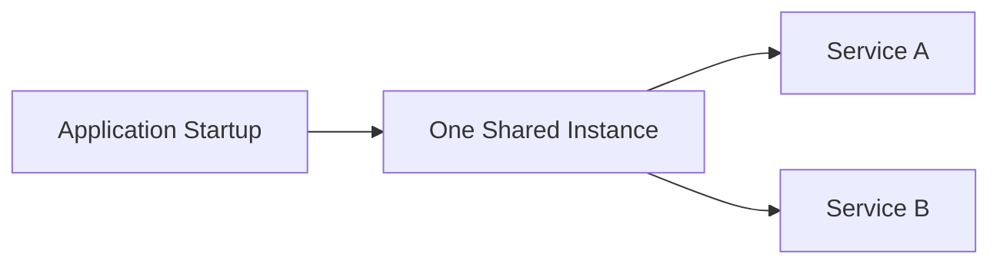

The application creates one instance and passes it where needed.

---

## Main Difference

| Approach             | Meaning                                                                       |
| -------------------- | ----------------------------------------------------------------------------- |
| Singleton            | The class controls its own single instance                                    |
| Dependency Injection | The application controls instance lifetime and passes dependencies explicitly |

## Architectural Judgment

In modern applications, dependency injection is often better than Singleton.

Why?

```txt
Dependencies are explicit.
Testing is easier.
Lifetimes are easier to control.
You can replace implementations.
You avoid hidden global state.
```

Singleton is still useful in small systems or for truly global infrastructure, but it should not be your default answer.

---

# 11. Singleton vs Factory Method

## Factory Method

Factory Method decides which concrete product to create.

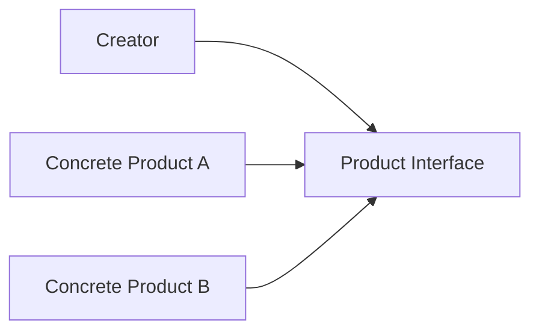

Question:

```txt
Which product type should be created?
```

---

## Singleton

Singleton controls how many instances exist.

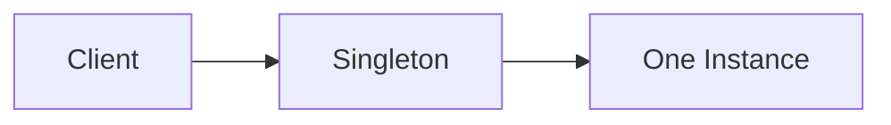

Question:

```txt
Should only one instance exist?
```

---

# 12. Singleton vs Prototype

## Prototype

Prototype creates new objects by cloning an existing one.

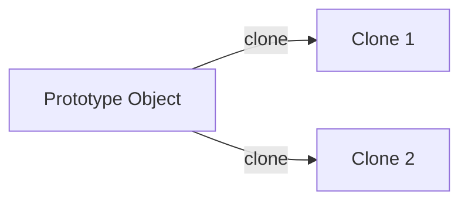

Prototype produces many similar objects.

---

## Singleton

Singleton prevents many objects.

```mermaid
flowchart LR
    CLIENT_A[Client A]
    CLIENT_B[Client B]

    SINGLE[Single Instance]

    CLIENT_A --> SINGLE
    CLIENT_B --> SINGLE
```

Singleton allows one shared object.

---

## Main Difference

| Pattern   | Main Question                                  |
| --------- | ---------------------------------------------- |
| Prototype | Can I copy this object to create more like it? |
| Singleton | Should only one instance of this object exist? |

---

# 13. Implementation Shape Without Code

## Step 1: Identify the Shared Resource

```mermaid
flowchart TD
    CANDIDATE[Candidate Object]

    CANDIDATE --> SHARED[Shared across system]
    CANDIDATE --> EXPENSIVE[Expensive to create]
    CANDIDATE --> COORDINATED[Needs coordination]
    CANDIDATE --> CONSISTENT[Must stay consistent]
```

Good candidates may include:

```txt
Configuration manager
Logger
Connection pool manager
Print queue manager
Application-wide registry
```

Bad candidates:

```txt
User session
Shopping cart
Request context
Form state
Temporary workflow state
```

Those usually should not be Singleton because each user, request, or workflow needs separate state.

---

## Step 2: Restrict Direct Construction

```mermaid
flowchart TD
    CLIENT[Client]

    CONSTRUCTOR[Private / Restricted Constructor]

    CLIENT -. cannot call .-> CONSTRUCTOR
```

The system should prevent random code from creating new instances.

---

## Step 3: Provide One Access Point

```mermaid
flowchart TD
    CLIENT[Client]

    ACCESS[getInstance]

    INSTANCE[Shared Instance]

    CLIENT --> ACCESS
    ACCESS --> INSTANCE
```

The access point returns the same instance each time.

---

## Step 4: Use Carefully

```mermaid
flowchart TD
    SINGLETON[Singleton]

    RULE1[Keep state minimal]
    RULE2[Avoid random mutation]
    RULE3[Make dependencies visible]
    RULE4[Support testing/reset if needed]

    SINGLETON --> RULE1
    SINGLETON --> RULE2
    SINGLETON --> RULE3
    SINGLETON --> RULE4
```

The hard part is not creating a Singleton.

The hard part is preventing it from becoming a global junk drawer.

---

# 14. When to Use Singleton

Use Singleton when:

```txt
Exactly one instance should exist.

The object manages a shared resource.

Multiple instances would cause incorrect behavior.

The object is expensive to create.

The instance needs centralized access.

The object is mostly stateless or carefully controlled.

The lifecycle is application-wide.
```

---

# 15. When Not to Use Singleton

Do not use Singleton when:

```txt
You only want convenience.

You are trying to avoid passing dependencies.

The object contains user-specific state.

The object contains request-specific state.

The object changes often from many places.

Testing requires replacing it frequently.

Dependency injection would solve the problem more cleanly.
```

This is the blunt truth: Singleton is often used because developers do not want to design dependency flow properly.

That is not a good reason.

---

# 16. Common Smell That Suggests Singleton

Singleton may be useful when you see this:

```txt
Every part of the system creates its own copy of something that should clearly be shared.
```

Examples:

```txt
Multiple configuration loaders
Multiple logger setup objects
Multiple database pool managers
Multiple print queue managers
```

But Singleton is risky when the smell is just:

```txt
I want to access this object from anywhere.
```

That usually means you are creating global state.

---

# 17. Simple Pattern Summary

| Concept             | Meaning                                            |
| ------------------- | -------------------------------------------------- |
| Singleton Class     | Class that controls its own single instance        |
| Instance            | The one shared object                              |
| Access Point        | Usually a method like getInstance                  |
| Private Constructor | Prevents outside code from creating more instances |
| Shared State        | Data or resource accessed through the singleton    |
| Lifecycle           | Usually lives for the duration of the application  |

---

# 18. Best Visual Summary

```mermaid
flowchart LR
    CLIENT_A[Client A]
    CLIENT_B[Client B]
    CLIENT_C[Client C]

    ACCESS[Single Access Point]

    INSTANCE[One Shared Instance]

    CLIENT_A --> ACCESS
    CLIENT_B --> ACCESS
    CLIENT_C --> ACCESS

    ACCESS --> INSTANCE
```

## Final Meaning

Singleton is not mainly about making access easy.

It is about enforcing that only one instance exists.

Use it when duplicate instances would cause real problems.

Do not use it just to avoid passing dependencies.
