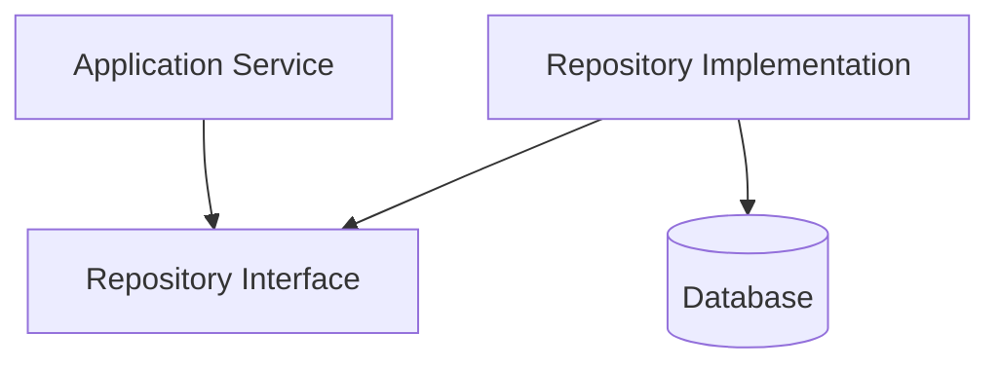
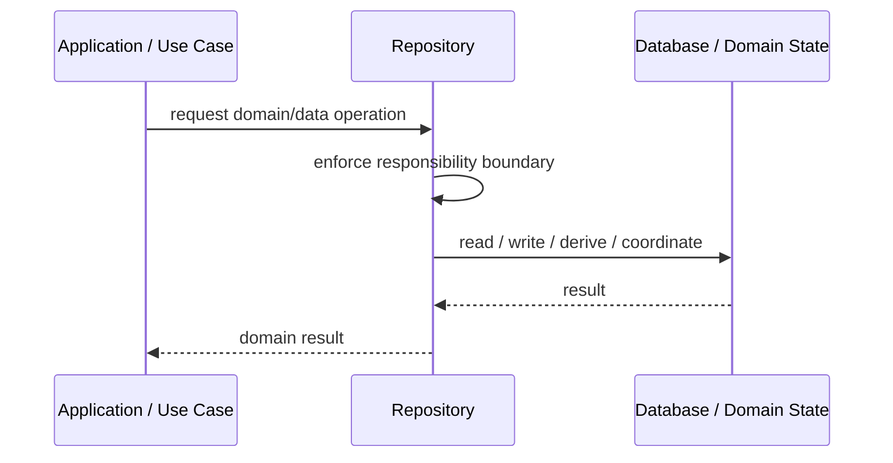
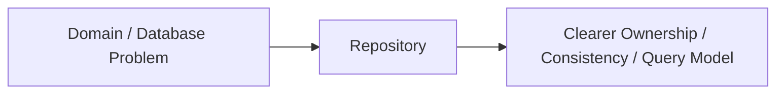

# Repository

## Core Idea

Repository provides a collection-like interface for loading and saving domain objects while hiding database/query details.

---

## Problem It Solves

Business logic becomes coupled to SQL, ORM queries, database schemas, or persistence details.

---

## 3 Concrete Examples

### Example 1: Order Repository

OrderService asks OrderRepository for orders instead of writing SQL in the service.

### Example 2: Customer Repository

Customer domain logic loads customers by ID or email through a repository interface.

### Example 3: Product Catalog Repository

Catalog use cases retrieve products without caring whether data comes from SQL, Elasticsearch, or cache.

---

## Architect Questions

- Which aggregate or entity does this repository manage?
- Should this repository expose domain-oriented methods or generic CRUD?
- Who owns transaction boundaries?
- Should queries return domain objects, DTOs, or projections?
- How will repositories be tested?
- Is the repository hiding persistence or just adding useless pass-through code?

---

## Main Diagram



---

## Runtime / Responsibility Flow



---

## Implementation Shape

```txt
1. Identify the domain or persistence problem.
2. Define the ownership boundary: entity, aggregate, repository, table, tenant, shard, view, or event stream.
3. Define invariants and consistency requirements.
4. Define how data is loaded, changed, saved, queried, and audited.
5. Define transaction behavior and failure behavior.
6. Add tests around business rules, persistence mapping, concurrency, and edge cases.
7. Keep the pattern focused. Do not use database patterns to hide unclear domain modeling.
```

---

## When to Use

- You want to hide persistence details from business logic.
- Domain code should not know SQL or ORM details.
- You need testable data access boundaries.

---

## When Not to Use

- It only forwards generic CRUD with no abstraction value.
- The ORM already provides adequate boundaries.
- Queries are simple and repository adds noise.

---

## Common Smell That Suggests This Pattern

```txt
Business rules, persistence logic, identity, history, or query needs are becoming unclear,
duplicated,
too coupled to database details,
or too slow for the current model.
```

---

## Common Mistakes

```txt
Confusing database tables with domain concepts.

Adding abstractions that only pass calls through.

Letting persistence concerns dominate the domain model.

Ignoring transaction boundaries.

Ignoring concurrency and stale data.

Using a complex DDD pattern for simple CRUD.

Using simple CRUD patterns for a complex domain.
```

---

## Best Visual Summary



## Final Meaning

Repository is useful when it protects business meaning, data consistency, query performance, or persistence boundaries. If the problem is simple CRUD, do not overcomplicate it.
